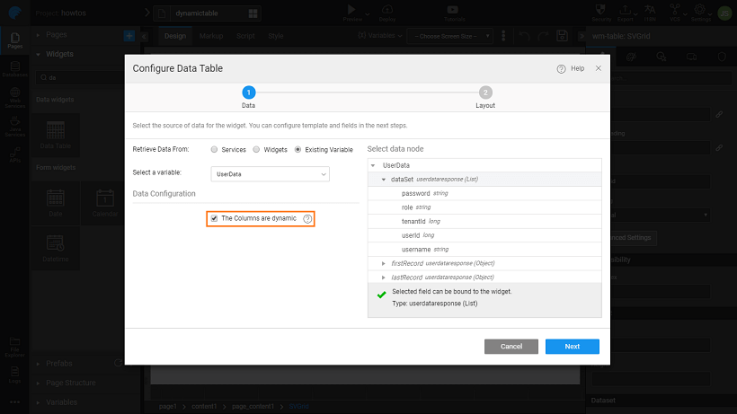
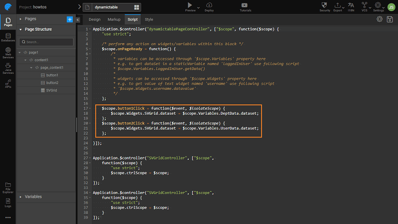

Dynamic Data Tables can be created in the following ways:

1. A **single service** output bound to a Data Table where the columns' metadata i.e., number of columns, its types and names etc. change depending on a specific condition
2. Metadata being returned from **multiple services** is bound to a single grid based on conditions/events

## Creating Dynamic Data Table using Single Service

The dynamic metadata from a single service can be displayed in the Data Table using “The Columns are dynamic” option and checking the “Update Data on Input Change” behavior in the respective variable at the time of Data Table configuration For example, an API may be returning dynamic data at runtime, hence, you will need to [create a API based variable](./how-tos/assets/img/var_sel.png) for the above API service and choose the option “The columns are dynamic” for the Data Table widget. <!-- <!-- [Click here for more details](/learn/app-development/variables/database-apis/) --> -->.

## Creating Dynamic Data Table using Multiple Services

Here we will see how to create a dynamic grid based on the metadata returned from multiple services. To illustrate the dynamic Data Table implementation, we have taken an example to switch the table data between the sample hrdb’s USER and DEPARTMENT datasets on a button click event. <!-- <!-- [See here to Import the Sample DB](/learn/app-development/services/database-services/working-with-databases/) --> -->.

1. Create two <!-- <!-- [SELECT **queries**](/learn/app-development/services/database-services/working-with-queries) --> --> - one to retrieve the data from the DEPARTMENT entity and other to retrieve the data from USER entity. **Note**: We have written simple SELECT statements as part of this example. However, you can create queries as per your requirement.
    1. DeptData:
        
        select * from DEPARTMENT
        
    2. UserData:
        
        select * from USER
        
2. [Create a Database API variables](./how-tos/assets/img/var_sel.png) for the queries created above. Call them, say DeptData and UserData **Note**: Make sure you have checked the **Request Data on Page Load** option for the variables created above. [](./assets/img/dynamic_grid1.png)
3. Drag and drop two **Button** widgets onto the canvas. Set the **Caption** property as _Show Department Data_ and _Show User Data_.
4. Drag and drop a **Data Table** widget on the canvas. While configuring the Data Table, select the option “_The columns are dynamic_”. Also, please note that we have chosen the UserData as the Source Variable. Thus User data will be displayed initially. You can configure it to any variable of your choice. [](./assets/img/dynamic_grid2.png)
5. Rename the Data Table to “SVGrid” or any other valid name as per your scenario (this name is used in the JavaScript code later). [](./assets/img/dynamic_grid3.png)
6. For the buttons placed on the canvas, navigate to the Events tab from the properties panel and choose JavaScript as operation for the **on Click** event.
7. Below is an example code snippet to change the grid dataset’s dynamically at runtime.
    
    ```javascript
    Page.button1Click = function ($event, widget) {
        Page.Widgets.SVGrid.dataset = Page.Variables.DeptData.dataSet;
    };
    
    Page.button2Click = function ($event, widget) {
        Page.Widgets.SVGrid.dataset = Page.Variables.UserData.dataset;
    };
    ```
    
    [](./assets/img/dynamic_grid4.png)

Using the above implementation steps, you will be able to successfully change the Data Table at runtime using multiple services.

[Data Table Use Cases](../../user-interfaces/web/components/angular-components/datalive/datatable/data-table-use-cases.md)

- [1. Basic Table Usage](../../user-interfaces/web/components/angular-components/datalive/datatable/data-table-basic-usage.md)
- [2. How to customise table actions](./data-table-actions.md)
- [3. How to represent data table columns using widgets](./data-table-widget-representations.md)
- [4. How to format data table column](./data-table-format-options.md)
- [5. How to apply styles (generic and conditional) to data table](./data-table-styling.md)
- [6. How to view master-detail record using a data table](./view-master-detail-data-records-using-data-table.md)
- [7. How to add master-detail record using a data table](./add-master-detail-records-using-data-table.md)
- [8. How to export data using a data table](./export-data-data-table.md)
- [9. How to create a dynamic data table](./dynamic-data-tables.md)
- [10. How to bind column of a data table to query variable](./data-table-column-bound-query.md)
