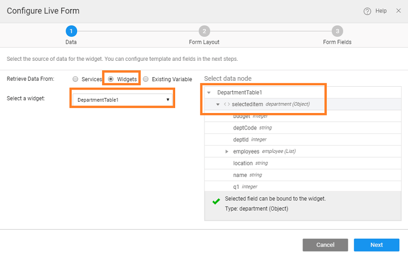

To use form for updating the table, it needs to be bound to a **Data Table** or a **List** widget's **Selected row** property. Here we will see linking Data Table to a Live Form, the same can be replicated for a List. Another easy way to achieve this would be to use the Editable Data Table with Live Form layout.

- Drag and drop a Data Table for the _Employee_ Variable.
- Choose the Data Table (grid) selected item as the datasource for the Live Form. This will set the initial values that will be displayed in the form. 
- At runtime, the row selected from the table will be displayed in the form. Make changes and click on save to commit the changes to the database.

[Live Form Use Cases](../../user-interfaces/web/components/angular-components/datalive/live-form/liveform-use-cases.md)

- [1. Live Form Basic Usage](../../user-interfaces/web/components/angular-components/datalive/live-form/live-form-basic-usage.md)
- [2. How to split live form](./live-form-tabbed-form.md)
- [3. How to link live form to another widget](./live-form-linking-another-widget.md)
- [4. How to configure related fields in a Live Form](./live-form-related-fields.md)
- [5. How to use cascading select and automplete widgets for fields in a Live Form](./using-cascading-select-autocomplete-live-form-fields.md)
- [6. How to configure cascading select for fields in a Live Form](./using-cascading-select-within-live-form.md)
- [7. How to add master-detail records from the same Live Form](./adding-master-detail-records-transaction.md)
- [8. How to use cascaded Live Filter to populate Live Form](./using-cascading-filter-populate-live-form.md)
- [9. How to add master-detail records from Live Form using Wizard](./using-wizard-master-detail-live-form.md)
- <!-- <!-- [10. How to progressively add fields to a record using Wizard](/learn/how-tos/using-wizard-progressive-data-entry-live-form/) --> -->
- <!-- <!-- [11. How to accumulate data over multiple steps in a Wizard and save at the last step](/learn/how-tos/using-wizard-cumulative-data-entry-live-form/) --> -->
