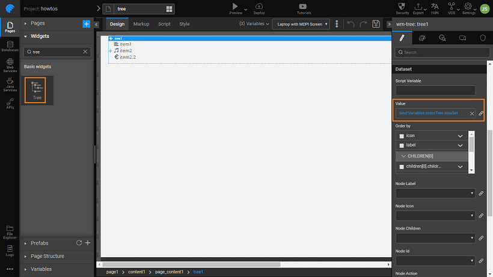

---

We will build a tree using a simple static structure

1. Drag and drop a _Tree_ widget in your canvas. Tree widget comes with multiple nodes
2. [Create a Model Variable](./how-tos/assets/img/var_sel.png), say staticTree, giving the structure of the data to be displayed in the tree. Ensure that the _IsList_ check box is selected.
3. In the _Text Editor_ enter the following code:

```json
[
  {
    "label": "item1",
    "icon": "fa fa-align-left"
  },
  {
    "label": "item2",
    "icon": "glyphicon glyphicon-music",
    "children": [
      {
        "label": "item2.1",
        "icon": "glyphicon glyphicon-bookmark",
        "children": [
          {
            "label": "item2.1.1",
            "icon": "glyphicon glyphicon-headphones",
            "children": [
              {
                "label": "item2.1.1.1",
                "icon": "glyphicon glyphicon-euro"
              }
            ]
          }
        ]
      }
    ]
  },
  {
    "label": "item2.2",
    "icon": "glyphicon glyphicon-euro"
  }
]
```

In this code, we are specifying the node structure - the _label_ on each node, _icon_ to be displayed at each node and any _child-level nodes_. Icons can be [halflings from glyphicons](https://getbootstrap.com/docs/3.3/components/) or [font awesome](https://fortawesome.github.io/Font-Awesome/cheatsheet/) icons.

:::note
If you follow this structure, the label, icon, link, and children tags are picked automatically. If you are using different tag names, then you need to specify them while binding.
:::

[](./assets/img/tree_statvar.png)

4. Next, bind the **Dataset ->** **Value** property of the tree widget to the dataset under the model variable created in the previous step (staticTree -> dataSet). You can see the preview on the canvas. [](./assets/img/tree_design.png)
5. Run the application and see the menu in action. Click on the + before nodes, here item2, to expand the node.

## See Also

[Tree Widget Cases](../../user-interfaces/web/components/angular-components/basic/tree.md)  
[How to build tree from java service](./tree-use-case-java-service.md)  
[How to build a dynamic tree](./tree-use-case-dynamic-tree.md)
