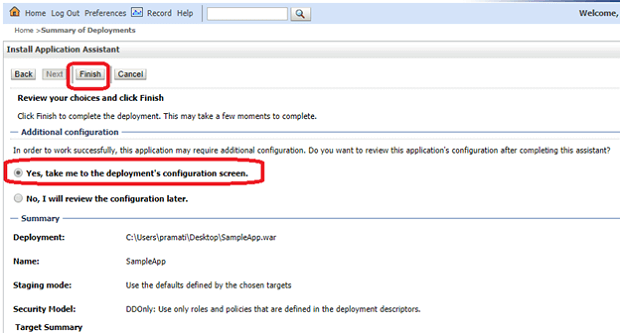

---

This section walks through the steps to deploy WaveMaker app to Oracle WebLogic Server.

## Pre-requisites

1. WebLogic Server needs to installed in the system. For installation, see [Oracle WebLogic Server Installers](http://www.oracle.com/technetwork/middleware/weblogic/downloads/wls-main-097127.html). 

:::note
The following instructions are for deployment to **WebLogic Server 14c `14.1.1.0.0`**.
:::
2. WaveMaker application (war) file. The following instructions assume the war file is named `SampleApp.war`, change the name as per your use case.

## Steps Involved

1. Create Application War file for WaveMaker app
2. Deploy Application (Deployment Process)

## Create Application War file

Export Project as war. For steps in war file generation for WaveMaker apps, see [War file generation](../../../build-and-deploy/build/web/package/war/build-war-from-projectzip.md).

## Deploy Application to WebLogic (Deployment Process)

1. Log in to WebLogic server
2. From the _Deployments_ section (link on the left side menu), click Install.

3. Provide the path to the location of war file in the _Path_ text box, select the _war file_ and click the _Next_ button.

4. Select '_Install this deployment as an application_' and click the _Next_ button.

5. Provide the app _Name_ and click the _Next_ button.

6. Select '_Yes, take me to the deployment's configuration screen_' and click the _Finish_ button.

7. Click the _Save_ button in deployment settings page 

8. Select the _Testing_ tab to access the deployed application.

