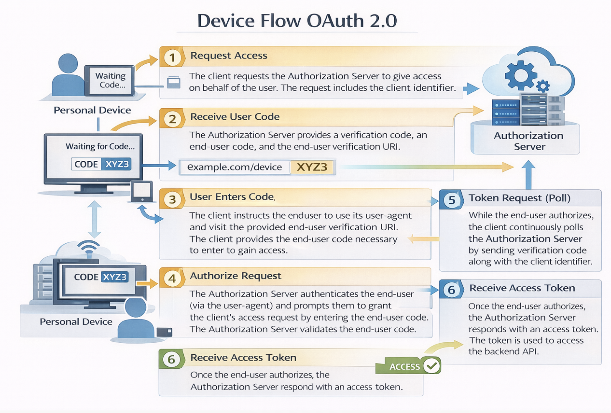

# REST Services using OAuth 2.0

OAuth 2.0 is an industry-standard **authorization framework** that enables applications to request limited access on behalf of a user to APIs and resources hosted by third-party services (such as Google, Facebook, GitHub, etc.). OAuth 2.0 focuses on simplifying client-side development while providing secure delegated access to protected resources. In WaveMaker, you can integrate OAuth 2.0-protected REST services without writing custom authentication code. 

---

## What OAuth 2.0 Does

OAuth 2.0 allows your application to securely access external services on behalf of a user. Instead of storing or handling user credentials directly, your app uses tokens (like access tokens) issued by an authorization server to authenticate requests to REST APIs. 

---

## Device Flow
The device flow is illustrated in the below image.

<!--  -->

## Device Flow Steps Explained

1.The client requests the authorization server to give the access. The request includes the client identifier in it.

2.The authorization server provides a verification code, an end- user code, and the end-user verification URI.

3.The client instructs the end-user to use its user-agent (elsewhere) and visit the provided end-user verification URI. The client provides the end-user with the end-user code that is necessary to enter, in order to gain access.

4.The authorization server authenticates the end-user (via the user-agent) and prompts the end-user to grant the client's access request. If the end-user accepts the client's request, then the end-user enters the end-user code provided by the client. The authorization server validates this end-user code.

5.While the end-user authorizes (or denies) the client's request (D), the client continuously polls the authorization server to verify if the end-user authorization step is successfully accomplished. The client's request includes the verification code and its client identifier.

6.Assuming that the end-user has granted access, the authorization server validates the verification code provided by the client and eventually responds with the access token.

## Adding an OAuth 2.0-Secured REST Service

You can configure a REST service to use OAuth 2.0 when you import it in WaveMaker.

### Steps to Configure

1. In **WaveMaker Studio**, go to the **Web Services** explorer and select **REST Service**.  
2. Enter the REST endpoint URL you intend to invoke.  
3. For **HTTP Authentication**, choose **OAuth 2.0**.  
4. Select an existing OAuth provider from the list or add a new one.  
5. Complete the OAuth provider settings (details below).  
6. Test the configuration to verify that the OAuth flow works and tokens are obtained successfully. 

---

## OAuth Provider Setup

When configuring OAuth 2.0 for a REST service, you must supply details about the authorization provider:

- **Provider ID** – The name or identifier for this OAuth provider.  
- **Callback URL** – WaveMaker generates this automatically; use this in the OAuth provider’s app registration settings as the authorized redirect URI.  
- **Authorization URL** – The endpoint where user consent is obtained.  
- **Access Token URL** – The endpoint to request the OAuth access token.  
- **Client ID / Client Secret** – Credentials received when you register your application with the OAuth provider.  
- **Token Delivery Method** – Choose whether the access token is sent in the request header or as a query parameter (header is the default).  
- **Scopes** – Define the permissions the app is requesting (e.g., `profile`, `email`, `openid`). Check with your OAuth provider for valid scope values. 
These provider settings allow WaveMaker to handle the OAuth 2.0 token exchange and inject valid access tokens into REST calls automatically.

---

## Testing OAuth Configuration

Once you’ve configured the OAuth provider:

- Use the **Test** button in the service import or settings UI.
- You will be prompted to sign in to the external OAuth service.
- After signing in, WaveMaker retrieves the OAuth tokens and verifies that the configuration is correct.  
- If successful, you can proceed with importing the service definition. 

These tokens are then used for subsequent REST requests to the protected service.

---

## Using OAuth-Secured REST Services

After importing an OAuth 2.0 REST service into your WaveMaker project:

- Create a **Variable** for the service method you want to call (just as you would for any REST service).  
- When the variable is invoked at runtime, WaveMaker will prompt the user to authenticate (if not already authenticated) using the configured OAuth provider.  
- The OAuth access token is included automatically in requests made through this variable, so you don’t have to manually attach tokens. 

This approach integrates OAuth-protected REST API calls seamlessly into your application logic.

---

## Runtime Behavior

During application execution:

- When a variable bound to an OAuth 2.0 service is called, users may be redirected to the provider’s login page to authenticate.  
- After successful login and token issuance, the access token is stored and used for subsequent REST calls.  
- If the token expires, users can be prompted again to reauthorize or refresh the token, depending on provider support.

This ensures secure access to protected resources without exposing sensitive credentials.

---

## Provider Configuration Persistence

OAuth provider settings can be managed in multiple deployment profiles:

- You can configure **OAuth details** separately for **Development**, **QA**, **Staging**, and **Production** profiles using WaveMaker’s configuration profiles.  
- The callback URL generated by WaveMaker should be registered with the OAuth provider when you deploy your app. 

This flexibility ensures that environment-specific configurations (like client IDs or secrets) are maintained without modifying application code.

Learn more: [configurations](../../apis-and-services/configurations/profile-settings.md)
<!--  -->

---

## Summary

WaveMaker simplifies consuming OAuth 2.0–secured REST services by:

- Providing built-in support for configuring OAuth providers.  
- Automating the OAuth token flow during service import and invocation.  
- Allowing REST calls to include access tokens without custom code.  
- Supporting storage and management of provider settings across environments.

With these features, you can securely integrate external APIs that require OAuth 2.0 authentication into your applications while keeping your development experience smooth and low-code.
