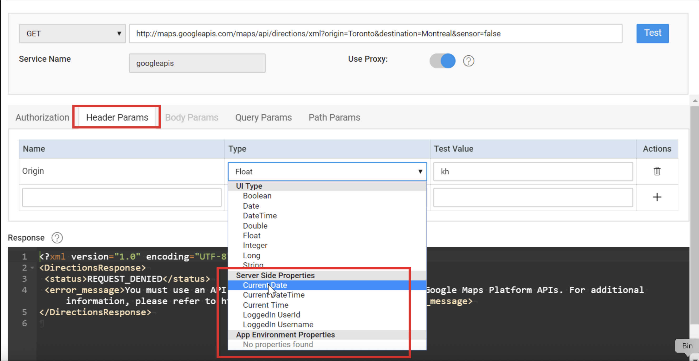

# Secure Server-Side Properties

When integrating REST services in your WaveMaker application, it's important to protect sensitive information such as API keys, passwords, and other confidential values. Without proper safeguards, these values could become visible in UI bindings or outgoing network requests. To prevent this, WaveMaker allows you to use App Environment Properties and Server-Side Properties and enforce usage of a proxy server for REST calls.

---

## Secure Property Types

WaveMaker supports two primary property types for securing sensitive data:

### App Environment Properties

- These are **custom properties** you define and manage.
- They can be used throughout your application wherever environment-specific values are needed.
- Ideal for values like API keys, tokens, endpoints, and other configuration parameters that may differ across environments.
- Once created, App Environment Properties appear in the REST service configuration dialog under **Header** and **Query** parameter options. 

### Server-Side Properties

- These are **built-in variables** provided by WaveMaker.
- Server-Side Properties typically represent dynamic runtime information (for example, current date/time or logged-in user details).
- Like App Environment Properties, they help keep sensitive values off the client and out of direct network calls.

> Both property types help ensure sensitive values are not exposed on the UI or transmitted directly from the client.

---

## Configuring REST Services to Use a Proxy

To prevent sensitive values from being exposed in requests made directly from the client, you can enable the **Use Proxy** option when setting up REST services:

1. Add the REST service as usual, providing the endpoint URL and any required parameters.  
2. For each **Header** or **Query** parameter that should not be sent directly from the client, assign it either a **Server-Side Property** or an **App Environment Property**.  
3. Toggle **Use Proxy** to enable proxy routing for this REST service.  
   - When proxy is enabled, REST calls are made from the server side through the proxy, not directly from the client browser or device.  
   - This hides the sensitive parameter values from both network traces and UI variables.
WaveMaker enforces the use of the proxy server whenever Server-Side or App Environment Properties are used in REST service parameters.

---

## How This Affects UI and Network Calls

When sensitive values (such as keys or credentials) are bound to REST service **Header** or **Query parameters**, they may appear in the Variables dialog input fields at design time. Without protection, these values could leak through UI bindings or client-side scripts. 

By enabling the proxy:

- Parameter values are **sent from the server**, not from the client.  
- The client cannot see or intercept these values in the UI or network traffic.  
- This ensures that confidential information stays on the server side and is not exposed to end users. 

---

## Best Practices and Considerations

- If App Environment Properties are not listed under Header or Query parameter selections, ensure they are added correctly to your configuration profile.  
- You **must enable Use Proxy** before you can assign Server-Side or App Environment Properties to REST parameters.  
- If you modify the REST service URL or other configurations, re-test the service before saving to ensure proper behavior. 
- Using **App Environment Properties** for reusable configuration values across environments.  
- Leveraging **Server-Side Properties** for dynamic runtime values.  
- Enabling **Use Proxy** so that API keys, passwords, and other sensitive data are never sent directly from the client.  
- Ensuring that confidential parameters are handled server-side and remain hidden from UI and network traffic. 

These practices help you maintain secure integration with third-party services and safeguard critical application data.

---

## Summary

Protecting sensitive REST service properties in WaveMaker involves:

- Using **App Environment Properties** for reusable configuration values across environments.  
- Leveraging **Server-Side Properties** for dynamic runtime values.  
- Enabling **Use Proxy** so that API keys, passwords, and other sensitive data are never sent directly from the client.  
- Ensuring that confidential parameters are handled server-side and remain hidden from UI and network traffic. 

These practices help you maintain secure integration with third-party services and safeguard critical application data.
