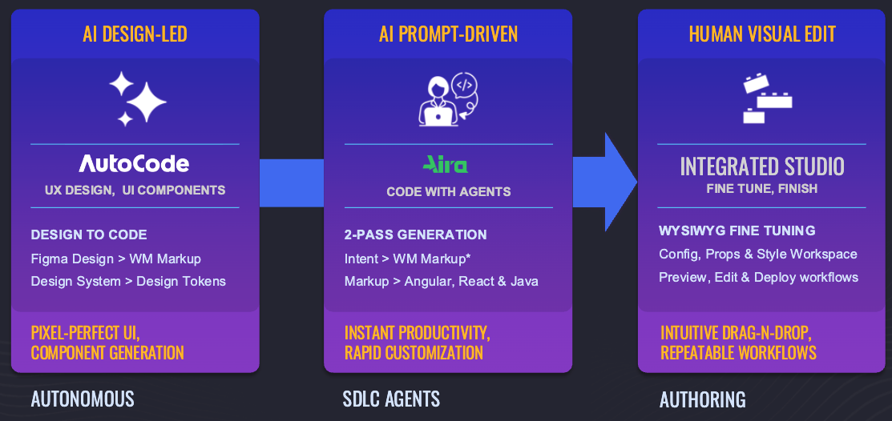

# WaveMaker 12  
## A New Era of AI-Accelerated Application Development

WaveMaker 12 represents a significant evolution of the platform. It marks a shift from traditional low-code development toward a modern, AI-accelerated approach to building applications.

With this release, WaveMaker brings together AI agents, design systems, and visual development into a single, cohesive experience. Developers can choose how they build—visually, with agents, or directly from design—without changing tools or workflows.

---

## A Unified Development Model

WaveMaker 12 supports three complementary modes of development, designed to work together rather than compete.

### Visual Development  
Developers can continue to use the visual canvas to design pages, configure components, and fine-tune application behaviour. Studio improvements make it easier to focus on layout, navigation, and structure while maintaining control over generated code.

### Agent-Based Development (AIRA)  
AI agents assist developers with common and repetitive development tasks using natural language prompts. These agents operate within the platform, helping accelerate development while keeping developers fully in control of outcomes.

### Design to Code (Autocode)  
Autocode enables direct conversion of supported design systems into working applications. Layout, styling, and components are generated automatically, allowing teams to move from design to implementation with minimal manual effort.

---

## Design System Projects for Web and Mobile

WaveMaker 12 introduces Design System Projects as the default approach for building applications.

All WaveMaker components now align with the WaveMaker UI Kit, ensuring consistency across projects and teams. Styling is driven by design tokens rather than custom CSS, enabling predictable theming and easier maintenance.

Key capabilities :
- Design System–based projects for both web and mobile
- Design Tokens for global and component-level styling
- A dedicated Style Workspace for managing tokens
- Auto Layout containers enabled by default for responsive design
- Updated component naming aligned with the design system

This approach significantly reduces styling overhead while improving consistency and scalability.

---

## Autocode: From Design to Production-Ready Applications

Autocode converts supported designs into WaveMaker applications using a design-first approach.

Generated output includes:
- UI components aligned with the design system
- Auto Layout–based responsive containers
- Design Tokens for theming and customization
- Page structure, configuration, and layout

Autocode currently supports designs built using the WaveMaker UI Kit and Material 3, with plans to expand support to additional design systems. Generated projects can also be imported into WaveMaker Enterprise environments.

---

## Aira: AI Agents for Application Development

WaveMaker 12 introduces Aira, an AI agent framework designed to assist across the application development lifecycle.

Aira agents can help with tasks such as:
- API binding and integration
- Internationalization support
- Security configuration
- JavaScript code generation
- Backend service creation
- Screenshot-to-code conversion aligned with the design system

The agent experience is fully integrated into WaveMaker Studio, offering prompt-based interaction, chat history, and execution control. Agents are designed to accelerate development while keeping developers in control of decisions and outputs.

---

## Studio Experience Improvements

WaveMaker Studio has been refined to support modern workflows and reduce friction during development.

Enhancements include:
- A more focused page workspace with increased canvas area
- Easier access to the page component tree and page switcher
- Page tree actions for updating and deleting elements
- Consistent terminology across the platform

---

## A Connected Developer Ecosystem

WaveMaker 12 brings together all supporting assets into a single, integrated ecosystem that complements the core platform.

### Documentation  
The documentation experience has been restructured with new information architecture around developer personas and workflows. Deeplinking with Academy and Storybook ensures relevant content is easily discoverable.

### Academy  
WaveMaker Academy evolves into a developer onboarding platform with mentor-led learning paths, and certification-oriented programs backed by latest videos explaining the development concepts.

### Component Storybook  
Detailed component documentation is now available through Storybook, enabling interactive exploration and live property manipulation for both web (React) and mobile (React Native) components.

### Marketplace  
A new product marketplace being introduced to support reusable components, connectors, prefabs, design systems and industry-specific solutions.

---

## One Platform, One Ecosystem

WaveMaker 12 is not just an incremental update. It reflects a clear direction toward AI-assisted development, design system–driven consistency, and a unified developer experience.

By combining visual tools, AI agents, and design-led workflows, WaveMaker 12 enables teams to build applications faster, maintain consistency at scale, and adapt to modern development needs with confidence.
