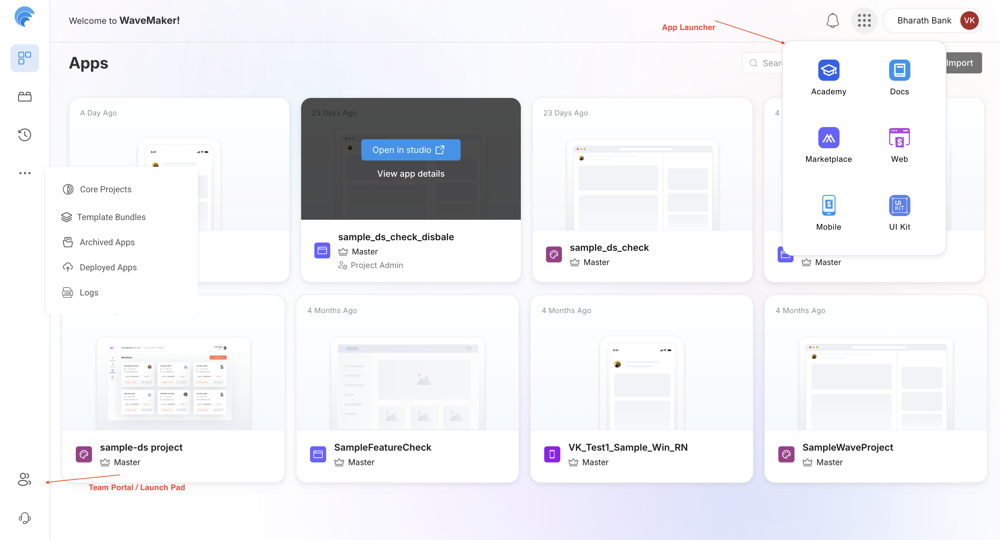

# Projects Collaboration

ProjectHub is the **central workspace in WaveMaker** where developers build, manage, reuse, deploy, and monitor applications. It provides a unified experience to handle the entire application lifecycle—from development to production—across web and mobile platforms.

## Overview

ProjectHub is built to support everyday development and collaboration needs. Developers typically use it to:

- Create and manage applications in one place
- Reuse shared assets such as prefabs and templates
- Manage team members and access permissions
- Organize applications by category
- Track deployed applications and their status
- View logs for troubleshooting and monitoring
- Move between tools quickly using the App Launcher

It is commonly used by developers, team leads, and administrators working on enterprise applications.

---

## Core Modules

ProjectHub is organized into a small set of focused modules. Each module addresses a specific part of the application lifecycle and team collaboration flow.

- **Apps** – Create and manage web and mobile applications  
- **Prefabs** – Reusable components shared across applications  
- **Team Portal** – Manage teams, users, and access  
- **Logs** – View application and system logs  
- **Deployed Apps** – Monitor applications running in environments  
- **App Launcher** – Entry point to platform tools and resources  

---

## Apps

The Apps section lists all applications that you have access to within the workspace. From here, you can view, create, and manage applications across different stages of development.

Applications in ProjectHub are grouped into the following categories:

- **Core Projects** – Foundational or platform-level applications used as a base for development
- **Archived Apps** – Applications that are no longer actively worked on but are retained for reference
- **Deployed Apps** – Applications that have already been deployed to one or more environments

ProjectHub supports both major application types:

- **Web Applications** – Applications designed for browser-based usage
- **Mobile Applications** – Native or hybrid applications built for mobile devices

Each app card shows basic details such as the application name, branch information, last update time, and app type.

---

## Prefabs

Prefabs are reusable UI and functional components that help reduce repetitive development work.

Developers typically use prefabs to standardize common features and maintain consistency across applications.

From the Prefabs section, you can:

- Browse available prefabs in the workspace
- Add prefabs to applications during development
- Configure prefab properties based on application needs
- Create and publish custom prefabs for reuse across projects

Learn more

- [Overview](/docs/user-interfaces/web/enterprise-capabilities/prefabs/overview)
- [Creating Prefab](/docs/user-interfaces/web/enterprise-capabilities/prefabs/create-prefab)
- [Packaging and Publishing](/docs/user-interfaces/web/enterprise-capabilities/prefabs/publishing)
---

## Team Portal

The **Team Portal** is used to manage collaboration across projects, provides a centralized view of users and their roles, making it easier to control access to applications and shared assets.

- Create and manage teams
- Add or remove users from teams
- Assign roles and permissions
- Control access to applications and prefabs

This helps ensure that the right people have the right level of access.

Learn more: [Team Settings](./team_management)

---

## Logs

The **[Logs](/docs/apis-and-services/testing-and-debugging/debugging#debugging-using-logs)** module provides visibility into application and system activity. It is commonly used during development, testing, and production support to understand what is happening inside an application.

---

## Deployed Apps

The **[Deployed Apps](/docs/apis-and-services/testing-and-debugging/debugging#debugging-deployed-applications)** module focuses on applications that are already running in environments. It helps teams track deployment status and monitor application health after release. This module is especially useful for tracking production and staging deployments.

---

## App Launcher

The **[App Launcher](/docs/user-interfaces/web/develop/create-web-app-project/project-structure)** is the global navigation menu in WaveMaker. It allows users to quickly switch between ProjectHub modules and other platform tools without leaving the current context.

---

## How ProjectHub Fits Together

| Stage | Module |
|------|--------|
| Build | Apps |
| Reuse | Prefabs |
| Collaborate | Team Portal |
| Deploy | Deployed Apps |
| Monitor | Logs |
| Navigate | App Launcher |

## Summary

ProjectHub acts as the **single source of truth** for application development and operations in WaveMaker. By combining development, reuse, deployment, monitoring, and collaboration into one workspace, it helps developers work more efficiently and maintain better visibility across projects.

---
