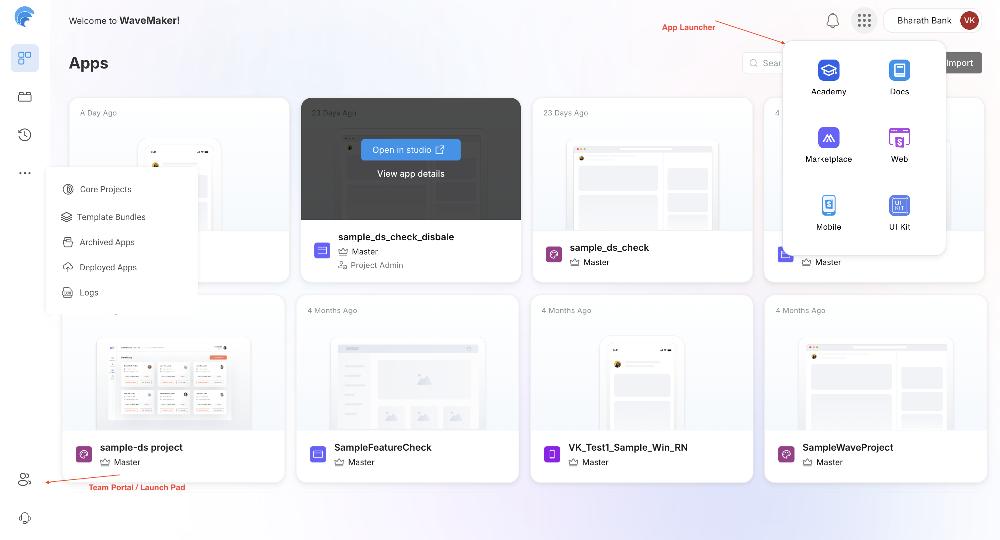

# Projects Collaboration

ProjectHub is the **central workspace in WaveMaker** where developers build, manage, reuse, deploy, and monitor applications. It provides a unified experience to handle the entire application lifecycle—from development to production—across web and mobile platforms.

## Overview

ProjectHub is built to support everyday development and collaboration needs. Developers typically use it to:

- Create and manage applications in one place
- Reuse shared assets such as prefabs and templates
- Control access through team-based permissions
- Track deployed applications and their status
- Diagnose issues using centralized logs
- Move between tools quickly using the App Launcher

It is commonly used by developers, team leads, and administrators working on enterprise applications.

## Core Modules in ProjectHub

ProjectHub is organized into a small set of focused modules. Each module addresses a specific part of the application lifecycle and team collaboration flow.

### Modules Overview

- **Apps** – Create and manage web and mobile applications  
- **Prefabs** – Reusable components shared across applications  
- **Team Portal** – Manage teams, users, and access  
- **Logs** – View application and system logs  
- **Deployed Apps** – Monitor applications running in environments  
- **App Launcher** – Entry point to platform tools and resources  

## Apps

The **Apps** module is where most development work starts in ProjectHub. It provides a consolidated view of all applications you have access to, making it easy to create new apps, import existing ones, and manage ongoing development. From this view, you can search, filter, and organize applications, as well as work with multiple branches for parallel development and releases.

Applications in ProjectHub are grouped into the following categories:

- **Core Projects** – Foundational or platform-level applications used as a base for development
- **Archived Apps** – Applications that are no longer actively worked on but are retained for reference
- **Deployed Apps** – Applications that have already been deployed to one or more environments

ProjectHub supports both major application types:

- **Web Applications** – Applications designed for browser-based usage
- **Mobile Applications** – Native or hybrid applications built for mobile devices

Each app card shows basic details such as the application name, branch information, last update time, and app type.

## Prefabs

Prefabs are reusable UI and functional components that help reduce repetitive development work.

Developers typically use prefabs to standardize common features and maintain consistency across applications.

### Why Use Prefabs
- Save time by reusing existing functionality
- Keep UI and behavior consistent
- Reduce long-term maintenance effort

### What You Can Do
- Browse available prefabs
- Add prefabs to your applications
- Configure prefab properties as needed
- Create and publish custom prefabs for reuse

## Team Portal

The **Team Portal** is used to manage collaboration across projects.

### What You Can Do
- Create and manage teams
- Add or remove team members
- Assign roles and permissions
- Control access to applications and shared assets

This helps ensure that the right people have the right level of access.

Learn more: [Team Settings](team_settings)

## Logs

The **Logs** module provides visibility into application and system activity.

It is commonly used during development, testing, and production support to understand what is happening inside an application.

### Types of Logs
- Application runtime logs
- Build logs
- Deployment logs

### Benefits
- Faster issue investigation
- Better understanding of failures
- Improved operational awareness

## Deployed Apps

The **Deployed Apps** module focuses on applications that are already running in environments.

### What You Can Do
- View all deployed applications
- Check application status and availability
- Monitor environment health
- Redeploy or roll back applications when required

This module is especially useful for tracking production and staging deployments.

## App Launcher

The **App Launcher** is the global navigation menu in WaveMaker.

It allows users to quickly switch between ProjectHub modules and other platform tools without leaving the current context.

### Accessible From App Launcher
- Academy
- Docs
- Marketplace
- Web
- Mobile
- UI Kit

The App Launcher helps reduce navigation overhead and keeps workflows smooth.

## How ProjectHub Fits Together

| Stage | Module |
|------|--------|
| Build | Apps |
| Reuse | Prefabs |
| Collaborate | Team Portal |
| Deploy | Deployed Apps |
| Monitor | Logs |
| Navigate | App Launcher |

## Summary

ProjectHub acts as the **single source of truth** for application development and operations in WaveMaker. By combining development, reuse, deployment, monitoring, and collaboration into one workspace, it helps developers work more efficiently and maintain better visibility across projects.

---
