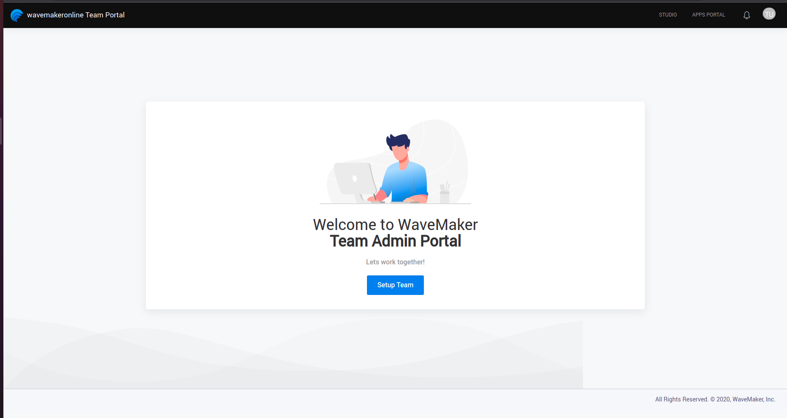

During the course of app development, tracking code changes and synchronizing the changes, in case of collaborated development, is of the essence. WaveMaker provides Version Control Services for this purpose. By default, WaveMaker Studio comes with a version control system that runs within your Platform Machine based on Gitlab. You can choose to add an external repo of your choice.

## Configure External VCS

- Supported Providers
  - [Gitlab](https://about.gitlab.com/)
  - [Bitbucket](https://bitbucket.org/product)
  - [Github](https://github.com/)
  - [Azure](https://azure.microsoft.com/en-us/services/devops/repos/)

- Select the TEAM PORTAL section on the top right corner.  

- Select on Setup Team.

- Select on Next.

- Select Code Repository that you want to store all your code and provide the required details. Select Save to save the changes. 

- After selecting **Add Code Repository**, select the repository type and provide the required details for adding the repository. As default providers, WaveMaker supports Gitlab, Bitbucket, Github and Azure for external VCS configuration. Select Save to save the changes. 

::: note

After you create a new VCS server and make it Primary if you wish to edit the projects from the old VCS server when you sync/push the changes they will be made to the old VCS server and not the new VCS server. Since the project references are to the old server, there is no relation with the new VCS server.
