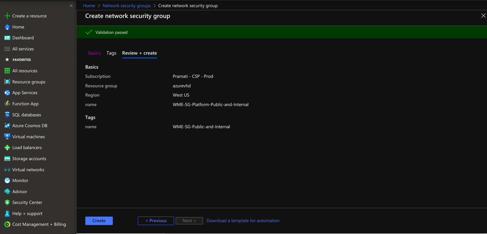
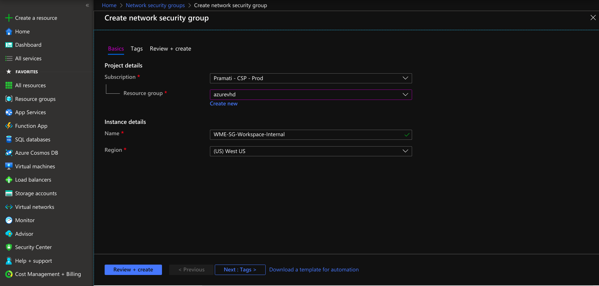
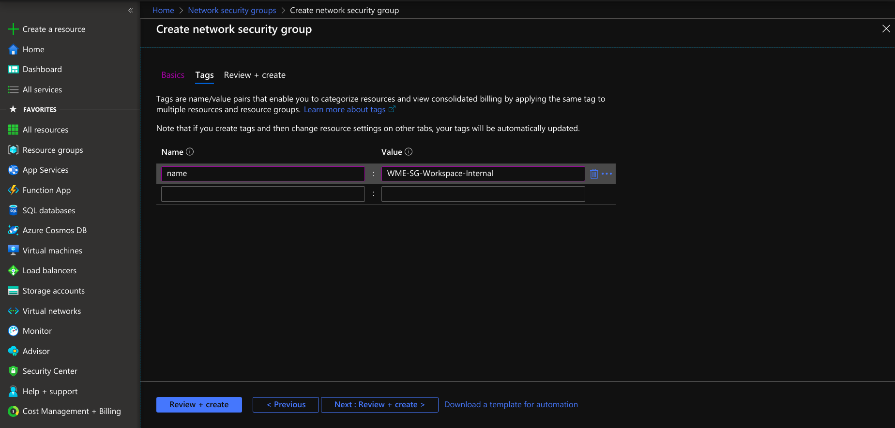
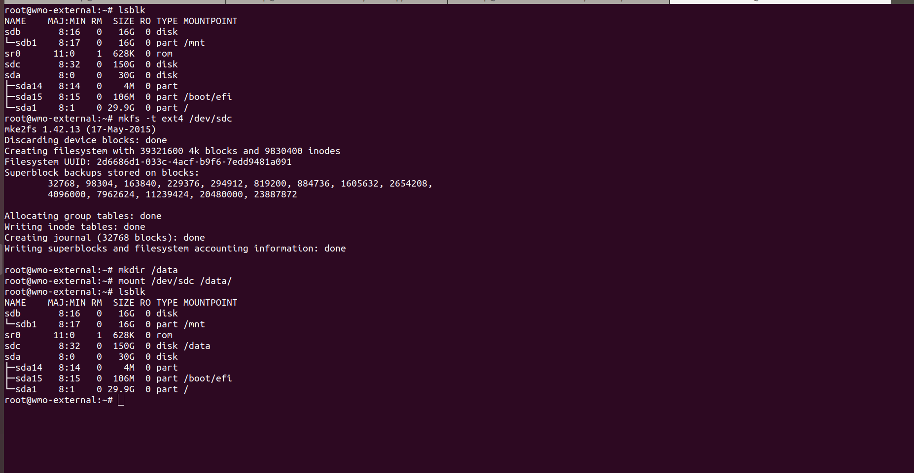

## Prerequisites

- Access to Azure to create VM and other resources. For more details, see [Azure resource documentation](https://docs.microsoft.com/en-us/azure/role-based-access-control/overview).
- An Azure Virtual Network (VNet) represents your network in the cloud. We are assuming an Azure Virtual Network (VNet) is already built or existed. For the creation of a virtual network, see [Azure Virtual Network Creation](https://docs.microsoft.com/en-us/azure/virtual-network/quick-create-portal).
- Create fixed vhd with ubuntu 16.04 OS.
- Install AzCopy for copying the files from local to Azure storage account container. For installing AzCopy to respective devices, see [Download AzCopy from Azure](https://docs.microsoft.com/en-us/azure/storage/common/storage-use-azcopy-v10).
- Install Azure CLI to login to the Azure account. For installing Azure CLI, see [Install Azure CLI from Azure](https://docs.microsoft.com/en-us/cli/azure/install-azure-cli?view=azure-cli-latest).
- Assuming storage account container is already created. If not done already, for creating the container, see [Creating a Container in Azure](https://docs.microsoft.com/en-us/azure/storage/blobs/storage-quickstart-blobs-portal).

## Creation of Network Security Groups

- For creating network security groups, see [Creating NSG in Azure](https://docs.microsoft.com/en-us/azure/virtual-network/manage-network-security-group).
- For WME setup in Azure, it requires two security groups , including:
  - [WME-SG-Platform-Public-and-Internal](#creating-network-security-group-for-platform-virtual-machine)
  - [WME-SG-Workspace-Internal](#creation-of-network-security-group-for-studio-workspaceapp-deployment-virtual-machine)
### Creating Network Security Group for Platform Virtual Machine

- Provide necessary information, including name and region, by selecting the resource group.

[](./assets/images/nsg-platform-basic-details.png)

- Provide tags that are name-value pairs for the network security group for categorizing the resources.

[](./assets/images/nsg-platform-tags.png)

- Create a network security group for a platform virtual machine with the provided information.

[](./assets/images/nsg-platform-review-and-create.png)

- After creating the network security group under settings, select inbound security rules, create a rule for developer network access and select protocol TCP and add a rule to a network security group.

[](./assets/images/nsg-platform-for-public-access.png)

- If you want ssh access to only desired networks, create another rule and provide your network IPs for ssh access.

- Create another rule to open additional ports to access a Platform Virtual Machine from the Studio Workspace/App Deployment Virtual Machine. Next, select a destination.

- If you select the destination as a virtual network, the security rule is applied to Virtual Machines irrespective of the virtual network of the platform Virtual Machine. If you choose the destination as an application security group, it applies only to the VMs connected to that application security group. If you select the destination as IP Addresses, the rules apply to the respected IP address resources. For more information, see [Filter Network Traffic in Azure](https://docs.microsoft.com/en-us/azure/virtual-network/tutorial-filter-network-traffic).

- Next, select protocol as TCP and select the **Allow** action. Provide **Priority** after the public access ports. Click save and add the rule to the network security group.

[](./assets/images/nsg-platform-internal-rule.png)

### Creation of Network Security Group for Studio Workspace/App Deployment Virtual Machine

Applies to Workspace Virtual Machine / AppDeployment Virtual Machine

- Provide necessary information, including name and region, by selecting the resource group.

[](./assets/images/nsg-external-basic.png)

- Provide tags that are name-value pairs for the network security group for categorizing the resources.

[](./assets/images/nsg-external-tags.png)

- Create a network security group for a platform virtual machine with the provided information.

[](./assets/images/nsg-external-review-and-create.png)

- Create a security rule to open additional ports to access the Platform Virtual Machine and select a destination. Note that restrictions apply to Virtual machines based on the destination selection.

- If you select the destination as a virtual network, the security rule is applied to Virtual Machines irrespective of the virtual network of the platform Virtual Machine. If you choose the destination as an application security group, it applies only to the VMs connected to that application security group. If you select the destination as IP Addresses, the rules apply to the respected IP address resources. For more information, see [Filter Network Traffic in Azure](https://docs.microsoft.com/en-us/azure/virtual-network/tutorial-filter-network-traffic).

[](./assets/images/nsg-external-internal-rule.png)

- If you want ssh access to only desired networks, create another rule and provide your network IPs for ssh access.

## Copying VHD File to Azure

- Generate SAS in a storage account.

[](./assets/images/generate-sas.jpg)

- Copy the VHD file from local to the respective created storage account container. Use the following example for copying the VHD to a container.
- AzCopy copy "localpath\filename.vhd", "container url and sas" --blob-type PageBlob

Example:

```bash
azcopy copy "C:\filename.vhd" "https://account.blob.core.windows.net/mycontainer1< generated sas >" --blob-type PageBlob
```

- The VHD file `WME-vhd-file.vhd` should be uploaded to the respected storage account container.

[](./assets/images/vhd-upload.png)

## Creating the Disk Using VHD File

- Specifying the project details for the disk creation.

[](./assets/images/disk-project-details.png)

- Create a disk by providing necessary details, selecting the source type as storage blob, and selecting the OS disk size.

[](./assets/images/disk-creation.jpg)

## VM Creation by Using The Disk

- Provide necessary information to create VM using a disk.

[](./assets/images/vm-vhd-basic.png)

- For Platform Virtual Machine, add root 50 GiB, storage 50 GiB. For wm-runtime, add 150 GiB and for wm-data, and if required add 50 GiB for /usr/local/content(/usr/local/content is optional not mandatory).
- For Studio Workspace/App Deployment Virtual Machine add root 50 GiB, storage 150 GiB for data.

[](./assets/images/vm-vhd-disks.png)

- Select create VM option at the left top. create VM providing required details disks and networking.
- At Configure network security group select WME-SG-Platform-Public-and-Internal for Platform Virtual Machine and select WME-SG-Workspace-Internal for Studio Workspace/App Deployment Virtual Machine(Workspace Virtual Machine / AppDeployment Virtual Machine).

[](./assets/images/vm-vhd-networking.png)

## Mounting Disks in Virtual Machines

### Mounting Disk in Platform Virtual Machines

- For ssh into the platform Virtual Machine use the following command.
- If you using the ssh key method for login use the following command.

```bash
ssh -i /path/to/ssh-privatekey username@ipaddress
```

- If you using the ssh username and password for login use the following command.

```bash
ssh username@ipaddress
```

- Check your list of block devices available by using the following command.

```bash
lsblk
```

- New volumes are raw block devices, and you must create a file system on them before you can mount and use them. For creating file systems use following command.

```bash
Command : mkfs -t ext4 /dev/<block-device-name_1>
      mkfs -t ext4 /dev/<block-device-name_2>
Example :
    mkfs -t ext4 /dev/sdd
    mkfs -t ext4 /dev/sdc
```

- Use the `mkdir` command to create a mount point directory for the volume. The mount point is where the volume is located in the file system tree and where you read and write files after you mount the volume. For WME-Setup, create two directories using the following commands.

```bash
mkdir /wm-data /wm-runtime
```

- Use the following command to mount the volume at the directory.

```bash
Command :  
mount /dev/<block-device-name_1>    /wm-data
mount /dev/<block-device-name_2>    /wm-runtime  
Example :
mount /dev/sdc    /wm-data
mount /dev/sdd    /wm-runtime  
```

[](./assets/images/platform-instance-mounting-volumes.png)

- To mount an attached Azure Disks on every system reboot, add an entry for the device to the /etc/fstab file.
- Take UUID of disks for identification by using the command.

```bash
blkid
```

- Entry the UUID of the disks in fstab.use the following format.

```bash
UUID=your-block-device-UUID      /wm-data        ext4     defaults ,nofail  0  2
UUID=<block-device_1-UUID>       /wm-runtime     ext4     defaults ,nofail  0  2
```

[](./assets/images/vm-fstab.png)

### Mounting Disks in Workspace Virtual Machine/AppDeployment Virtual Machine

:::note
Applies for StudioWorkspace Virtual Machine/AppDeployment Virtual Machine
:::

- For ssh into the platform Virtual Machine use the following command.
- If you using the ssh key method for login use the following command.

```bash
ssh -i /path/to/ssh-privatekey username@ipaddress
```

- If you using the ssh username and password for login use the following command.

```bash
ssh username@ipaddress
```

- Check your list of block devices available by using the following command.

```bash
lsblk
```

- New volumes are raw block devices, and you must create a file system on them before you can mount and use them. For creating file systems use following command.

```bash
Command: mkfs -t ext4 /dev/< block-device-name >
Example: mkfs -t ext4 /dev/sdc
```

- Use the `mkdir` command to create a mount point directory for the volume. The mount point is where the volume is located in the file system tree and where you read and write files after you mount the volume. For WME-Setup, create two directories using the following commands.

```bash
mkdir /data
```

- Use the following command to mount the volume at the directory.

```bash
Command: mount /dev/block-device-name    /data
Example: mount /dev/sdc  /data
```

[](./assets/images/vm-external-mounting-volumes.png)

- To mount an attached Azure Disks on every system reboot, add an entry for the device to the /etc/fstab file.
- Take UUID of disks for identification by using the command.

```bash
blkid
```

- Entry the UUID of the disks in fstab.use the following format.

```bash
UUID=your-block-device-UUID      /data     ext4     defaults ,nofail  0  2
```

[](./assets/images/vm-external-fstab.png)

## What's next

- Install [prerequisites softwares](../../common-steps/install-prerequisites.md) based on OS.
- Start WME Installation process
