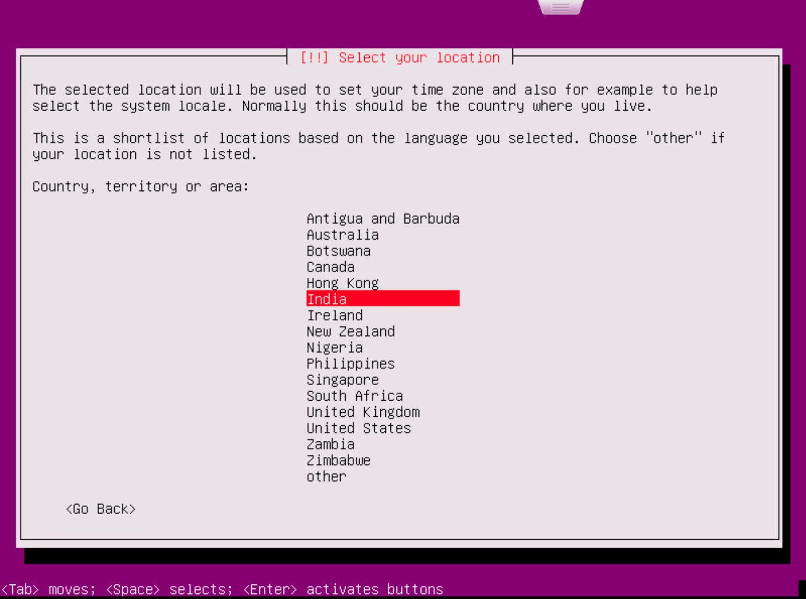
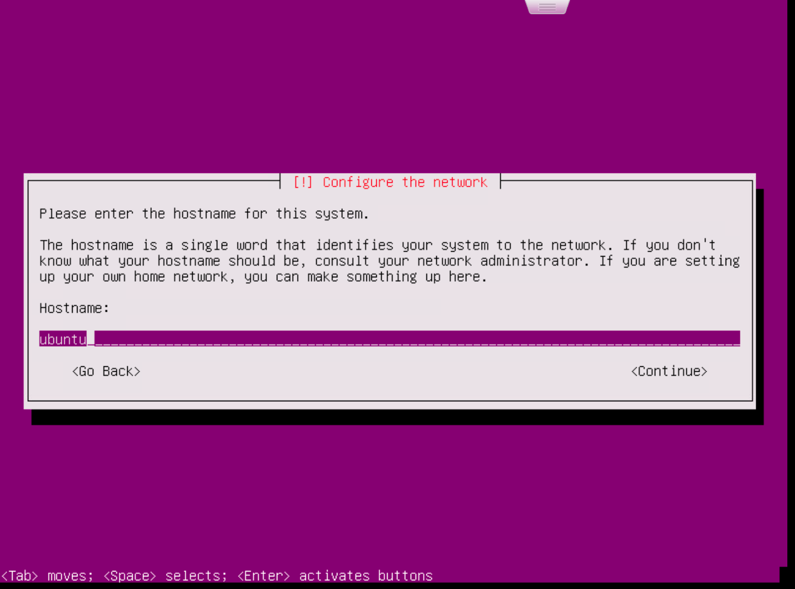
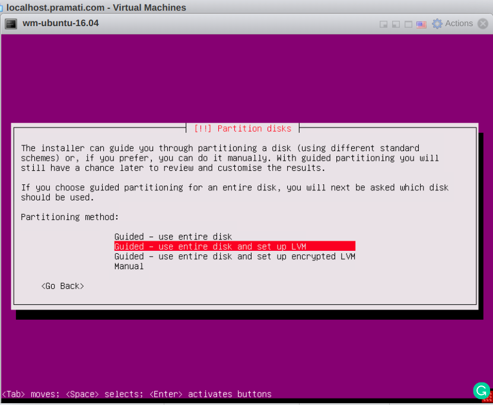
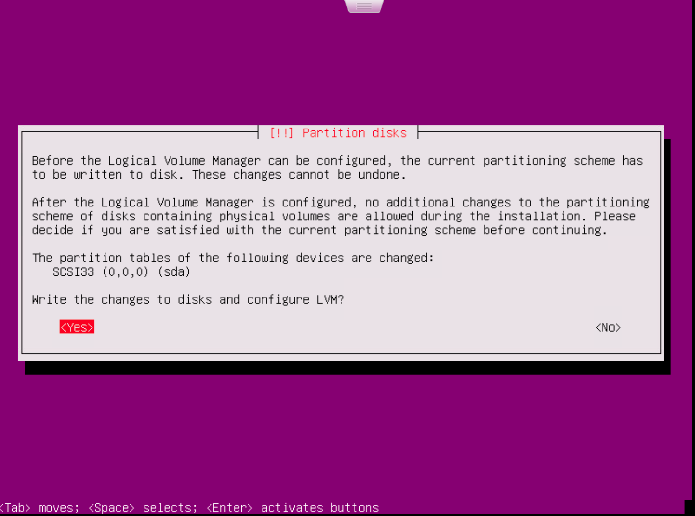
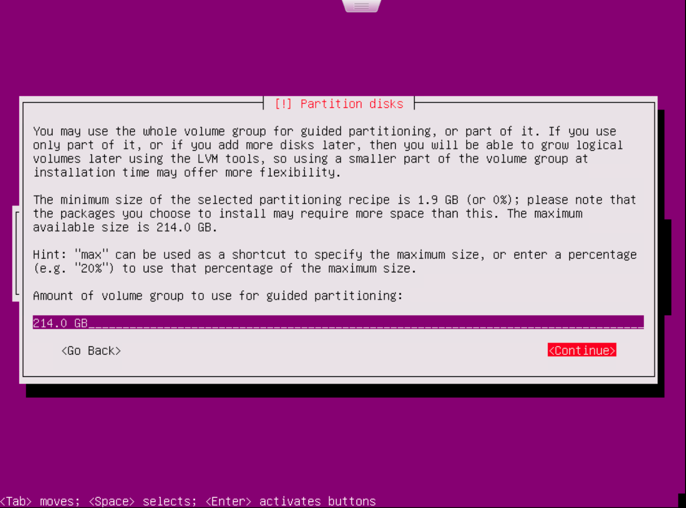

## Prerequisite

- Ubuntu ISO file from internet.
- Link for download the image of
[ubuntu 16.04.6 iso image](http://releases.ubuntu.com/16.04/ubuntu-16.04.6-server-amd64.iso).
- VMWare ESXi version 6.5 or higher.
- Permission for launching machines in Esxi.

:::note
This guide has written based on Esxi version 6.5.
:::

## Launch Platform Instance

- Upload ubuntu server iso image to the database store.
- Select Create / Register VM.
- Select creation type as a new virtual machine.

[](./assets/images/selecting-vm-creation-type.png)

- Select name and guest os, select os family as Linux and guest os version as ubuntu Linux 64bit.

[](./assets/images/selecting-the-name-and-guest-os.png)

- Select a database in which to store configuration and data store.

[](./assets/images/selecting-the-database.png)

- Customize virtual machine hardware, additional options and upload file from datastore.after creating the VM power ON the VM and proceed to next operation.

[](./assets/images/customize-settings.png)

- Select the language to perform the further operation.

[](./assets/images/selecting-language-for-process.png)

- Select install ubuntu server to start installation process.

[](./assets/images/ubuntu-server-installation.png)

- Select the language for system.

[](./assets/images/selecting-the-language-for-system.png)

- Select your location.

[](./assets/images/selecting-location.png)

- Configure the keyboard by selecting a language.
- Provide hostname for the system to configure the system.

[](./assets/images/selecting-the-host-name.png)

- Setup users and password details for server, provide the username as ubuntu.

[](./assets/images/username-and-password-setup.jpg)

- Configure the clock.

[](./assets/images/configuring-the-clock.png)

- Select the disk partition method.

[](./assets/images/disk-partition-method.png)

- Select the disk to partition.

[](./assets/images/selecting-disk-to-partition.png)

- Choose the option to write changes to disk and configure.

[](./assets/images/selecting-option-for-writting-changes-to-disk.png)

- Select amount of volume to do the partition.

[](./assets/images/selecting-volume-size-for-partition.png)

- If you have any proxy provide proxy details.

[](./assets/images/proxy-information.png)

- Select option to manage upgrades on your system.

[](./assets/images/managing-upgrades.png)

- Choose an option to install or not grub boot loader to the master boot record.

[](./assets/images/installing-grub-loader.png)

- Wait for few moments to complete the installation process, then login into system by providing username and password.
- For connecting from terminals via ssh, install openssh-server and check the status.
  Below are the commands.

```shell
sudo apt-get install openssh-server -y
sudo systemctl start ssh
sudo systemctl status ssh
```

## Launch StudioWorkspace Instance / AppDeployment Instance

- Use same procedure for StudioWorkspace Instance / AppDeployment Instance.

## Security and Networking

- Do one of the two things below.
  - All traffic opened between Platform Instance and StudioWorkspace Instance / AppDeployment Instance.
  - Configure security rules as per Prerequisites.
