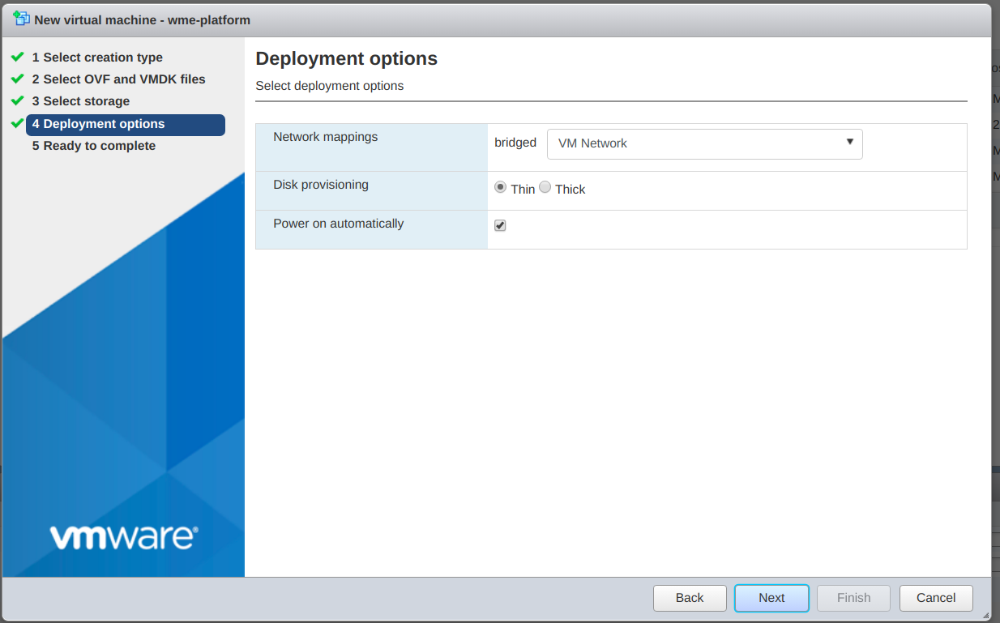

## Prerequisites

- Platform OVA file shared by WaveMaker team.
- StudioWorkspace Instance / AppDeployment Instance OVA file shared by WaveMaker team.
- VMWare ESXi version 6.5 or higher.
- Permission for launching OVA.

:::note
This guide has written based on Esxi version 6.5.
:::

## Launch Platform Instance

- Login into VMWare ESXi Server using  Server IP address and user credentials.
- Select Create/Register VM for creating the new virtual machine.
- Select creation type as deploy a virtual machine by from an OVF or OVA file.

- Select OVF or OVA file for VM would like to deploy. User Platform Instance OVA.

- Select the database in which to store the configuration and disk files.

- Select deployment options like networks mappings, disk provisioning, etc.

- Review your selected configuration and settings, then click on the finish for creating the virtual machine.

- Wait for few moments for complete successfully the creation of virtual machine.

## Launch StudioWorkspace Instance / AppDeployment Instance

- Use same procedure for StudioWorkspace Instance / AppDeployment Instance- Use StudioWorkspace Instance / AppDeployment Instance OVA.

## Security and Networking

- Do one of the two things below.
  - All traffic opened between Platform Instance and StudioWorkspace Instance / AppDeployment Instances.
  - Configure security rules as per Prerequisites.
