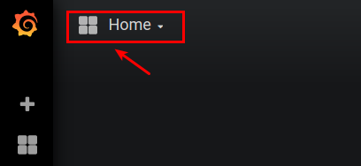
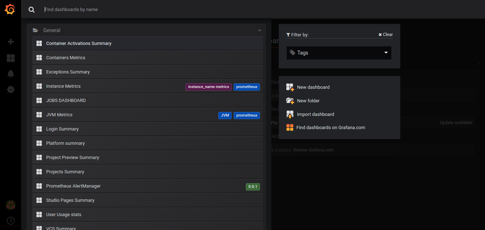

*Grafana* is a Dashboard creation and visualization tool. All the metrics from Prometheus can be accessed by Grafana and complex dashboards can be created from those metrics.

This is very useful because you do not need to type in Prometheus queries every time. A *Dashboard* is created once and is accessed multiple times.

## How to access Grafana

1) After the WaveMaker login, open the Launchpad and click the Troubleshoot located on the bottom left as shown below.

2) In the dial menu, click the "**grafana**" button as shown below

3) It opens the grafana home page, which should look like the below image

4) You can access the dashboards by clicking the "**home**" button at the top left

5) You should be able to see the list of dashboards as shown in the below image.

## Available Dashboards

WaveMaker contains the following list of dashboards

### Platform specific

| Dashboard   | Description |
| ----------- | ----------- |
| Platform Summary | Complete platform status |
| Instance Metrics | Dashboard showing Instance CPU, RAM, disk, etc |
| Container Metrics | Container CPU, RAM and Network status |
| Alert Manager | Alerts triggered in platform |
| JVM Metrics | JVM summary of all containers |

### WaveMaker specific

| Dashboard   | Description |
| ----------- | ----------- |
| User Usage Stats | Seven days user platform usage trend |
| Container Activation | Container Activation summary |
| Exceptions Summary | Exceptions seen across platform |
| Jobs Dashboard | Platform jobs summary |
| Login Summary | Platform login success and failure counts |
| Project Preview Summary | Project preview success and failure counts |
| Projects Summary | Project usage summary |
| Studio Pages | WaveMaker app page creation and load summary  |
| VCS Summary | WaveMaker user VCS activity summary  |
