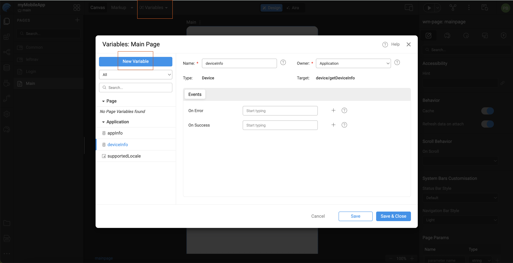

# Variables and Types

In WaveMaker, variables are used to manage data and actions within an application. They act as the bridge between the UI, backend services, and application state.

Variables can fetch data, store values, invoke services, and respond to user actions. They are tightly integrated with UI widgets through data binding.

---

## What is a Variable in WaveMaker?

A **variable** in WaveMaker is a configurable entity used to:

* Store data
* Fetch data from databases or services
* Bind data to UI components
* Trigger actions (create, update, delete, fetch)
* Maintain application or page state

Variables act as the **data and action layer** between the UI and backend services.

---

## Variable Scope

WaveMaker variables are scoped at different levels depending on where they are created:

### 1. App-Level Variables

* Available across the entire application
* Useful for shared data (logged-in user info, global settings)

### 2. Page-Level Variables

* Available only within a specific page
* Destroyed when the user navigates away from the page
* Ideal for page-specific data and actions

---

## Types of Variables in WaveMaker

When creating a variable in WaveMaker, you can select the target action based on the type of data source or service you want to interact with. Each variable type is designed to simplify data handling and integration with the appropriate backend or frontend logic.

| Variable Type      | Description |
|-------------------|-------------|
| **Database CRUD**  | Enables Create, Read, Update, and Delete (CRUD) operations on database tables. Strongly typed according to the database schema to ensure consistency and reduce errors. |
| **Imported APIs**  | Used to consume APIs imported via Swagger or OpenAPI definitions. Operations and data models are automatically generated for seamless integration with external services. |
| **Database APIs**  | Invokes custom database queries, stored procedures, or APIs exposed from the database layer. Ideal for advanced database interactions beyond standard CRUD operations. |
| **Web Service**    | Integrates external REST or SOAP web services. Perfect for connecting with third-party systems and leveraging external functionality. |
| **Java Service**   | Calls custom Java services implemented in the backend. Ideal for executing complex business logic or backend computations. |
| **Security Service** | Handles authentication, authorization, and other security-related operations such as login, logout, and user management. |
| **Device Variable** | Exposes device-specific features and state for mobile applications, enabling interaction with native capabilities such as camera, network, and storage. |

## Creating Variables

Variables are created from the Variables section in WaveMaker Studio and can be defined at either the App or Page level.

### Steps
1. Open the **Variables** tab at the Page level.
2. Click **Add Variable**.
3. Select the required variable type.
4. Configure the variable properties and provide a meaningful name.
5. Bind or trigger the variable using UI events or page lifecycle actions.

---

## Binding Variables

Binding variables connects data or actions to UI components, enabling dynamic behavior in the application.

Variables can be bound in the following ways:
- **Data Binding**: Bind variable data directly to widget properties (for example, binding a list to a table).
- **Event Binding**: Trigger variables on UI events such as `onClick`, `onLoad`, or `onChange`.
- **Page Lifecycle Binding**: Execute variables automatically during page load using auto-execute or page events.

Variable binding allows the UI to display, update, and react to data seamlessly.

---

## Summary

Variables are the backbone of data flow in WaveMaker applications. Understanding the different variable types and scopes helps in building scalable, maintainable, and efficient applications.

Choosing the right variable type ensures better performance, cleaner design, and easier debugging.
