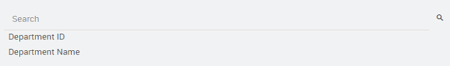
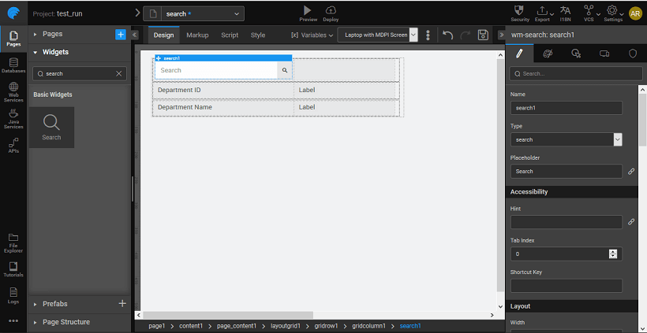

WaveMaker allows you to add search capability via the **search widget**. Following are the steps in using the same. We will use the search widget to search the <!-- <!-- [**Department database from the sample HRDB imported earlier**](/learn/app-development/services/database-services/working-with-databases/#integrating-database) --> --> and display the department id and name.

[](./assets/img/search_run1.png)

[](./assets/img/search_run2.png)

[](./assets/img/search_run3.png)

1. Drag and drop a **search**, and four **label** widgets on a page. We have used the grid layout here. [](./assets/img/search_design.png)
2. <!-- <!-- [Import the sample database](/learn/app-development/services/database-services/working-with-databases/) --> -->. [Create a Variable](../assets/img/var_sel.png) based on the database CRUD APIs auto-generated when the database is imported. [](./assets/img/search_lv.png)
3. Bind the **Value** dataset property of the search widget to the department variable created in the previuos step. [](./assets/img/search_bind.png)
4. Set the **Search key** and **Label Value** properties to the column name you want to search by, in this case, _name_. **Note**: The Search Key, Label Value, and Image Source are bindable. For example, the Label Value can be bound in this case to 'deptcode+name', using the expression option from the binding dialog. [](./assets/img/search_props.png)

You can capture the result of the Search widget in two ways:

1. Using the **outbound properties** of **data value** - which contains the dataset returned by the search to be bound to the list or Data Table, **query** - search text entered by the user and **show**. [](./assets/img/search_outbound.png)
2. Using **JavaScript** - From the event tab, set the **onSubmit** event to JavaScript. [](./assets/img/search_event.png) In the Script the following function will be created The selected item can be accessed by '$event.data.item' property as follows: Here we have set the labels to the department name and id returned by the search widget. NOTE: The label names might vary in your project.

```javascript
Page.search1Submit = function($event, widget) {
        Page.Widgets.label3.caption = $event.data.item.deptid;
        Page.Widgets.label4.caption = $event.data.item.name;
    };
```
    
3. Save and run the application.
4. The page will display the search widget along with the labels.
