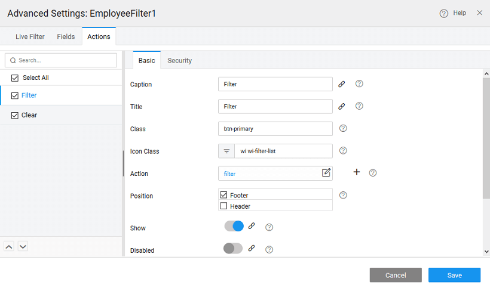

---

## Configuring filter actions

**Actions** to be performed can be mentioned from the **Actions** tab, by default filter and clear buttons are provided. You can add custom actions to your filter. Multiple events can be triggered by a given action. Note: If a custom column/action is not selected, it will be deleted when the Filter Designer is saved.

