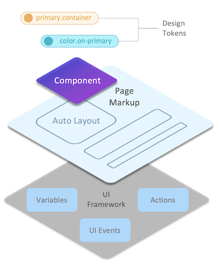

# Overview

WaveMaker Platform provides 
- well-architected UI framework
- a comprehensive component library and
- Design System

which enable web app developers to build applications using simple and abstracted set of UI concepts. App developers with essential skills in HTML, CSS & JavaScript are empowered to build complex, scalable and enterprise-grade web applications using WaveMaker.

Platform uses component-based architecture and a meta markup known as WaveMaker Markup Language (WML) to represent components within a page similar to HTML, which is used by code generators to generate Angular or React code.

## UI Concepts

Web App UI is very well separated into layers to define styling, layouts, components and client-side logic. WaveMaker open source component library provides a comprehensive set of components for building enterprise-grade forms, dashboards, portals etc. with scalable, secure and modern experience needs.



### Design Tokens
Styling is made easy through design tokens that can be customized to any Design System. Components built as part of the library enable built-in style customization through design tokens, completely eliminating CSS for most styling needs.

```json
   btn.background=color.primary
   btn.height=space.10

   header.padding=space.0
   header.border.radius=radius.none

   search.dropdown.menu.item.color=color.secondary
   wizard.step.title.color=color.on-surface
   breadcrumb.item.letter-spacing=body.medium.letter-spacing
```

### Auto Layout
Layouts can be created within a page or components using container Auto Layout, which provides the most advanced and fully customized layouting capability built on top of flex.

```html
    <wm-container direction="column" alignment="top-left" gap="8" width="fill" 
            name="container6" class="app-container-default" variant="default" 
            wrap="false" clipcontent="false" padding="4px">
        ...
    </wm-container>
```

### Components
Components provide behaviour customization through properties, events for UI event handling and variants to enable look-n-feel customization combined with design tokens.

```html
    <wm-button class="btn-filled btn-default" caption="Button" type="button" 
            margin="unset" name="button1" variant="filled:default"
            on-click="button1Click($event, widget)">
    </wm-button>
    <wm-switch datavalue="yes" name="switch2"
            dataset="bind:Variables.switchVarData.dataSet[$i].dataValue">
    </wm-switch>
    <wm-progress-bar datavalue="50" name="progress_bar3" 
            class="app-progress progress-bar-default" variant="filled:default">
    </wm-progress-bar>
```

### Variables
Variables provide integration capabilities enabling components to be bound to REST APIs or other supported data sources. Variables also inherently support managing state within the page context or across the application

```json
    sv_serviceVariableHireReq: {
        owner: "Page",
        category: "wm.ServiceVariable",
        ...
        service: "hirerequisition",
        operation: "invoke",
        operationId: "hirerequisition_invoke",
        operationType: "get",
        serviceType: "RestService",
        dataSet: [],
        isList: true,
        maxResults: 20,
        startUpdate: true,
        autoUpdate: true,
        inFlightBehavior: "executeLast",
        ...
    }
```

### Actions
Actions provide routing capability to transition between pages, dialogs, notifications or messages.
```json
    goToPage_FormComponents : {
        name : "goToPage_FormComponents",
        owner : "App",
        category : "wm.NavigationVariable",
        dataBinding : [ ],
        operation : "gotoPage",
        pageName : "FormComponents",
        dataSet : [ ],
        pageTransitions : "none"
    }
```

### Events

Events in WaveMaker UI framework enable app developers to handle complex UI interactions across components, handle pre/post processing of data from API calls and fully customize application experience.

With events, developers can write client-side logic using JavaScript to fully customize application behaviour and take control of the user interactions.
```javascript
    Page.button1Click = function ($event, widget) {
        Page.Widgets.select1.dataset = ["min", "max", "same"]
        Page.Widgets.switch1.datavalue = "max"
    };

    Page.switch1Change = function ($event, widget, newVal, oldVal) {
        console.log('switch change')
        Page.Variables.MyService.invoke({
            value: newVal
        })
    };
```

## Single Page Application

Application code generated in Angular or React adheres to Single Page Application (SPA) and uses architectural principles from the underlying javascript framework such as components, routing, state management, dependency injection, virtual-DOM or 2-way binding etc. Platform generated code is readable, maintainable and secure for enterprise deployments.

UI concepts are AI-ready enabling agents to generate application artifacts from the intent, spec or designs provided by app developers.