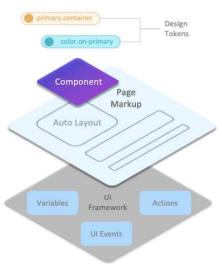

# Overview

## Building Web Apps

WaveMaker Platform provides 
- well-architected UI framework
- a comprehensive component library and
- Design System

which enable web app developers to build applications using simple and abstracted set of UI concepts. App developers with essential skills in HTML, CSS & JavaScript are empowered to build complex, scalable and enterprise-grade web applications using WaveMaker.

Platform uses component-based architecture and a meta markup known as WaveMaker Markup Language (WML) to represent components within a page similar to HTML, which is used by code generators to generate Angular or React code.

UI concepts are AI-ready enabling agents to generate application artifacts from the intent, spec or designs provided by app developers. Developers are provided with a hybrid approach for building apps
- Visually through Studio
- Using prompts through Agents and 
- manually editing code in editor.

## UI Concepts

Web App UI is very well separated into layers to define styling, layouts, components and client-side logic. WaveMaker open source component library provides a comprehensive set of components for building enterprise-grade forms, dashboards, portals etc. with scalable, secure and modern experience needs.

WaveMaker provides a technology agnostic UI development methodology without requiring app developers to learn the underlying javascript frameworks i.e., Angular, React or React Native. Both web and mobile app developers embrace a unified development model with the same UI concepts for building apps.




### Design Tokens
Styling is made easy through design tokens that can be customized to any Design System. Components built as part of the library enable built-in style customization through design tokens, completely avoiding CSS for most styling needs.

```
   btn.background=color.primary
   btn.height=space.10
   btn.font-size=label.large.font-size

   header.padding=space.0
   header.border.radius=radius.none
```

### Auto Layout
Layouts can be created within a Page or components using container Auto Layout, which provides the most advanced and fully customized layouting capability built on top of flex.

```
    <wm-container direction="column" alignment="top-left" gap="8" width="fill" 
            name="container6" class="app-container-default" variant="default" 
            wrap="false" clipcontent="false" padding="4px">
        ...
    </wm-container>
```

### Components
Components provide behaviour customization through properties, they expose specific events for UI event handling and Variants to enable look-n-feel customization combined with design tokens.

```
    <wm-button class="btn-filled btn-default" caption="Button" type="button" 
            margin="unset" name="button1" variant="filled:default"
            on-click="button1Click($event, widget)">
    </wm-button>
    <wm-switch datavalue="yes" name="switch2"
            dataset="bind:Variables.switchVarData.dataSet[$i].dataValue">
    </wm-switch>
    <wm-progress-bar datavalue="50" name="progress_bar3" 
            class="app-progress progress-bar-default" variant="filled:default">
    </wm-progress-bar>
```

### Variables
Variables provide integration capabilities enabling components to be bound to REST APIs or other supported data sources. Variables also inherently support managing state within the page context or across the application

```
    sv_serviceVariableHireReq: {
        owner: "Page",
        category: "wm.ServiceVariable",
        ...
        service: "hirerequisition",
        operation: "invoke",
        operationId: "hirerequisition_invoke",
        operationType: "get",
        serviceType: "RestService",
        dataSet: [],
        isList: true,
        maxResults: 20,
        startUpdate: true,
        autoUpdate: true,
        inFlightBehavior: "executeLast",
        ...
    }
```

### Actions
Actions provide routing capability to transition between pages, dialogs or messages.

### UI Events
UI Events are provided across Components, Variables, Actions and Page or Application context enabling developers to write client-side logic to fully customize and take control of the user behaviour.
```
    Page.button1Click = function ($event, widget) {
        Page.Widgets.select1.dataset = ["min", "max", "same"]
        Page.Widgets.switch1.datavalue = "max"
    };
```

## Single Page Application

Application code generated in Angular or React adheres to Single Page Application construct and uses architectural principles such as components, routing, state management, virtual-DOM or 2-way binding etc. Platform generated code is readable, maintainable and secure for enterprise deployments.
