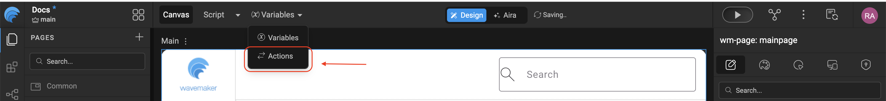
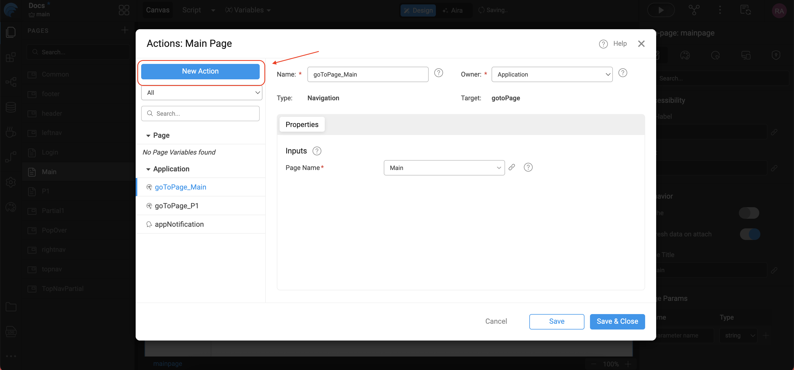
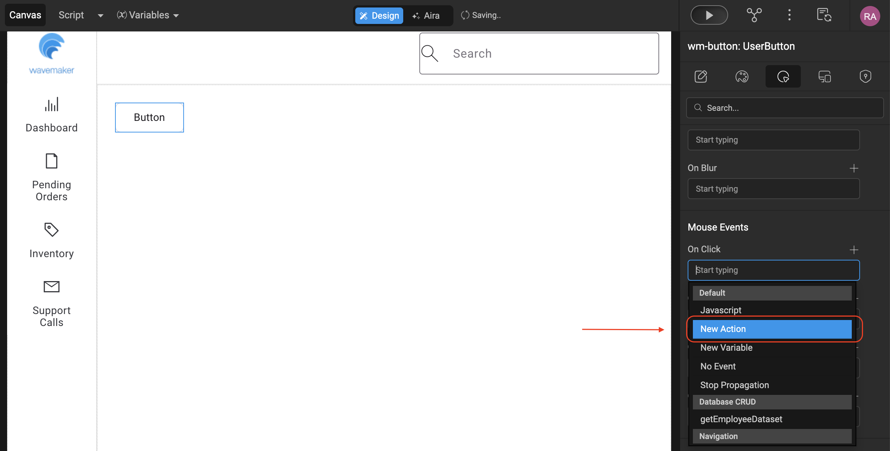
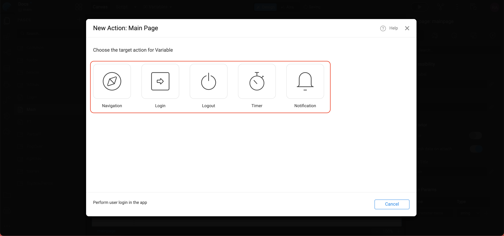

# Overview

## Actions in WaveMaker

In WaveMaker, Variables and Actions together form the integration layer between the frontend user interface and backend services. While variables primarily manage data retrieval and binding for UI widgets, Actions define the behavior and execution flow of the application.

Actions are responsible for executing tasks in response to events and orchestrating interactions between the UI, variables, and application logic.

## What Are Actions?

Actions represent operations performed by the application when an event occurs. These operations can be triggered by:
- User-initiated events (such as clicking a button or submitting a form)
- System-driven events (such as successful completion of a service call)
Actions enable developers to implement business logic, rules, and navigation flows without tightly coupling them to UI components.

## Action Creation
There are two ways of creating a Action
- Select the Action option from Variables on the Workspace Toolbar

- Click New Action from the Actions dialog.

- or as a New Action event on any component

- In both the cases, a New Action dialog will open.

### Action Types
- **Navigation:** action provides navigation capabilities to help in navigating from one page or view to another
- **Login:** action is to authenticate a user at the server. A Login Action is created automatically when you enable Security in your application
- **Logout** action
- **Timer:** action can be used to trigger events repeatedly at timed intervals.
- **Notification:** is an action to show UI notifications in the app in the form of a toaster, alert or a confirmation box

