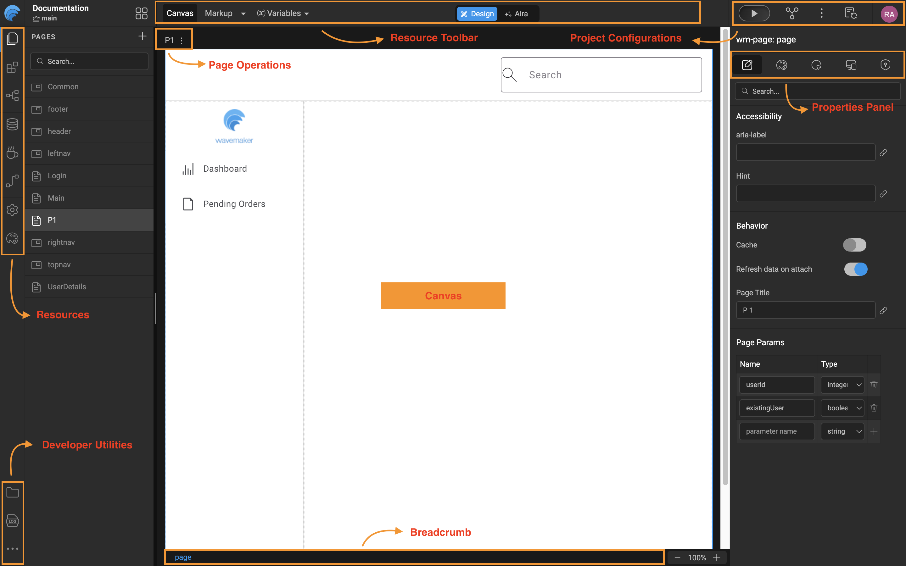

# Walkthrough

## WaveMaker Project Workspace
When you create a new application or open an existing one in WaveMaker Studio, you are taken to the Project Workspace.
The Project Workspace is the central area where you design UI, configure services, manage resources, and control project settings.

### Project Workspace Overview
The Project Workspace is divided into the following major sections:

#### Studio Left Navigation
The Left Nav provides access to all **application resources and developer utilities**.

- **Resources**: Each resource opens its own Resource Explorer (as nested item in left nav).
  - Pages
  - Building Blocks
  - Page Structure
  - Databases
  - Java Services 
  - View Project and Team Published API's 
  - Settings
  - Style

- **Developer Utilities**
  - File Explorer – View project files
  - Logs – Application and server logs
  - App Resources
    - Update Sources
    - App.css
    - App.js
    - Issues

#### Studio Header
The Header provides access to all frequently used actions and global project operations.
  - Wavemaker Logo (Naviagtes back to projects)
  - Project name and Branching
  - Recently Accessed Items
  - Resource Toolbar 
    - Canvas
    - Canvas view switch (Markup, Script, Style)
    - Variables | Actions
    - Design Mode (Visual development)
    - AIRA (AI assisted development)
  - Project Configurations
    - Previewer
    - Sync Project Changes
      - Pull changes
      - Push changes
      - View Changes
      - Commit History
      - Push to external Repo
      - Open in VCS
    - Export Project
      - Export
        - Project Sources as ZIP
        - Project as Angular ZIP
        - Project as React ZIP
        - Project as WAR (Development | Deployment)
        - Theme to Team
      - Publish
        Publish to Teams as CORE
      - Deploy
    - Updates (Project Notifications)
    - User Profile
      - User Details 
      - Logout
      - About Studio

#### Studio Top Navigation
The Top Nav appears only when a page is selected and has below page operations.
  - WaveMaker Generated Pages
    - Duplicate
    - Ch ange Layout
  - User created Pages
    - Rename
    - Duplicate
    - Delete
    - Change Layout

#### Canvas (Design Area)
The Canvas occupies the majority of the workspace and is used to design and edit pages visually.
  - Displays the selected page UI
  - Allows drag-and-drop of components
  - Shows real-time layout and styling changes

#### Component Breadcrumb & Page Adjustments (Bottom of Canvas)
  - The Component Breadcrumb shows:
    - The hierarchy of the currently selected component
    - The active component context in Properties Panel
    - Quick navigation to parent containers
  - Page Adjustments (Sets zoom percentage of Page )

#### Properties Panel (Right Side)
The Properties Panel allows configuration of the selected page or component.
  - Properties – Data binding, behavior
  - Styles – Layout and appearance
  - Events – Client side logic
  - Device – Responsive behavior
  - Security – Role based access

