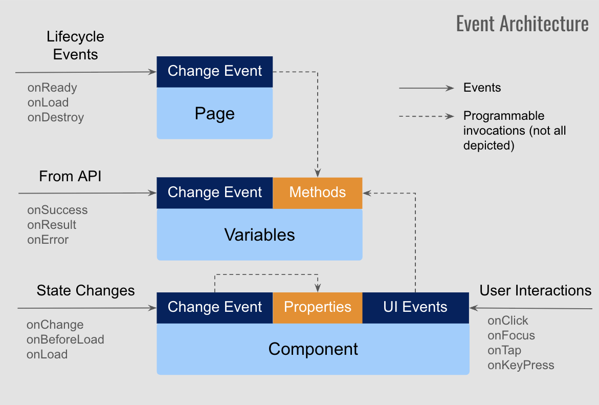

# Overview

WaveMaker uses a layered, event-driven architecture where Pages, Variables, and UI Components enable events for lifecycle, state changes and user actions to build complex UI interactions. Events allow pre- and post-processing of API invocations and UI component lifecycle, enabling developers to programatically handle state and data changes across the application.

### Event Types
There are 4 broad categories of events:
1. Application and Page lifecycle events
2. Variable invocation callback events - used for pre and post-processing on API calls
3. UI Component state change and callback events - triggered by UI framework across Components
4. UI Events - initiated by user interaction with Components (*depicted to the right in the below image*)

### Application and Page Lifecycle events
**App-level Events** are tied to the overall application lifecycle. They are invoked when the app starts, initializes or shuts down and are typically used for global setup, configuration, or cleanup logic.
    - onPageReady
    - onAppVariablesReady
    - onSessionTimeout
    - onServiceError

**Page-level Events** are associated with individual pages. They are invoked during page load, render, or navigation, and are commonly used to handle page-specific logic like fetching data or initializing variables.
    - onReady
    - onDestroy
    - onResize
    - onAttach
    - onOrientation.

### Variable invocation callback events
Variables are associated with underlying REST API and provide events to handle pre and post-processing for the API call invocations. This enables customizing the raw response data returned by the API, before passing on to the Component to render.
    - onBeforeUpdate
    - onResult
    - onBeforeDatasetReady
    - OnSuccess
    - OnError
    - OnCanUpdate

### Component state change & callback events
Each Component provides various state change or callback events specific to the component's behaviour such as Form submit, List reorder, Chips add or remove etc. These events are deeply integrated with the functionality exposed by individual components and are different from UI Events.

Not all components have state change events, for example a Button component already has UI Events such as onClick, onDblclick etc. to program the interactions, where as Toggle component exposes onChange event to handle user interactions.
    - onChange
    - onSubmit
    - onLoad
    - onSelect
    - onBeforeLoad etc.

### UI Events across Components
**Component specifc UI Events** are triggered by user interactions with UI components such as click, double click, mouse enter / leave or keystroke input changes. These events are available to handle interactive behavior specific to each individual component such as Button, Form Input, DropDown etc.
    - onClick, onDblclick
    - onFocus, onBlur
    - onMouseenter, onMouseleave
    - onKeyPress, onKeyUp etc.

Refer to https://www.w3.org/TR/uievents/#events-uievents

