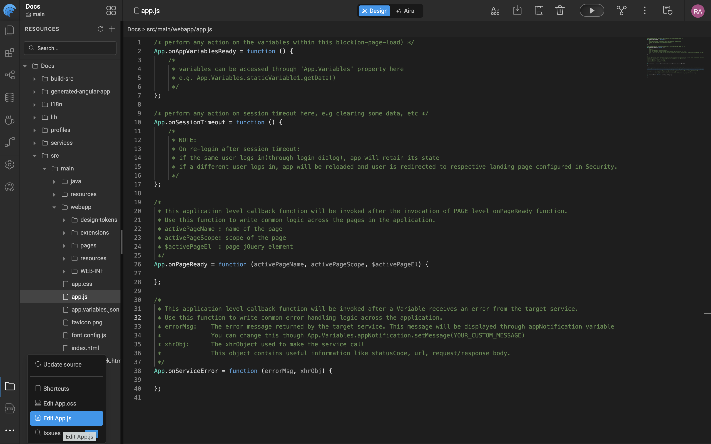

# Accessing Elements via JavaScript

## App Level Events

WaveMaker provides application level events that allow developers to define behavior that applies across the entire application, rather than being limited to a specific page or component. These events are exposed through the global ```App``` object and are triggered at key points in the application lifecycle.

WaveMaker exposes a set of application level callback functions through the global App object. These events are triggered at predefined stages of the application lifecycle and are used to implement logic that applies across the entire application.

The following application-level events are supported: 
- **onAppVariablesReady**
- **onSessionTimeout**
- **onPageReady**
- **onServiceError**



### onAppVariablesReady
The ```onAppVariablesReady``` callback is invoked after all application level variables are initialized and available for use. This callback should be used to perform actions that depend on application variables.

Use Cases
- Accessing application variables using ```App.Variables```
- Triggering application level service calls
- Setting default application state

### onSessionTimeout
The ```onSessionTimeout``` callback is invoked when the user session expires due to timeout. This callback allows the application to handle session expiration events.

Use Cases
- Clearing application or user-specific data
- Resetting application state
- Displaying session timeout notifications

### onPageReady
The ```onPageReady``` callback is invoked after the execution of the page level onPageReady function. This callback is intended for implementing logic that must execute across all pages.

Use Cases
- Applying common UI behavior
- Tracking page navigation events
- Initializing page level access control

### onServiceError
The ```onServiceError``` callback is invoked when a service or variable invocation results in an error. This callback enables centralized handling of service errors across the application.

Use Cases
- Displaying custom error messages
- Logging error details
- Handling authorization and session related errors

## Page level Events

In a WaveMaker application, each page is composed of Markup, Script, and CSS files. Page-level events are defined and managed within the page script file, which allows developers to implement logic specific to an individual page.

### Page.onReady
The Page.onReady lifecycle method is invoked after the page has been fully rendered and initialized. This method is used to write initialization logic that must execute when the page is ready for interaction.

Invocation Timing:
- Triggered once each time the page is loaded
- Invoked after all widgets and variables on the page are available

```
Page.onReady = function () {
    /*
     * variables can be accessed through 'Page.Variables' property here
     * e.g. to get dataSet in a staticVariable named 'loggedInUser' use following script
     * Page.Variables.loggedInUser.getData()
     *
     * widgets can be accessed through 'Page.Widgets' property here
     * e.g. to get value of text widget named 'username' use following script
     * 'Page.Widgets.username.datavalue'
     */
};
```

Page level resources can be accessed within **```Page.onReady```** as follows:
- Variables: Accessed using **```Page.Variables```**, include reading datasets, invoking service variables, or setting default values.
- Widgets: Accessed using **```Page.Widgets```**, Widgets can be read or modified to control UI behavior and display values.

## Widget Level Events

For every Component, there are a set of lifecycle methods and event callbacks that can be accessed from the JavaScript.

The events can be accessed from the properties panel for the specific Component and assigned to a JavaScript or any other actions. JavaScript can be written from the Script tab, as per the app requirements. 

For example, to display an alert message on click of a button, the following would be the code:
```
Page.button1Click = function($event, widget) {
    alert("Hello")
};
``` 

For Component Life Cycle Events and Methods refer to the specific [Component Documentation](https://react-components.wavemaker.com).