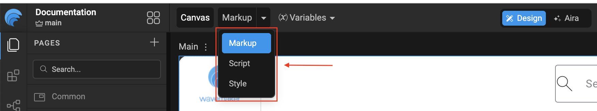

# Page Elements

In WaveMaker, every page is designed and managed through the **Canvas**. On the top-left corner of the Canvas, you’ll find a dropdown with three options: **Markup, Script, and Style**. These options represent the core building blocks of a WaveMaker page and define how a page is structured and managed.



- **Markup:** The Markup view contains the UI structure of the page
    - It includes all WaveMaker components that are dragged and dropped onto the canvas (such as datatable, charts, containers, forms, etc.).
    - This section defines how the page looks structurally and how components are laid out.

    ```html
        <!-- Main Page Markup -->
        <wm-page name="mainpage" pagetitle="Main">
            <wm-left-panel columnwidth="2" name="leftpanel" content="leftnav" navtype="rail" navheight="full"></wm-left-panel>
            <wm-content name="content">
                <wm-header content="header" name="header" height="auto"></wm-header>
                <wm-page-content columnwidth="10" name="mainContent"></wm-page-content>
                <wm-footer name="footer" content="footer"></wm-footer>
            </wm-content>
        </wm-page>
    ```
- **Script:** The Script view is used for page level and component level logic.
    - Any JavaScript logic written for handling events, data manipulation, validations, or custom behaviors is added here.
    - This includes lifecycle hooks, event handlers, and custom functions related to the page.

    ```JavaScript
        // Page logic that added in script section 
        Page.onReady = function () {
            Page.Variables.svProfileData.invoke();
            Page.Widgets.userButton.caption = "Steve Harrington";
        };

        Page.submitClick = function ($event, widget) {
            Page.Actions.goToPage_Main.invoke();
        };
    ```
- **Style:** The Style view is dedicated to page level styling
    - Any CSS rules specific to the page, such as layout adjustments, colors, fonts, or overrides are defined here.
    - These styles apply only to the current page and do not affect other pages in the application.
    ```css 
        .wm-app .button {
            background-color: red;
            border: none;
            color: white;
            padding: 15px 32px;
            text-align: center;
            font-size: 16px;
            cursor: pointer;
        }
    ```
To switch between these views, simply select the required option (**Markup, Script, or Style**) from the dropdown on the top-left of the Canvas.

---
## Page Level Project Structure

For each page created in WaveMaker Studio, the platform generates a set of five related files within the project structure. These files work together to define the page’s layout, behavior, styling, and configuration. Each file serves a specific purpose, enabling a clean separation of concerns and making the page easier to develop, customize, and maintain.

   ```text
        src/
        └── main/
            └──── webapp/
                  └─── pages/
                        └─── Main/
                             ├── Main.css
                             ├── Main.html
                             ├── Main.js
                             ├── Main.variables.json
                             └── page.min.json
    ```

- **Main.css:** Contains all the CSS styles defined in the Style tab for page-level styling.
- **Main.html:** Contains all the markup defined in the Markup tab, including the UI components added to the page.
- **Main.js:** Contains all the JavaScript logic written in the Script tab, including event handlers and custom functions.
- **Main.variable.json:** Stores metadata related to page variables, such as service variables, modal variables and configurations.
- **page.min.json:** A minified representation that consolidates the page definition and metadata for optimized runtime usage.

---
## Page Overview

In **WaveMaker App**, a page represents a complete UI view within an application. You can create any number of pages in an app, and each page follows a defined layout structure that ensures consistency, responsiveness and ease of development across the application.

The page layout is divided into two main sections (**Leftpanel, Content**) each serving a specific purpose.

By default, WaveMaker generates a standard page markup that follows below structure, which can be customized based on application requirements.

        ```html
            <!-- Default Page Markup -->
            <wm-page name="mainpage" pagetitle="Main">
                <wm-left-panel columnwidth="2" name="leftpanel" content="leftnav" navtype="rail" navheight="full"></wm-left-panel>
                <wm-content name="content">
                    <wm-header content="header" name="header" height="auto"></wm-header>
                    <wm-page-content columnwidth="10" name="mainContent"></wm-page-content>
                    <wm-footer name="footer" content="footer"></wm-footer>
                </wm-content>
            </wm-page>
        ```

### Left Panel

The **Left Panel** serves as a dedicated area for navigation and contextual support within the application. It provides users with quick access to important sections and tools without interrupting the main content area, helping maintain a consistent and intuitive user experience.

Typical use cases include:
- **Navigation menus:** Used to render primary or secondary navigation structures, enabling routing between pages, modules, or application sections.
- **Contextual tools and actions:** A place to put things like filters, action buttons, shortcuts, or small utilities that make sense for the current page or component

    ```html
        <!-- Left Panel Partial Markup -->
        <wm-partial name="leftnav" type="leftnav">
            <wm-container direction="row" alignment="middle-center" width="fill" name="container1" variant="default:" height="80px">
                <wm-picture resizemode="cover" name="picture1" variant="default:rounded" class="img-rounded" picturesource="https://dh2dw20653ig1.cloudfront.net/assets/wavemaker_logo.png"></wm-picture>
            </wm-container>
            <wm-nav name="leftnavigation" type="pills" layout="stacked">
                <wm-nav-item name="list_dashboard">
                    <wm-anchor caption="Dashboard" name="dashboardLink" iconclass="wi wi-bar-graph" on-click="Actions.goToPage_Main.invoke()"></wm-anchor>
                </wm-nav-item>
                <wm-nav-item name="list_order">
                    <wm-anchor caption="Pending Orders" name="orderLink" iconclass="wi wi-file"></wm-anchor>
                </wm-nav-item>
            </wm-nav>
        </wm-partial>
    ```

### Content

The **Content** section forms the main body of the page where most user interactions occur. This section is designed to be flexible and supports complex layouts. To improve structure and usability, the content area is further divided into three parts: **Header, Page Content, Footer**

#### Header

The **Header** section appears at the top of the page and is typically used for global or page level information. It commonly contains: Top navigation menus, User profile actions (login, logout, settings)

The header can be defined directly within a page or implemented as a **reusable partial**, allowing it to be shared across multiple pages for a consistent user experience.

    ```html
        <!-- Header Partial Markup -->
        <wm-partial name="header" type="header">
            <wm-container direction="column" alignment="top-left" gap="4" width="fill" name="containerlayout">
                <wm-container direction="row" alignment="top-left" gap="4" width="fill" name="containerrow" variant="default" height="fill">
                    <wm-container direction="row" alignment="top-right" gap="4" width="100%" name="containerright" variant="default" wrap="false">
                        <wm-container direction="row" alignment="top-right" gap="4" width="320px" name="containersearch" variant="default" wrap="false">
                            <wm-search dataset="Home, Services, Products, About US, Contact" name="search1"></wm-search>
                        </wm-container>
                    </wm-container>
                </wm-container>
            </wm-container>
        </wm-partial>
    ```


#### Page Content

The **Page Content** area is the primary workspace of the page. It contains the core UI components and business functionality, such as:

- Layouts & UI Components
- Charts and dashboards

This area dynamically updates based on user interactions and data bindings and usually occupies the majority of the available screen space.

#### Footer

The Footer is located at the bottom of the page and is intended for supplementary, non-interactive content. It is commonly used to display information that applies across the application rather than to a specific page workflow.

Like other sections, the footer can be created as a reusable partial to ensure consistency across the application.


Typical use cases include:
- **Copyright information:** Displays ownership details and the applicable year for the application.
- **Legal links:** Provides access to legal documents such as the Privacy Policy, Terms of Service, and other compliance related information.

    ```html
        <!-- Footer Partial Markup -->
        <wm-partial name="footer" type="footer">
            <wm-container direction="row" alignment="middle-right" gap="4" width="fill" height="auto" name="footerlayout" variant="default">
                <wm-label caption="Copyright 2026 [company name]" textalign="right" name="copyright"></wm-label>
            </wm-container>
        </wm-partial>
    ```

---
### Page Operations
You can duplicate, rename and delete a page using the page operations. These can be accessed from the more options against a given page.

- **Renaming** a page or a partial page leads to the page name being renamed, with the new name given by you. All the references are also renamed.
- **Duplicating** a page leads to a copy of the page or partial page being created, with the new name given by you. A new goTo action for that page is also created.
- **Deleting** a page removes all references to the selected page from the project.

---
### Page Name Validations
When creating a page, the following naming conventions should to be followed.

- The page name should contain at least one character, and it cannot be a number.
- The page name cannot contain special characters.
- The page name cannot start with a number.

---
### Home Page Configuration
Every WaveMaker application has as **Home Page**. This allows flexible control over the app’s entry point without changing navigation logic.
- The page named **Main** is set as the homepage by default.
- You can customize the default homepage from App Settings, Select the desired page from the Homepage dropdown.


<VideoCard
  videoUrl="https://next-academy.wavemaker.com/Watch?wm=2E64DC5B64"
  title="Create a Page in WaveMaker"
  description="Watch for a step-by-step guide on creating and managing pages in WaveMaker Studio."
  thumbnailText="Create Page"
/>


