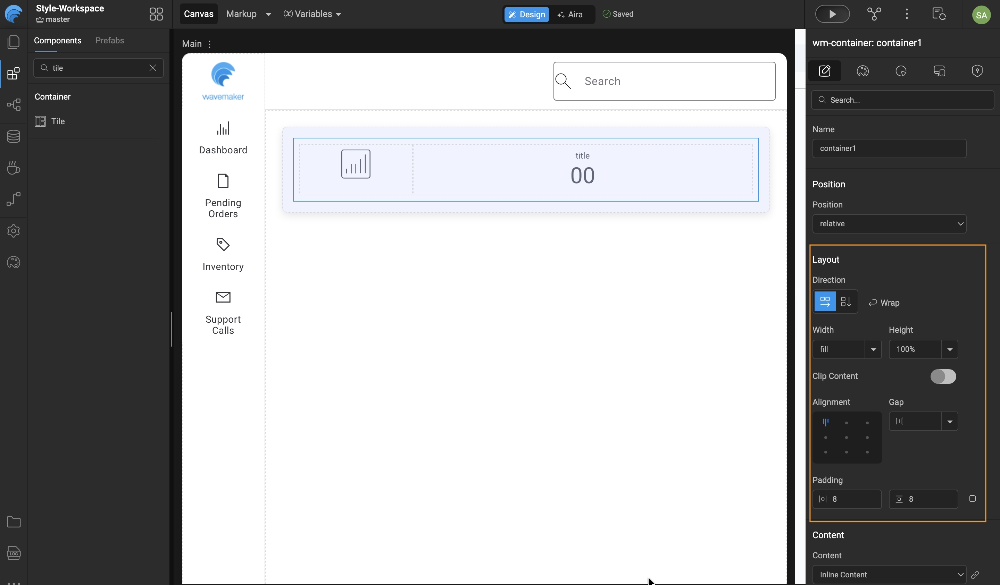

# Auto Layout

Auto Layout in WaveMaker is a layout system designed to manage component layouting and spacing without requiring direct CSS authoring. It provides developers with a visual layout workflow that closely aligns with the way designers typically create and reason about layouts. By abstracting common layout patterns into configurable properties within the editor, Auto Layout enables the creation of both simple and complex UI structures efficiently. It can be applied at both the page and section levels, ensuring consistent layout behavior across an application. The underlying layout model is loosely based on **CSS3 Flexbox** principles.

;

## Let us go into details. 

This feature can be used in two approaches:
1. **Component first approach**: In this approach you don't worry about layout first. You bring in all or a bunch of  your components into the canvas. And then you decide how you visually want to group them. Then you multiselect one group of components using the shift key and mouse click. Now you right click on any of the selected components and select “Add Auto Layout”. Remember multi select works for only sibling components. This action wraps these siblings into an Auto Layout container. And now you apply your preferred layout configurations

2. **Layout first approach**: This approach requires prior planning of the layout. You create layout containers first and then design your layout based on your visual design. And then you drop your children components, like, anchor, labels, picture etc and then create your page or sections of your page.

Auto layout is provided in the WaveMaker component called Container. As soon as we select a Container in the canvas and shift our focus to the properties panel on the right, we have a section called “Layout”.
Within Layout we have the following subsection with their respective configuration UI controls

1. Direction
    - Row(default)
    - Column
    - Wrap
2. Width
    - Fill(default)
    - Hug
    - User defined(takes an integer with or without units. If without unit, it assigns pixels in obscurity)
3. Height
    -Fill(default)
    - Hug
    - User defined(takes an integer with or without units. If without unit, it assigns pixels in obscurity)
4. Clip Content(If enabled it provides options for various types of scrolling)
    - No Scrolling(default)
    - Vertical
    - Horizontal
    - Both Directions
5. Alignment(Provides 9 options)
    - Top Left(default)
    - Top Center
    - Top Right
    - Middle Left
    - Middle Center
    - Middle Right
    - Bottom Left
    - Bottom Center
    - Bottom Right
6. Gap(Accepts integer or Auto)
    - Horizontal(default for Direction-row)
    - Vertical(default for Direction-column)
    - Auto
7. Padding(Accepts horizontal/Vertical or individual padding)
    - Left-Right(Horizontal)
    - Top-Bottom(Vertical)
    - Individual(four directions independently)

## Now lets get to know them individually 

### Direction

This control allows you control the direction in which the children components will be laid out inside the container. On selecting the row, the direction will be left to right. On selecting the column the direction will be from top to bottom. 
The wrap toggle is by default off, when turned on children will wrap to the next row or column if space of the container(Parent) runs out horizontally or vertically respectively. For the wrap property to work. The respective length, ie. Width, height, or both needs to be defined in number or percentage. Be careful while using this feature as it might cause problems in your responsive behaviours across devices.

### Width and Height

The **Width** controls the width of the Container. If “fill” is selected it stretches to occupy the entire available horizontal space.
Similarly on selecting hug, the container takes up width based on its content(Children). On providing a custom number it takes up space, as much as defined.

The **Height** controls the height of the Container. If “fill” is selected it stretches to occupy the entire available vertical space.
Similarly on selecting hug, the container takes up height based on its content(Children). On providing a custom number it takes up space, as much as defined.

### Clip Content

This toggle by default stays off. On enabling, it provides scrolling options if contents overflow. We can either choose, horizontal, vertical or both types of scrolling as we prefer.   

### Alignment

Inside the container, the  children components are aligned based on the settings of this feature. The position that the children can take are any of the 9 grids which we get on dividing the container space into a 3x3=9 grid. And these are, Top-Left(default),  Top-Center, Top-Right, Middle-Left, Middle-Center, Middle-Right, Bottom-Left, Bottom-Center, Bottom-Right

### Gap
This feature allows users to control the spacing between child components. When the direction is set to row, the spacing applies horizontally; when it is set to column, the spacing applies vertically. The gap can be configured in two ways: Auto or user-defined. When set to Auto, the child components expand to fill the available horizontal or vertical space and are spaced evenly. When a user-defined value is provided, the spacing is applied using explicit units such as pixels. Other units, including em, percentage, and similar CSS units, are also supported.

It is important to note that the available alignment options change based on the selected direction and gap type. For example, when the direction is set to row and the gap is Auto, only vertical alignment options—top, center, and bottom—are available. In this case, horizontal alignment options are not shown. The same behavior applies inversely when the direction is set to Column.

### Padding
This is fairly familiar and so the behaviour too is predictable. The padding unit by default is pixels unless declared explicitly. There are three types of options to provide padding, left-right, top-bottom, and independent defining on all four sides. To enable independent assignment of padding a button is provided on the right side of the padding section.
