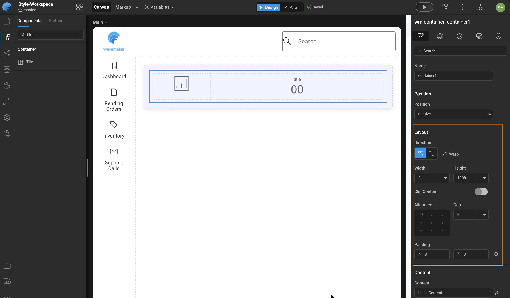

# Auto Layout

Auto Layout in WaveMaker is a layout system designed to manage component layouting and spacing without requiring direct CSS authoring. It provides developers with a visual layout workflow that closely aligns with the way designers typically create and reason about layouts. By abstracting common layout patterns into configurable properties within the editor, Auto Layout enables the creation of both simple and complex UI structures efficiently. It can be applied at both the page and section levels, ensuring consistent layout behavior across an application. The underlying layout model is loosely based on **CSS3 Flexbox** principles.

;

## Let us go into details. 

This feature can be used in two approaches:
1. **Component first approach**: In this approach you don't worry about layout first. You bring in all, or a bunch of  your components into the canvas. And then you decide how you visually want to group the components. Next, select these components by holding down the Shift key and clicking on each one of them. Once the components are selected, either right-click on any of them and choose "Add Auto Layout" or you can use the "Add Auto Layout" button in the properties panel. Remember multi select works for only sibling components. This action wraps these siblings into an Auto Layout container. And now you apply your preferred layout configurations.

2. **Layout first approach**: This approach requires prior planning of the layout. You create layout containers first and then design your layout based on your visual design. And then you drop your children components, like, anchor, labels, picture etc and then create your page or sections of your page.

Auto layout is provided in the WaveMaker component called Container. As soon as we select a Container in the canvas and shift our focus to the properties panel on the right, we have a section called “Layout”.
Within Layout we have the following subsection with their respective configuration UI controls

1. Direction
    - Row(default)
    - Column
    - Wrap
2. Width
    - Fill(default)
    - Hug
    - User defined(takes an integer with or without units. If without unit, it assigns pixels in obscurity)
3. Height
    -Fill(default)
    - Hug
    - User defined(takes an integer with or without units. If without unit, it assigns pixels in obscurity)
4. Clip Content(If enabled it provides options for various types of scrolling)
    - No Scrolling(default)
    - Vertical
    - Horizontal
    - Both Directions
5. Alignment(Provides 9 options)
    - Top Left(default)
    - Top Center
    - Top Right
    - Middle Left
    - Middle Center
    - Middle Right
    - Bottom Left
    - Bottom Center
    - Bottom Right
6. Gap(Accepts integer or Auto)
    - Horizontal(default for Direction-row)
    - Vertical(default for Direction-column)
    - Auto
7. Padding(Accepts horizontal/Vertical or individual padding)
    - Left-Right(Horizontal)
    - Top-Bottom(Vertical)
    - Individual(four directions independently)

## Now lets get to know them individually 

### Direction

This control allows you control the direction in which the children components will be laid out inside the container. On selecting the row, the direction will be left to right. On selecting the column the direction will be from top to bottom. 
The wrap toggle is by default off, when turned on children will wrap to the next row or column if space of the container(Parent) runs out horizontally or vertically respectively. For the wrap property to work. The respective length, ie. Width, height, or both needs to be defined in number or percentage. Be careful while using this feature as it might cause problems in your responsive behaviours across devices.

### Width and Height

The **Width** controls the width of the Container. If “fill” is selected it stretches to occupy the entire available horizontal space.
Similarly on selecting hug, the container takes up width based on its content(Children). On providing a custom number it takes up space, as much as defined.

The **Height** controls the height of the Container. If “fill” is selected it stretches to occupy the entire available vertical space.
Similarly on selecting hug, the container takes up height based on its content(Children). On providing a custom number it takes up space, as much as defined.

### Clip Content

This toggle by default stays off. On enabling, it provides scrolling options if contents overflow. We can either choose, horizontal, vertical or both types of scrolling as we prefer.   

### Alignment

Inside the container, the  children components are aligned based on the settings of this feature. The position that the children can take are any of the 9 grids which we get on dividing the container space into a 3x3=9 grid. And these are, Top-Left(default),  Top-Center, Top-Right, Middle-Left, Middle-Center, Middle-Right, Bottom-Left, Bottom-Center, Bottom-Right

### Gap
This feature allows users to control the spacing between child components. When the direction is set to row, the spacing applies horizontally; when it is set to column, the spacing applies vertically. The gap can be configured in two ways: Auto or user-defined. When set to Auto, the child components expand to fill the available horizontal or vertical space and are spaced evenly. When a user-defined value is provided, the spacing is applied using explicit units such as pixels. Other units, including em, percentage, and similar CSS units, are also supported.

It is important to note that the available alignment options change based on the selected direction and gap type. For example, when the direction is set to row and the gap is Auto, only vertical alignment options—top, center, and bottom—are available. In this case, horizontal alignment options are not shown. The same behavior applies inversely when the direction is set to Column.

### Padding
This is fairly familiar and so the behaviour too is predictable. The padding unit by default is pixels unless declared explicitly. There are three types of options to provide padding, left-right, top-bottom, and independent defining on all four sides. To enable independent assignment of padding a button is provided on the right side of the padding section.

For a complete understanding of how Auto Layout works in practice, watch the **Auto Layout video**, where the concepts and controls are demonstrated step by step.

<AcademyCard
  title="Auto Layout"
  
  academyLink="https://academy.wavemaker.ai/Walkthrough?wm=44FAE42ED5"
>

  <>
  

    <iframe
      style={{
        width: "100%",
        height: "100%",
        position: "absolute",
        left: 0,
        top: 0,
        borderRadius: 10
      }}
      src="https://embed.app.guidde.com/playbooks/5o5iUfSnGjfTmySi58nwF8?mode=videoOnly"
      title="Auto Layout"
      frameBorder={0}
      referrerPolicy="unsafe-url"
      allowFullScreen="true"
      allow="clipboard-write"
      sandbox="allow-popups allow-popups-to-escape-sandbox allow-scripts allow-forms allow-same-origin allow-presentation"
    />
  

  

    
00:00: This video provides a comprehensive overview of Auto layout in wave maker.

 
00:04: We will explore its features approaches and controls to help you create efficient and consistent layouts.

 
00:12: Auto layout in wave maker is a system designed to manage component layout and spacing without requiring direct CSS authoring.

 
00:20: This feature provides developers with a visual layout workflow that closely aligns with how designers typically create and reason about layouts.

 
00:29: By abstracting Common layout patterns into configurable properties within the editor Auto layout enables the efficient creation of both simple and complex UI structures.

 
00:40: It can be applied at both the page and section levels ensuring consistent layout behavior across an application.

 
00:47: The underlying layout model is loosely based on css3 flexbox principles.

 
00:52: let's dive in

 
00:54: Auto layout offers two primary approaches the first is the component first approach where you bring components into the canvas, and then visually group and align them.

 
01:05: Multi-select sibling components right click and select add Auto layout to wrap them in an auto layout container then configure the layout.

 
01:14: The second approach is layout first which requires prior planning.

 
01:19: Create layout containers first then drop in child components like anchors labels and pictures to create your page or sections.

 
01:28: Auto layout is provided in the wavemaker component called container.

 
01:33: Selecting a container in the canvas shifts Focus to the properties panel revealing the layout section with various UI controls.

 
01:42: The direction control dictates how child components are laid out within the container?

 
01:47: Selecting row Alliance components from left to right.

 
01:51: selecting column arranges them from top to bottom

 
01:54: the wrap toggle when enabled allows children to move to the next row or column if the container runs out of space

 
02:02: For the wrap property to function correctly. Make sure to define the relevant dimension such as width or height using a number or percentage.

 
02:10: The Width control determines the container’s horizontal size.

 
02:15: Fill stretches the container to occupy all available horizontal space.

 
02:20: Hug adjusts the width based on the content inside the container.

 
02:24: A custom number sets a fixed width.

 
02:28: The Height control works similarly to Width but affects the vertical dimension of the container, allowing you to control how much vertical space it occupies.

 
02:37: Fill stretches the container vertically to use available space.

 
02:41: Hug adjusts the height based on the content.

 
02:44: A custom number defines a fixed height.

 
02:48: The Clip Content toggle controls how overflowing content is handled.

 
02:52: When enabled, scrolling options become available if the content exceeds the container size.

 
02:59: You can choose horizontal scrolling, vertical scrolling, or both, depending on how the content overflows.

 
03:05: the alignment feature positions child components within the container

 
03:10: it uses a 3i 3 grid system to define placement.

 
03:14: This provides 9 alignment options such as top left top Center and bottom right?

 
03:22: The Gap feature controls the spacing between child components

 
03:26: when direction is set to Row the spacing is applied horizontally.

 
03:31: When direction is set to Column the spacing is applied vertically.

 
03:35: Gap values can be configured in two ways.

 
03:39: Auto child components expand to fill the available space

 
03:44: custom value

 
03:45: spacing is defined explicitly using units.

 
03:49: padding provides spacing around the content inside the container

 
03:53: You can set padding for left right and top bottom.

 
03:57: You can also assign padding independently for all four sides for finer control.

 
04:02: in summary Auto layout in wave maker offers a powerful and flexible system for managing component layouts

 
04:11: by understanding its approaches and controls developers can create efficient and consistent user interfaces.

</>

  </AcademyCard>

