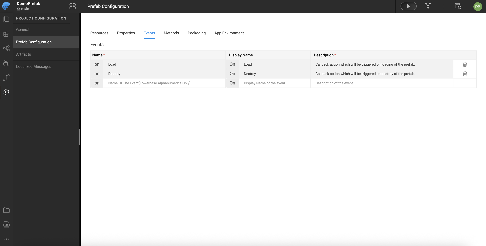
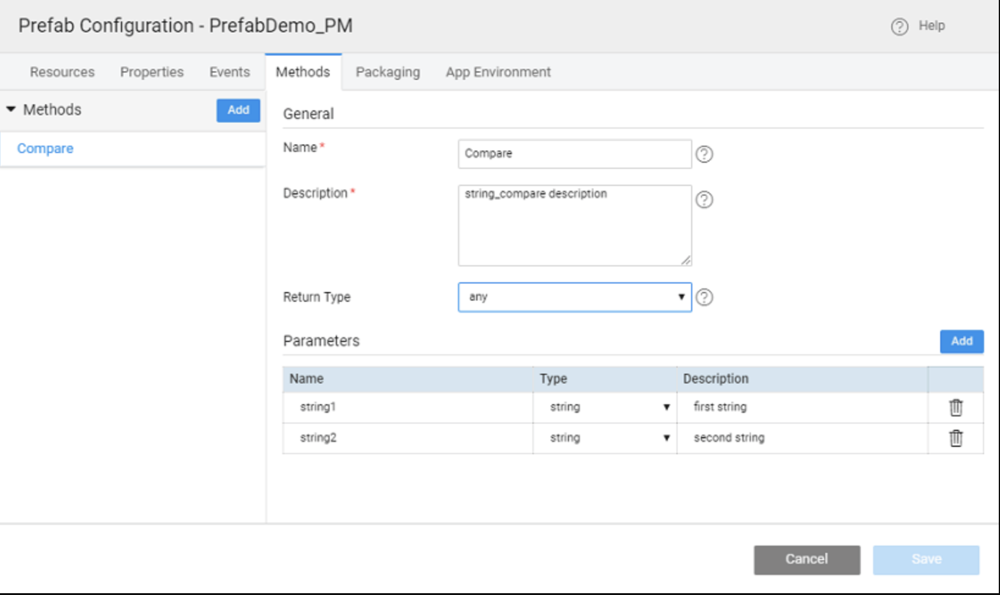

# Creating Prefabs

Prefabs in WaveMaker are reusable application components that encapsulate UI, logic, and service interactions into a modular unit. Once created, a Prefab can be embedded seamlessly into applications and reused across projects. WaveMaker provides a guided workflow to create, configure, test, and publish your own Prefabs.

---

## Creating a New Prefab

To build your own Prefab:

1. Open the **Project Dashboard** and navigate to the **Prefab** tab.  
2. Click **Create** to start a new Prefab.  
3. Enter a meaningful **Name**, choose an **Icon** for the Prefab avatar, and add a **Description**.  
4. Review the **Package** and **Copyright** information, make adjustments if needed, and click **Save** to proceed.

---

## Configuring the Prefab

After creation, configure your Prefab under **Project Configurations → Settings → Config Prefab**. Configuration options are grouped for convenience:

### Resources
- **Style:** Apply CSS styles to the Prefab or include your own style files.  
- **Script:** Add JavaScript files that need to run before the Prefab load. 


---

## Defining Properties

WaveMaker allows you to define **properties** that users of the Prefab can set or bind.

### UI Properties
UI properties appear in the Properties panel when the Prefab is used in an application. These include:

- **Name:** Internal identifier (lowercase).  
- **Display Name:** Label shown in the Properties panel.  
- **Description:** Help text for the property and documentation generation.  
- **Data Type:** Type of value accepted by the property.  
- **Default Value:** Fallback value if none is provided.  
- **Binding Type:** Controls how the property can be bound:
  - `in-bound` — Accepts incoming values.  
  - `out-bound` — Outputs values for binding.  
  - `in-out-bound` — Supports both.  
- **Widget Settings:** Defines how the property appears in the panel (widget type, visibility, disabled state, and show conditions). 

### Server Properties
Server properties are set using backend services or Java and typically include elements like authorization tokens or other server-side values. These include:
- **Name**  
- **Default Value** 


---

## Defining Events

Prefabs support events that application developers can handle when using the Prefab:

- **onLoad** — Triggered when the Prefab is first added to a page or when the page loads.  
- **onDestroy** — Triggered when the Prefab is removed or the page closes.  
- **Custom Events** — Additional events defined by the Prefab developer can be added and exposed in the Events tab.

Each event includes:
- **Name** — Event identifier (prefixed with `on`).  
- **Description** — Used in documentation when the Prefab is published. 

**Event Flow Notes:**  
- `onPropertyChange` is triggered when a property changes internally but is not exposed to the end user.  
- Custom events must be explicitly triggered within the Prefab using code such as:
  ```javascript
  Prefab.on<event_name>($event, $data)
  ```




---

## Defining Methods

Developers can add reusable functions to Prefabs:

- **Name** — Method name.  
- **Description** — Used for Prefab documentation.  
- **Return Type** — Data type returned by the method.  
- **Parameters** — Inputs required by the method.

Methods can be invoked in applications using:
```javascript
Page.<prefab_name>.<method_name>(<parameters>)
```

If a method is referenced but not defined, WaveMaker will generate a placeholder in the Prefab’s script tab.



---

## Testing the Prefab

WaveMaker includes a built-in **Preview** option for testing Prefabs:

- Enter values for **inbound properties**.  
- View results via the **outbound properties** tab.  
- Invoke defined **methods** through the Methods tab.  
- Observe triggered **events** from the Events tab.  

---


## Summary

WaveMaker Prefabs are modular, reusable components that encapsulate UI, logic, and service integrations. Once created, they can be packaged with a name and icon, tested via the built-in Preview for properties, methods, and events, and published to a project, workspace, team, or enterprise repository. Updates require incrementing the version number, with WaveMaker handling version conflicts and prompting projects to update. Prefabs streamline development by enabling drag-and-drop reuse across multiple applications.

