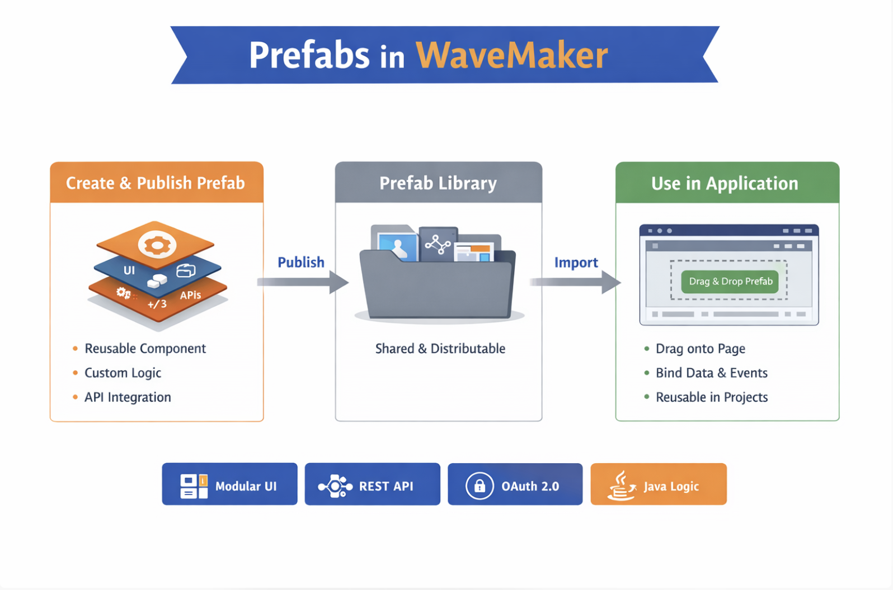

# Overview

In WaveMaker, **Prefabs** are reusable, distributable components that encapsulate UI, business logic, and service integration into a single modular unit. They act as custom widgets or composite components that can be independently developed, tested, and embedded into multiple applications with minimal effort. Prefabs simplify complex UI and backend interactions while promoting reuse across projects. 

---

## What Are Prefabs?

A **Prefab** is a self‑contained part of an application that can interact with data sources, REST APIs, and backend services. Once created and published, it can be imported and used like any other widget in WaveMaker Studio by dragging it onto a page. They are ideal for encapsulating commonly used functionality such as comment panels, maps, social feeds, or any reusable UI pattern. 

### Key Characteristics

- **Reusable:** Prefabs can be used across multiple apps and pages.
- **Modular:** They encapsulate UI elements, services, properties, events, and methods.
- **Distributable:** Once published, prefabs can be shared within your workspace, team, or enterprise. 

---

## Why Use Prefabs?

Prefabs accelerate application development by:
- Abstracting complex UI and backend interactions into reusable components.
- Enabling developers to build new widgets by composing existing widgets or third‑party libraries.
- Allowing integration of REST APIs without writing repetitive code.
- Supporting reusable backend services through Java libraries within prefab logic.

---

<!-- ## Prefab Integration with APIs

Prefabs make API integration straightforward:
- Import REST APIs as Services and bind them within the prefab.
- Use built‑in OAuth 2.0 support for secure API communication.
- Bind API responses directly to UI elements.
- Configure input parameters through prefab settings.
- Expose data outputs and events for use within the parent application. 

--- -->

<!-- ## Using Prefabs in Your Application

To use a prefab in an application:
1. **Publish** the prefab after creation.
2. **Import** the prefab `.zip` file into your app.
3. Once imported, the prefab appears under the **Prefabs** section in Studio.
4. Drag and drop the prefab onto any page like a standard widget. 

**Notes:**
- Published prefabs appear in the Prefabs panel without needing import; use the refresh icon if not visible.
- Updating a prefab in your project requires re‑importing the latest version. 

--- -->

## Prefab Features

Prefabs, like standard widgets, offer configurable **features** that make them flexible and reusable within applications:

- **Properties**  
  If a Prefab exposes properties, you can configure them through the **Properties Panel**. For more complex Prefabs, you may need to integrate them into your page using custom code to set or bind property values.

- **Events**  
  Prefabs provide default lifecycle events:
  - **onLoad** — Triggered when the Prefab is loaded onto a page.  
  - **onDestroy** — Triggered when the Prefab is removed from a page.  
  In addition, any custom events defined by the Prefab developer will also be available for handling, allowing you to bind these events to other widgets or application logic.

- **Methods**  
  Any methods exposed by the Prefab developer can be invoked by binding them to events of widgets within the page. This enables interactive behavior and dynamic execution of Prefab functionality from your application.

---

## Creating Prefabs

To create a Prefab:

1. Open the **Project Dashboard → Prefab tab**.  
2. Click **Create**, and enter:
   - **Name**  
   - **Icon**  
   - **Description**  
   - **Package & Copyright info**  
3. Click **Save** to proceed.

To Learn more [Creating Prefabs](create-prefab.md)

---

## Publishing Prefabs

WaveMaker supports several publishing scopes:

- **Project:** Prefab available only within the current project.  
- **Workspace:** Prefab available across all projects in the workspace.  
- **Team (Enterprise):** Prefab shared across team members.  
- **Enterprise Repository (EDN):** Prefab available for import in any enterprise project.  

To Learn more [Package and Publish Prefabs](publishing.md)

---

## Prefab Storage and Structure

When a prefab is imported into a WaveMaker project, it is stored in the following location:

Each prefab folder is organized to include all the necessary components that make the prefab **self-contained and reusable**:

`src/main/webapp/WEB-INF/prefabs/{prefab-name}`

- **config** — Contains configuration files that define the prefab’s properties, metadata, and settings required for proper initialization and integration within the application.  
- **lib** — Holds any library dependencies, such as JavaScript libraries or third-party modules, required by the prefab to function correctly.  
- **webapp** — Includes UI pages, templates, styles, scripts, and other resources used by the prefab to render its interface and provide interactive functionality.

> **Note:** Prefabs are modular by design. Deleting the prefab folder from the project will remove the prefab entirely, including its configuration, libraries, and UI resources. This ensures that all components of the prefab are self-contained, preventing orphaned files or broken references in the application.

This structure enables **easy import, reuse, and maintenance** of prefabs across multiple applications while keeping them fully encapsulated and portable.

---

## Summary
Prefabs are reusable, modular components in WaveMaker that encapsulate UI elements, custom logic, and API integrations. They can be created and published as standalone units, stored in a shared prefab library, and imported into applications where they can be dragged onto pages, bound to data and events, and reused across projects. Prefabs simplify development, promote consistency, and accelerate building complex applications by combining modular UI, REST APIs, OAuth 2.0 support, and Java logic in a single distributable package.