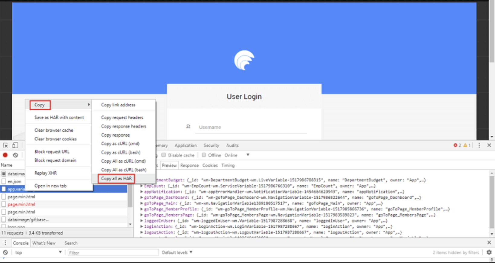
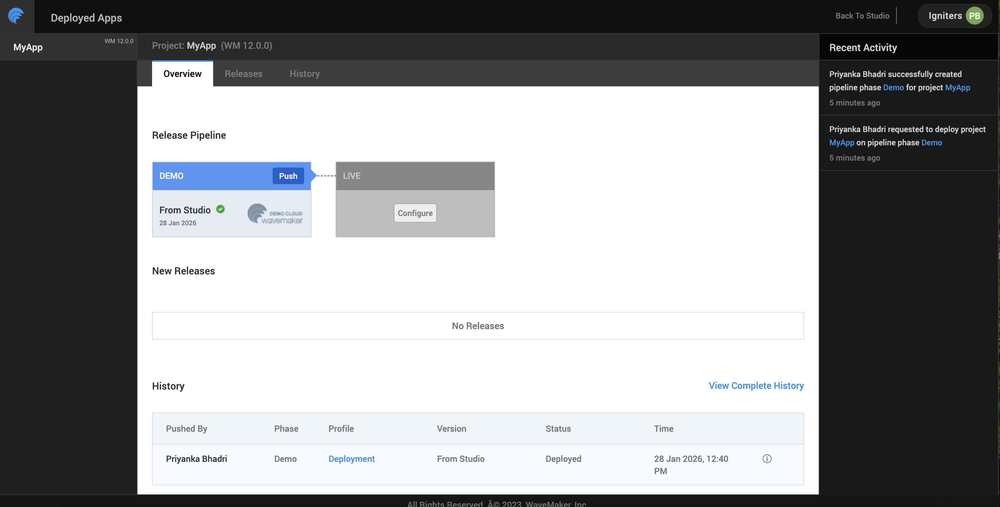

# Debugging

WaveMaker applications run as standard web applications in the browser. This allows developers to debug application behavior using familiar **JavaScript techniques**, **browser developer tools**, and WaveMaker’s built-in **Inspection Framework**. Together, these tools provide deep visibility into UI rendering, data flow, variable execution, and runtime errors.

---

## JavaScript Debugging in WaveMaker

WaveMaker supports custom JavaScript across multiple layers of an application, including:

- Page lifecycle events
- Widget events
- Variable callbacks
- Custom script blocks

Developers can debug JavaScript logic using standard techniques:

- Use `console.log()` to trace values and execution flow  
- Use `debugger;` statements to pause execution  
- Inspect variables, function calls, and runtime state  

Since WaveMaker generates client-side JavaScript, all custom and generated logic can be inspected directly in the browser.

To debug the JavaScript code of the pages, add keyword debugger in the script part of the page. Example: Suppose we want to debug the function on click of a button ‘button2’.

```
Page.button2Click = function ($event, widget) { 
    var postion = $event.pageX;
    debugger;
};
```

Instead, if you want to just print the results in the console use the method ‘console.log()’. Example: Suppose we want to print the results of a dataset.

```
Page.button2Click = function ($event, widget) { 
    console.log(Page.Variables.HrdbEmployeeData.dataSet)
};
```
---

<!-- ## Debugging with Chrome Developer Tools

Chrome Developer Tools (DevTools) offer a powerful set of features to inspect and debug WaveMaker applications in real time.

### Elements Tab
- Inspect rendered HTML and CSS
- Analyze widget structure and layout
- Verify dynamic styling and bindings

### Console Tab
- View logs, warnings, and runtime errors
- Execute JavaScript expressions
- Inspect WaveMaker variables and objects

### Sources Tab
- Set breakpoints in JavaScript code
- Step through execution line by line
- Inspect call stacks and scope variables

### Network Tab
- Monitor API calls triggered by variables
- Inspect request payloads and responses
- Analyze request failures and performance issues

These tools help identify UI issues, JavaScript errors, data binding problems, and backend communication failures.

--- -->

## Debugging with HAR Files

In certain scenarios, the WaveMaker support team may request a **HAR (HTTP Archive) file** to help analyze network-related issues such as failed service calls, incorrect request payloads, or unexpected responses. A HAR file captures detailed information about all network activity between the browser and the server.

### Steps to Generate a HAR File

1. Open the application in the browser and navigate to the app runtime window.
2. Launch Developer Tools.  
   - In Chrome, open the menu (⋮) → More tools → Developer Tools, or use the shortcut Ctrl + Shift + I.
3. From the Developer Tools panel, select the Network tab.
4. Enable Preserve log to ensure network requests are not cleared on refresh.
5. Refresh the application page to capture network activity.
6. Right-click on any request in the Network panel and select  
   Copy → Copy all as HAR.
7. Open a text editor (such as Notepad), paste the copied content, and save the file with a `.har` extension.
8. Share the HAR file with the WaveMaker support team along with the name of the service or API call** that is failing.

### When to Use HAR Files

HAR files are especially useful for:
- Debugging failed or slow API calls
- Verifying request headers, payloads, and responses
- Analyzing authentication or authorization issues
- Identifying network or server-side errors

Providing a HAR file helps the support team reproduce and diagnose issues more accurately and efficiently.



---

## Debugging Deployed Applications

When troubleshooting issues in a **deployed WaveMaker application**, you may need to collect runtime logs to analyze errors or share them with the WaveMaker support team. WaveMaker provides an option to download logs directly from the Apps Portal for deployed applications.


### Accessing Deployed App Logs

1. **Open the Apps Portal**
   - From the Project Dashboard, click Manage Deployed Apps, or  
   - From the Project Workspace main menu, go to Deploy → Manage App, and select the required application.

2. **Select the Deployment Phase**
   - Once the application details page opens, hover over the deployment phase (for example, Development, QA, or Production) for which you want to retrieve logs.
   - Click DETAILS.

3. **Download Logs**
   - Navigate to the Logs tab.
   - Click the Download button to download the application logs.


### Sharing Logs with Support

When sharing logs with the WaveMaker support team, include:
- The downloaded log files
- The application name and environment
- A brief description of the issue and the time it occurred

These logs help identify backend errors, deployment issues, and runtime failures in deployed environments.




---

## WaveMaker Inspection Framework

WaveMaker provides an **Inspection Framework** that exposes runtime information about application components.

Using the inspection capabilities, developers can:

- Inspect widget properties and runtime values
- View variable execution state and responses
- Analyze data bindings and expressions
- Understand lifecycle events and execution flow

The Inspection Framework bridges WaveMaker’s low-code abstraction with the underlying runtime behavior, making it easier to debug complex interactions.

---

## Typical Debugging Workflow

A common debugging flow in WaveMaker includes:

1. Trigger an application action (page load, button click, variable execution)
2. Check logs and errors in the **Console**
3. Inspect widget structure in the **Elements** tab
4. Debug JavaScript logic using **Sources**
5. Analyze API calls using the **Network** tab
6. Validate bindings and runtime values using the **Inspection Framework**

This approach allows developers to isolate issues across UI, logic, and data layers efficiently.

---

## Summary

WaveMaker supports comprehensive debugging through standard JavaScript techniques, browser-based developer tools, and its built-in Inspection Framework. By combining these tools, developers gain complete visibility into application behavior, enabling faster troubleshooting of UI rendering, variable execution, data binding, and API integration issues—while retaining the productivity benefits of low-code development.
