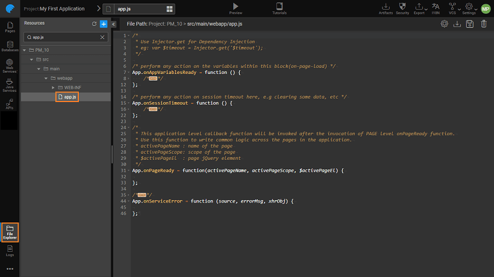

in WaveMaker application consists of Markup, Script & CSS files. In this document, we will go through the various functions/methods that are available in the script file. We will see how these methods can be created and modified.

**script** can be accessed from the script tab on your project workspace. Using JavaScript, the functionality of your project can be enhanced. The various methods and properties associated with each of the Studio elements can be found in the [Documentation](https://www.wavemakeronline.com/studio/docs/index.html)

# Lifecycle

When a Page is created, it has a single context object (singleton instance) called "" in the JavaScript. You can attach lifecycle methods, events, and callbacks to this object. When a new page is created it creates the "" lifecycle methods where you can write the code to be invoked after the page is rendered completely.

There are two more singleton instances are used in the platform named "" & "" which are used in Partial pages and Prefab page respectively.

:  has been deprecated since 10.0 release, use Page.onReady instead.

In the following sections, we will be seeing how each element of the project can be accessed using the Script.

# Lifecycle

For every Widget, there are a set of lifecycle methods and event callbacks that can be accessed from the JavaScript.

The events can be accessed from the properties panel for the specific Widget and assigned to a JavaScript or any other actions. JavaScript can be written from the Script tab, as per the app requirements. For example, in order to display an alert message on click of a button, the following would be the code:

1Click = function($event, widget) {
    alert("Hello")
};

For Widget Life Cycle Methods usage examples refer to the specific [Documentation](/learn/app-development/widgets/widget-library/)

# Methods

You can write your own custom functionality and access the methods from anywhere in the page.

 = function(parameters) {
// your code here
};

# Variables

Variables created with Owner set to App can be accessed from all Pages, Partials, and Prefabs

<variable-name>.<fields/methods>

## the Page/Partial/Prefab Widgets and Variables

Widgets and Variables of a page can be accessed through the page script. The widgets and variables operate within the scope they are created in. Additionally, the widgets and variables defined in a Page can be accessed within the partial pages and vice versa.

Widgets and Variables of a page can be accessed through the page script. They are exposed as 'Widgets' and 'Variables' properties in the respective page scope. **:** To access variables and widgets of a page named "Main" use following scripts in Main page controller:

  /\*\*to set "caption" property of a label widget (eg 'label1')\*\*/
  Page.Widgets.label1.caption = "New Caption";

  /\*\*to change a variable (eg 'userInfoVariable') dataSet property, use the script:\*\*/
  Page.Variables.userInfoVariable.dataSet = {dataValue": "new value"};

: Replace Page with Partial or Prefab when working with in Partial or Prefab, respectively

## the Widgets and Variables of Partial from Parent Page through Scripting

Widgets and Variables inside a partial page can be accessed from the parent page script through the 'Widgets' and 'Variables' property exposed in the scope of the partial container widget.

\[container\_name\].Widgets.\[widget\_name\].\[widget\_property\];
Page.Widgets.\[container\_name\].Variables.\[variable\_name\];

**:** access variables and widgets of a partial page loaded in a page named "Main"

  /\*\* to set the "caption" of a label widget (eg label1) of a partial page loaded as a content of panel widget (eg panel1) \*\*/
  Page.Widgets.panel1.Widgets.label1.caption = "New Caption";

  /\*\* to access partial page's Variable (say staticVariable1) in the parent page 'Main' \*\*/:
  Page.Widgets.panel1.Variables.staticVariable1.dataSet = {"dataValue": "new value"};

# Level Access

As with the Pages, App lifecycle events and variables can be accessed from the  file. This file can be accessed from the File Explorer.  The following methods are available:

- - \- this refers to the Variables created with App as Owner.  Variables can be accessed through 'App.Variables' property: e.g. App.Variables.staticVariable1.getData()
    - \- perform any action on session timeout here, e.g clearing some data, etc
    - \- This application level callback function will be invoked after the invocation of PAGE level onPageReady function
    - \- This application level callback function will be invoked after a Variable receives an error from the target service. Use this function to write common error handling logic across the application

< Variable Binding

6\. Data Integration - Variables

- 6.1 Binding Layer
    - [Overview](/learn/app-development/variables/data-integration/)
- 6.2 Variables and Actions
    - [Overview](/learn/app-development/variables/variables-actions/#)
    - [Variables](/learn/app-development/variables/variables-actions/#variables)
        - a. Database CRUD
            - [Overview](/learn/app-development/variables/database-crud/)
            - [Variable Creation](/learn/app-development/variables/database-crud/#creation)
            - [Properties](/learn/app-development/variables/database-crud/#properties)
            - [Events](/learn/app-development/variables/database-crud/#events)
            - [Methods](/learn/app-development/variables/database-crud/#methods)
        - b. Database API
            - [Overview](/learn/app-development/variables/database-apis/)
            - [Variable Creation](/learn/app-development/variables/database-apis/#creation)
            - [Properties](/learn/app-development/variables/database-apis/#properties)
            - [Events](/learn/app-development/variables/database-apis/#events)
            - [Methods](/learn/app-development/variables/database-apis/#methods)
        - c. Web Service
            - [Overview](/learn/app-development/variables/web-service/)
            - [Variable Creation](/learn/app-development/variables/web-service/#creation)
            - [Properties](/learn/app-development/variables/web-service/#properties)
            - [Events](/learn/app-development/variables/web-service/#events)
            - [Methods](/learn/app-development/variables/web-service/#methods)
        - d. Java Service
            - [Overview](/learn/app-development/variables/java-services)
            - [Variable Creation](/learn/app-development/variables/java-services/#creation)
            - [Properties](/learn/app-development/variables/java-services/#properties)
            - [Events](/learn/app-development/variables/java-services/#events)
            - [Methods](/learn/app-development/variables/java-services/#methods)
        - e. Security Service
            - [Overview](/learn/app-development/variables/security-service/)
            - [Variable Creation](/learn/app-development/variables/security-service/#creation)
            - [Properties](/learn/app-development/variables/security-service/#properties)
            - [Events](/learn/app-development/variables/security-service/#events)
            - [Methods](/learn/app-development/variables/security-service/#methods)
        - f. Model
            - [Overview](/learn/app-development/variables/model-variable/)
            - [Variable Creation](/learn/app-development/variables/model-variable/#creation)
            - [Properties](/learn/app-development/variables/model-variable/#properties)
            - [Events](/learn/app-development/variables/model-variable/#events)
            - [Methods](/learn/app-development/variables/model-variable/#methods)
        - g. Device Variables
            - [Overview](/learn/hybrid-mobile/device-variables/#)
            - [Services](/learn/hybrid-mobile/device-variables/#services)
            - [Operations](/learn/hybrid-mobile/device-variables/#operations)
            - [Events](/learn/hybrid-mobile/device-variables/#events)
            - [Methods](/learn/hybrid-mobile/device-variables/#methods)
            - [Usage](/learn/hybrid-mobile/device-variables/#usage)
    - [Actions](/learn/app-development/variables/variables-actions/#actions)
        - i. Navigation
            - [Overview](/learn/app-development/variables/navigation-action/#)
            - [Action Creation](/learn/app-development/variables/navigation-action/#creation)
            - [Properties](/learn/app-development/variables/navigation-action/#properties)
            - [Methods](/learn/app-development/variables/navigation-action/#methods)
        - ii. Login
            - [Overview](/learn/app-development/variables/login-action/)
            - [Action Creation](/learn/app-development/variables/login-action/#creation)
            - [Properties](/learn/app-development/variables/login-action/#properties)
            - [Data](/learn/app-development/variables/login-action/#data)
            - [Events](/learn/app-development/variables/login-action/#events)
        - iii. Logout
            - [Overview](/learn/app-development/variables/logout-action/)
            - [Action Creation](/learn/app-development/variables/logout-action/#creation)
            - [Properties](/learn/app-development/variables/logout-action/#properties)
            - [Events](/learn/app-development/variables/logout-action/#events)
        - iv. Timer
            - [Overview](/learn/app-development/variables/timer-action/)
            - [Action Creation](/learn/app-development/variables/timer-action/#creation)
            - [Properties](/learn/app-development/variables/timer-action/#properties)
            - [Events](/learn/app-development/variables/timer-action/#events)
            - [Methods](/learn/app-development/variables/timer-action/#methods)
        - v. Notification
            - [Overview](/learn/app-development/variables/notification-action/)
            - [Action Creation](/learn/app-development/variables/notification-action/#creation)
            - [Properties](/learn/app-development/variables/notification-action/#properties)
            - [Events](/learn/app-development/variables/notification-action/#events)
            - [Methods](/learn/app-development/variables/notification-action/#methods)
    - [Scoping](/learn/app-development/variables/variables-actions/#scoping)
    - [Variable Events](/learn/app-development/variables/variables-actions/#events)
    - [Error Handling](/learn/app-development/variables/variables-actions/#error-handling)
- 6.3 Variable Binding
    - [Overview](/learn/variables/variable-binding/#)
    - [Data Binding](/learn/variables/variable-binding/#data-binding)
    - [Widget Binding](/learn/variables/variable-binding/#widget-binding)
    - [Binding Options](/learn/variables/variable-binding/#binding-options)
- [6.4 JavaScript Access](#)
    - [Overview](#)
    - [Page Lifecycle](#page-lifecycle)
    - [Widget Lifecycle](#widget-lifecycle)
    - [Custom Methods](#custom-methods)
    - [App Variables](#app-var)
    - [Page/Partial/Prefab Component Access](#page-scripting)
    - [Partial Component Access from Page](#partial-scripting)
    - [App Level Access](#app)
