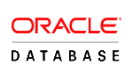

---

A _database_ is the most common form of data storage for any enterprise and apps need to interact with these databases to define the workflow.

WaveMaker makes it easy to create web-based forms that are connected to an underlying database. To access a database from your WaveMaker application, you first create a new data model or import an existing data model into the project.

Import or creation of database within a WaveMaker app results in the generation of REST APIs. Each of the services integrated into your app is converted to a RESTful service and is consumed through their respective REST APIs. These REST APIs are exposed via the [API Designer](http://[supsystic-show-popup id=110]) and can be tested and reconfigured as per the application needs.

## WaveMaker DB Integration Process

The following figure gives an overview of the Database integration process within WaveMaker App.

1. Database Schema from an external RDBMS is imported into the app. This import includes the Data Model consisting of Tables, Columns, Relationships between tables and Constraints.
2. An ORM layer is auto-generated from the above DB Schema using Hibernate and JPA. A service layer is also auto-generated using Spring.
3. You, as an App Developer, can access the Entities from the ORM Layer, write custom queries, procedures and Java Services to extend the database functionality.
4. For each entity, query, procedure and Java service, a REST API is auto-generated using Spring-REST and Swagger.
5. Variables need to be created to interact with the REST API layer to access the database services. These variables will, in turn, be bound to Widgets to allow user interaction with the data.

## DB Workflow

When you integrate your WaveMaker app with any database, you set up the connection details and enable your app to interact with the Database. There are two forms of Database interaction:

- during design time to generate files for use within the app, and
- during runtime to access the data and work with it.

 **Design Time Studio App behavior**: From the WaveMaker app:

1. when you add DB to WaveMaker app, it results in a request for metadata to the corresponding external Database, based upon the connection settings,
2. the external Database returns the metadata,
3. this returned metadata is used to generate files which will be used within the app.

**Note**: The database is not replicated or copied into the Studio.

**Run Time Studio App behavior**: During the run mode, when database call is triggered by user interaction:

1. a database call in the form of a CRUD operation is made by the app
2. the call is forwarded to the external Database with the help of the generated files

For an in-depth understanding of the ORM layers generated, their functionality and code generated for the Database Integration, refer to [ORM Artifacts](/learn/app-development/services/database-services/orm-artifacts/).

## WaveMaker Supported Databases and their Versions

WaveMaker supports the following databases and versions and the same can be used within your app.

| Database Name | Version | Driver Jar |
| --- | --- | --- |
|  | 10.2 | Available in Maven Repo |
|  | 5.5 | Available in Maven Repo |
| 5.6 |
| 5.7 |
|  PostgreSQL | 9.4 | Available in Maven Repo |
| 9.5 |
|  | 11.2 | [download ojdbc6.jar from here](http://www.oracle.com/technetwork/database/features/jdbc/index-091264.html) |
| 12.1 | [download ojdbc7.jar from here](http://www.oracle.com/technetwork/database/features/jdbc/index-091264.html) |
| 12.2 | [download ojdbc8.jar from here](http://www.oracle.com/technetwork/database/features/jdbc/index-091264.html) |
|  SQL Server | 2014 | [Steps to Download sqljdbc4.2.jar](/learn/app-development/services/database-services/download-jdbc-driver-jar/)
(you can use JDBC driver 4.2, 6.0, 6.1 or 6.2, ensure that you import  **sqljdbc42.jar** or any Java ver 8 compatible jar file) |
| Azure SQL Database [Connect to Azure](/learn/how-tos/connect-azure-sql-server/) |
|  | 10.1 | [db2jcc4.jar](http://www-01.ibm.com/support/docview.wss?uid=swg21363866) |
| 11.1 |
|  | 2.3.3 | Available in Maven Repo |
| 2.3.4 |

< Backend Services Overview

Working with Databases >

5\. Creating Backend Services

- 5.1 Overview
    - [i. Accessing Data](/learn/app-development/services/creating-backend-services/#accessing-data)
        - [○ Life-cycle of data](/learn/app-development/services/creating-backend-services/#life-cycle)
    - [ii. Manipulating Data](/learn/app-development/services/creating-backend-services/#manipulating-data)
        - [○ Life-cycle of Events](/learn/app-development/services/creating-backend-services/#life-cycle-events)
    - [iii. REST APIs](/learn/app-development/services/creating-backend-services/#rest-apis)
- 5.2 Web Services
    - [i. Overview](/learn/services/web-services/web-services/#overview)
    - [ii. Variables for Invocation](/learn/services/web-services/web-services/#service-variable)
    - iii. Working with SOAP Services
        - [○ Overview](/learn/app-development/services/web-services/web-services/working-with-soap-services/#SOAP-service-setup)
        - [○ SOAP Service Setup](/learn/app-development/services/web-services/working-with-soap-services/#SOAP-service-setup)
        - [○ SOAP Service Settings](/learn/app-development/services/web-services/working-with-soap-services/#SOAP-service-settings)
        - [○ Generated REST APIs](/learn/app-development/services/web-services/working-with-soap-services/#generated-rest-apis)
        - [○ SOAP Service Usage](/learn/app-development/services/web-services/working-with-soap-services/#SOAP-service-usage)
    - iv. Working with REST Services
        - [○ Overview](/learn/app-development/services/web-services/rest-services/)
        - [○ Test REST Service](/learn/app-development/services/web-services/rest-services/#test-API)
        - [○ Configure REST Service](/learn/app-development/services/web-services/rest-services/#configure-REST-service)
        - [○ REST Service Usage](/learn/app-development/services/web-services/rest-services/#REST-service-usage)
    - iii. Working with Web Sockets
        - [○ Overview](/learn/app-development/services/web-services/working-with-websockets/)
        - [○ Service Integration](/learn/app-development/services/web-services/working-with-websockets/#import)
        - [○ Service Consumption](/learn/app-development/services/web-services/working-with-websockets/#variable)
        - [○ Use Cases](/learn/app-development/services/web-services/working-with-websockets/#use-cases)
- [5.3 Database Services](#)
    - [i. Overview](#)
    - [ii. Supported Databases](#supported-databases)
    - iii. Working with Databases
        - [○ Overview](/learn/app-development/services/database-services/working-with-databases/)
        - [○ Adding Database](/learn/app-development/services/database-services/working-with-databases/#integrating-database)
        - [○ Database Actions](/learn/app-development/services/database-services/working-with-databases/#database-actions)
    - iv. Data Modelling
        - [○ Overview](/learn/app-development/services/database-services/data-modelling/)
        - [○ Configuration Settings](/learn/services/db-services/data-modelling/#configuration-settings)
        - [○ Database Designer](/learn/services/db-services/data-modelling/#database-designer)
            - [● Schema Import Modes](/learn/app-development/services/database-services/database-schema-import-modes/)
        - ○ Working with Database Schema
            - [● Overview](/learn/app-development/services/database-services/working-database-schema/)
            - [● Adding Tables and Columns](/learn/app-development/services/database-services/working-database-schema/#add-tables-columns)
            - [● Working with Relationships](/learn/app-development/services/database-services/working-database-schema/#database-relationships)
            - [● Identity Generators for Primary Key Column](/learn/app-development/services/database-services/working-database-schema/#identity-generators)
            - [● Column Metadata Configuration](/learn/app-development/services/database-services/working-database-schema/#column-metadata-configuration)
            - [● Virtual Primary Keys and Relations](/learn/app-development/services/database-services/working-database-schema/#virtual-primary-keys)
            - [● Temporal Support](/learn/app-development/services/database-services/temporal-support/)
    - v. Databases Access
        - [○ Overview](/learn/app-development/services/database-access/)
        - ○ Working with Queries
            - [● Overview](/learn/app-development/services/database-services/working-with-queries/)
            - [● Query Editor](/learn/app-development/services/database-services/working-with-queries/#query-editor)
            - [● Types of Queries](/learn/app-development/services/database-services/working-with-queries/#query-types)
            - [● Query Creation](/learn/app-development/services/database-services/working-with-queries/#query-creation)
            - [● Query Usage](/learn/app-development/services/database-services/working-with-queries/#query-usage)
            - [● Parameterised Query Creation](/learn/app-development/services/database-services/working-with-queries/#query-creation-parameterised)
            - [● Query Operation Type](/learn/app-development/services/database-services/working-with-queries/#query-op-types)
            - [● Query Architecture](/learn/app-development/services/database-services/working-with-queries/#query-architecture)
        - ○ Working with Stored Procedures
            - [● Overview](/learn/app-development/services/db-services/working-stored-procedures/)
            - [● Procedure Creation](/learn/app-development/services/db-services/working-stored-procedures/#procedure-creation)
            - [● Procedure Parameters](/learn/app-development/services/db-services/working-stored-procedures/#proc-params)
            - [● Procedure Invocation](/learn/app-development/services/db-services/working-stored-procedures/#procedure-invocation)
            - [● Procedure Architecture](/learn/app-development/services/db-services/working-stored-procedures/#procedure-architecture)
        - [○ Versioning of Queries and Procedures](/learn/app-development/services/database-services/versioning-queries-procedures/)
        - [○ Blob Support for Queries and Procedures](/learn/app-development/services/database-services/blob-support-queries-procedures/)
        - [○ Invoking Queries & Procedures from Java Service](/learn/app-development/services/database-services/invoking-queriesprocedures-java-services/)
        - [○ Database Views](/learn/app-development/services/db-services/database-views/)
        - ○ Database Tools
            - [● Overview](/learn/app-development/services/database-tools/)
            - [● DB Shell](/learn/app-development/services/database-tools/#db-shell)
            - [● DB Scripts](/learn/app-development/services/database-tools/#db-scripts)
                - [● Import DB](/learn/app-development/services/database-tools/#import-db)
                - [● Export DB](/learn/app-development/services/database-tools/#export-db)
    - vi. ORM Artifacts
        - [○ Database Integration Process](/learn/app-development/services/db-services/orm-artifacts/#database-integration-process)
        - [○ Layered Architecture](/learn/app-development/services/db-services/orm-artifacts/#layered-architecture)
        - [○ Generated Files](/learn/app-development/services/db-services/orm-artifacts/#generated-files)
        - [○ Generated APIs](/learn/app-development/services/db-services/orm-artifacts/#generated-apis)
            - [● CRUD APIs](/learn/app-development/services/db-services/orm-artifacts/#crud-apis)
            - [● Query APIs](/learn/app-development/services/db-services/orm-artifacts/#query-apis)
            - [● Custom Query Syntax](/learn/app-development/services/db-services/orm-artifacts/#custom-query-syntax)
- 5.4 Java Services
    - [i. Overview](/learn/app-development/services/java-services/java-service/#overview)
    - [ii. Java Services Framework](/learn/app-development/services/java-services/java-service/#java-services-framework)
    - iii. Integration Services
        - [○ Current Loggedin User](/learn/app-development/services/java-services/java-integration-services/#loggedin-user)
        - [○ External Java Libraries](/learn/app-development/services/java-services/java-integration-services/#external-java-libraries)
        - [○ Database Entities](/learn/app-development/services/java-services/java-integration-services/#db-services)
        - [○ Named Queries](/learn/app-development/services/java-services/java-integration-services/#query-service)
        - [○ Imported Web Services](/learn/app-development/services/java-services/java-integration-services/#web-services)
    - [iv. Variables for Invocation](/learn/app-development/services/java-services/variables/)
    - [v. Generated REST APIs](/learn/app-development/services/java-services/generated-rest-apis-api-designer/)
- 5.5 API Designer
    - [i. Overview](/learn/app-development/services/api-designer/api/)
    - [ii. Database Services APIs](/learn/app-development/services/api-designer/database-service-apis/)
    - [iii. Web Services APIs](/learn/app-development/services/api-designer/web-service-apis/)
    - [iv. Java Services APIs](/learn/app-development/services/api-designer/java-service-apis/)
    - [v. Security Services APIs](/learn/app-development/services/api-designer/security-service-apis/)
- 5.6 3rd Party Libraries
    - [i. Overview](/learn/app-development/services/3rd-party-libraries/)
    - [ii. Including resource files](/learn/app-development/services/3rd-party-libraries/#resource-files)
    - [iii. Using third-party JavaScript file](/learn/app-development/services/3rd-party-libraries/using-3rd-party-javascript-files/)
    - [iv. Using third-party jar file](/learn/app-development/services/3rd-party-libraries/using-3rd-party-jar-files/)
