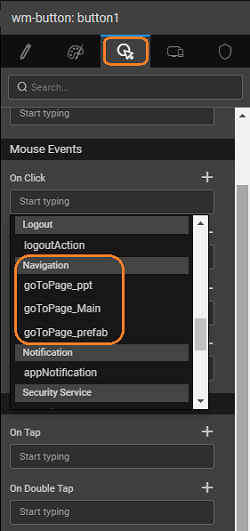

An app is divided into multiple pages to segregate the functionality of the app. Various aspects of a Page are used to unite these segregated functionalities to form an app flow. In this document we will discuss:

- [Page Layouts](#page-layouts) as tool to demarcate the page into components and give a unified look across pages
- [Page Navigation](#page-navigation) to aid user to move from one page to another
- [Events](#events) to capture define actions for user interactions and other incidents.

# Page Layouts

**Page Layouts** help you design the structure of the page by demarcating the header, footer, navigation and one or more content columns. Based on the Page construction system WaveMaker provides different options for Page Layouts, which can be picked based on the interaction required for the app. Depending on the app platform - web or mobile, the layout will differ. Here we will be discussing web platform, for mobile platform [refer here](/learn/hybrid-mobile/mobile-page-concepts/). Page

A layout can be selected at the time of Page Creation or later from the Change Layout option on the Workspace Toolbar.

A **Page Layout** has the following containers - a header, navigation bar, content, and footer. The content can have one, two or three columns. To change the layout of a page, simply click on the desired layout to see it take effect on the design canvas.

There are four Page Layout options:

- **Blank Layout** - without any header or a footer.
- **Header, content, and footer**: The content along with a header and a footer.
- **Header, topnav, content and footer**: The content along with a header, a footer, and a top navigation bar.
- **Header, content, leftnav and footer**: The content along with a header, a footer, and a left navigation bar.
- **Header, topnav, leftnav, content, and footer**: The content along with a header, a footer and a top and left navigation bar.
- **Header, leftnav, content, rightnav and footer**: The content along with a header, a footer and a left and right navigation bar.
- **Header, topnav, leftnav, content, rightnav and footer**: The content along with a header, a footer and a top, left and right navigation bar.

A typical page layout with header, footer, topnav, leftnav and rightnav has the following structure, as can be seen from the _Page Structure_ for the selected page:

Widgets can be added to the _content._ The header, footer, top-nav, left and right panels are partial pages and can be customized using the edit button on each of the panels.

**Note**: WaveMaker automatically adjusts the layout rendering for mobile devices.

### Container Widgets

You can use the **Container Widgets** to arrange the widgets on a web page. [Know more](/learn/app-development/widgets/widget-library/#container).

# Page Navigation

There are several ways for the user to move from one page to another. A **Navigation Action** is triggered when an event occurs. You can change what is displayed when an event occurs, for example:

- Button click – Use the button’s _On click_ event to trigger a move to a new page.
- Grid selection – Use the grid’s _On select_ event to trigger a navigation. Navigation Action specifies exactly how the user should move from one page to another when an event occurs.

Navigation Action is a component you can add to your project and provide the following options:

- _Page_ – Navigates to the specified page.
- _Previous Page_ – Navigates to the previous page.
- _Accordion_ – Navigates to the specified accordion of the specified page.
- _Tab_ – Navigates to the specified tab of the specified page.

Navigation in the application happens using a **Navigation Action**. Whenever a page is created a corresponding _gotoPage_ navigation action is generated or one can create the action manually.  Navigation can be to a page or to a component like a tab or accordion pane on a page. Navigation Action can be invoked in two ways:

1. Binding the Navigation Action to a Widget event - For example Button click – Use the button’s onClick event to trigger a Navigation Action to move to a new page or view. 
2. Manually invoking the Navigation Action used when you want to validate the user action or state of the application before allowing the navigation. For example: Assume a scenario, to allow the navigation only when the user selects a subscriptionType, then the onClick event can trigger a JavaScript function:
    
    Page.subscribe = funtion($event, widget){
      //navigate to subscribe page only when subscriptionType is provided
      if (Page.Widgets.subscriptionType.datavalue) {
          Page.Actions.goToPage\_subscription.navigate();
       }
     };
    
     

# Events

Events provide a way for you to define the actions that take place when something occurs in your application. There are many events that occur within a WaveMaker application. The most common events are user interface events, such as when a user clicks a button. Events are also triggered when an editor's value changes, and even when a** Variable** gets new data from the server. You have several options for specifying what will happen when a button is clicked.

 Here are a few examples:

- **No Event**: Take no action.
- **New Action:** For example, a help dialog automatically displays when a help button is clicked. Or the user clicks a _Next Page_ button, and the _Navigation Action_you select for your event loads a new page.
- **New Variable:** For example, a user clicks a _Search_ button. A Service is invoked whenever the button is pressed, causing the service to be executed and the data of the corresponding Variable is updated. Or the user clicks a _Save_ button, and the corresponding Variable you select for your event will automatically write its current source data to the database.
- **JavaScript:** You can write your own event handler in JavaScript, providing unlimited flexibility to define the resulting action.
- **Stop Propagation:** If applied for an event it stops event propagating to its parent. Ex: - Button is present inside a container. Both 'Container' and 'Button' have click events and you don't want to propagate click of the button to its parent ie. to trigger container click. You can add 'Stop Propagation' after the click of 'Button'. With 'Stop Propagation' only 'Button' click is triggered. Without 'Stop Propagation' both click events will be triggered. One exception is for 'List' widget as click on any widget inside list will trigger first the click of 'List' widget as it is being done in capturing stage.

### Event Categorization

For sake of convenience, the events are categorized as follows:

- **Common events** which are triggered by multiple actions. These include _Change_, _Focus_, _Blur_ etc.
- **Mouse Events** which capture the mouse activity on your application. These include _Click_, _Double Click_, _Mouse Enter_, _Mouse Leave_ etc.
- **Touch Events** which get triggered when running the app on a mobile or tablet or any other smart device. These events include: _Swipe Up_, _Swipe Down_, _Swipe Left_, _Swipe Right_, _Pinch In_, _Pinch Out_, etc.
- **KeyBoard Events** which capture the key strokes. These include _Enter Key Press_, etc.
- **CallBack Events** which are widget-specific special events. Like _Record Delete_, _on Select_, _on Deselect_ for a grid widget; _Before Records Update_ for Data Navigator; etc.

### Multiple Event Handling

WaveMaker supports multi-event handling. One can assign a series of actions to be triggered by a single event. Click on the "**+**" next to the event name to add more actions. When you use a series of variables to trigger on an event ensure that you handle eventualities like one callback was a success and other failed.

We have seen how Page Layouts, Navigation, and Events help in defining the flow of the app. Check out these [use cases](/learn/app-development/ui-design/use-cases-ui-design/) to further your experience.

< Partial Pages

Page Templates >

2\. Design UI

- 2.1 Overview
    - [i. App UI Design](/learn/app-development/ui-design/design-overview/#app-ui-design)
    - [ii. Responsive Design](/learn/app-development/ui-design/design-overview/#responsive-design)
    - [iii. UI Development](/learn/app-development/ui-design/design-overview/#ui-development)
- [2.2 Page Concepts](/learn/app-development/ui-design/page-concepts/)
    - [i. Single Page Apps](/learn/app-development/ui-design/page-concepts/)
    - [ii. Page Life Cycle](/learn/app-development/ui-design/page-concepts/#page-lifecycle)
    - [iii. Page Creation](/learn/app-development/ui-design/page-creation/)
    - [iv. Parameter Passing](/learn/app-development/ui-design/page-creation/#page-parameters)
    - [v. Partial Pages](/learn/app-development/ui-design/page-concepts/partial-pages/)
    - [vi. Page Basics](#)
        - [○ Page Layouts](#page-layouts)
        - [○ Page Navigation](#page-navigation)
        - [○ Events](#events)
            - [● Event Categorization](#event-categorization)
            - [● Multiple Event Handling](#multiple-events)
    - [vii. Page Templates](/learn/app-development/ui-design/page-concepts/page-templates/)
        - [○ Custom Page Templates](/learn/app-development/ui-design/page-concepts/page-templates/#creating-page-templates)
    - [viii. Use Cases](/learn/app-development/ui-design/use-cases-ui-design/)
- [2.3 Project Shell](/learn/app-development/ui-design/project-shells/)
- 2.4 Page Artefacts
    - [i. Overview](/learn/app-development/ui-design/page-artefacts/)
    - [ii. Markup](/learn/app-development/ui-design/page-artefacts/#page-markup)
    - [iii. Script](/learn/app-development/ui-design/page-artefacts/#page-script)
    - [iv. Style](/learn/app-development/ui-design/page-artefacts/#page-style)
- 2.5 Themes
    - [i. Overview](/learn/app-development/ui-design/themes/)
    - [ii. Applying Theme](/learn/app-development/ui-design/themes/#apply-theme)
    - [iii. Importing Theme](/learn/app-development/ui-design/themes/#import-theme)
    - [iv. Creating Themes](/learn/app-development/ui-design/themes/#create-theme)
        - [○ Creating Web Theme](/learn/app-development/ui-design/themes/#create-theme-web)
        - [○ Creating Web Theme using Bootswatch](/learn/app-development/ui-design/themes/#create-theme-bootswatch)
        - [○ Creating Mobile Theme](/learn/app-development/ui-design/themes/#create-theme-mobile)
    - [v. Building Theme](/learn/app-development/ui-design/themes/#build-theme)
    - [vi. Testing Theme](/learn/app-development/ui-design/themes/#test-theme)
