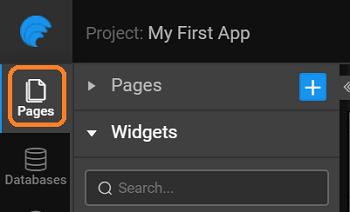

WaveMaker app is a collection of pages. Learn how to create a page.

---
WaveMaker app is a collection of pages though it is a single page application (SPA). Pages load asynchronously on demand. Each page is composed of different UI elements and [widgets](/learn/app-development/widgets/widgets-library). These UI elements enable user interaction and get data from the backend services. You can set navigation and interaction rules across pages.

:::tip
To learn about page life cycle and architecture, see [Page Concepts](/learn/app-development/ui-design/page-concepts).
:::

For developing app, you create multiple pages and link them as per your app flow.

## Creating a Page
Navigate to the pages section to create a page. However, by default, the **Main Page** generates automatically.  

  

In this section, you will learn:

- How to customize the [Main Page](#main-page)
- How to create [Additional Pages](#page-creation)
- See the [Types of Pages](#page-types)
- Learn about [Page Operations](#page-operations)

## Main page

The Main page comes with header, footer, top nav, left nav and right nav layout. You can change the layout can as per your needs. For more information, see [Layouts](/learn/app-development/ui-design/page-concepts/page-layouts). 

Each element of the page layout - header, footer, topnav, leftnav and rightnav can be edited and customized. The change will reflect in all pages that use the same element. Thus, it gives a unified look across all pages in the app. 

When you are editing, WaveMaker effectively generates the HTML code. You can access the code from the markup tab.

 

## Things to be aware of

When creating a page, the following naming conventions should to be followed:

1. The page name should contain at least one character and it cannot be a number.
2. The page name should not contain special characters.
3. The page name should not start with a number.

New pages can be created to segregate the functionality of the app. Ideally, each page would cater to one business need of the app. New pages can use pre-built templates and layout. 

## Types of Pages

There are two types of pages that can be created in an application:

1. **Page** – which can be loaded independently in the application. These act as a route within the application when associated with navigation events.
2. **Partial** - these have to be associated with a component within a page. Usually, a part of the page which is common across the app like a header or a left navigation, are implemented as a single partial and used across all app pages.

## Page Title

By default, WaveMaker provides the Main Page. When you add additional pages, it titles the pages as Page1, Page2, and so on. You can use the Page Title property to set the Page Title. 

You can use Page.pageTitle to change and access the page title. You can set the Page Title from Script tab using: Page.pageTitle = 'Profile'. Once set through Script any binding from the properties will be invalidated.

## Page Operations

You can duplicate, rename and delete a page using the page operations. These can be accessed from the more options against a given page or a partial page. 

- **Renaming** a page or a partial page leads to the page name being renamed, with the new name given by you. All the references are also renamed.
- **Duplicating** a page leads to a copy of the page or partial page being created, with the new name given by you. A new goTo action for that page is also created.
- **Deleting** a page removes all references to the selected page from the project.

