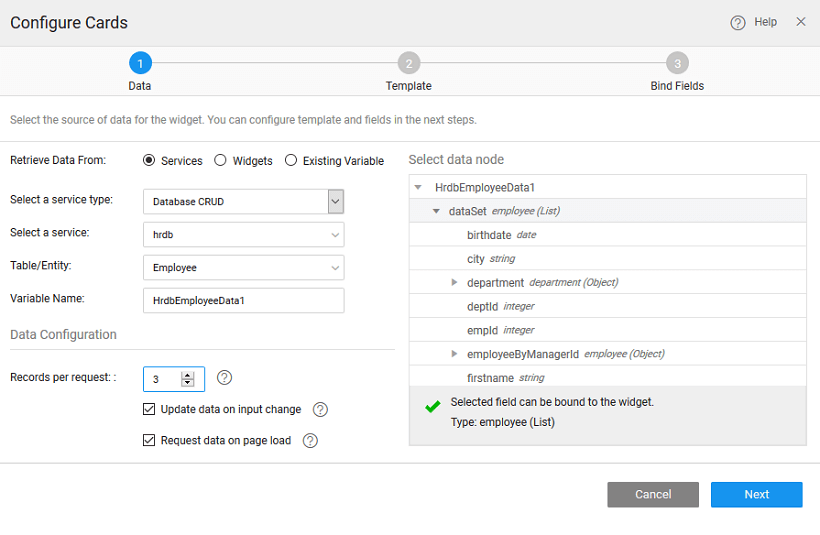

---
## Creating Employee Cards

**Cards** represents view of items that are rendered responsively across a wide range of mobile devices and screen sizes.

To bind the Cards to your back-end services data, drag and drop the Cards Widget onto the canvas. 

## Select Data

There can be different scenarios to deal with when configuring your Cards Widget with a data source. The data source can be in the form of a service - database, web or Java; or from an another widget on the page.

### Example 1: No existing variable or service
You do not have any service available in your project. In this scenario, no variables can be created as there are no services available in your project.
    
1. You will be prompted to import either a database or a web service or a create java service. Click the appropriate button to proceed.
2. When the service is available in your application, proceed by selecting the service and follow the same steps as mentioned in scenario 2.  
    
  

### Example 2: With an existing service 
You have service integrated within the app like [Database]http://[supsystic-show-popup id=106]), [Web Service](http://[supsystic-show-popup id=115]), or [Java Service](http://[supsystic-show-popup id=119]).

1. **Retrieve Data From**: Services option is selected by default.
2. Here we will show how to use Database CRUD service. Select Service Type as Database CRUD
3. **Select a Service**: Select a service from the drop-down which lists the services available in your application. 

4. **Variable Creation**: Once you select the service and Table/Entity for the service, a default variable will be created for you – see the Variable Name field populated by default which will be holding the dataset of the service. You can change the Variable name.
5. **Select the Data Node**: You are given the option of choosing either the entire dataset – when you are binding the widget to a data source or any of the fields in the dataset. Select data node tree when binding a single widget or a List item to a field in the dataset.
6. **Data Configuration Options**: You also have the option of setting the following Data Configuration options:
        
    - **Records per request**: with an option to enter the number of records to be fetched on each request. This will define the pagination behavior of the List. The default is 20, for this example, we set it to 3.
    - **Update Data on input change**: which is checked on by default. This means that whenever there is a change in the input parameter or filter field of the variable the data will be fetched from the service. This option will have an impact on the app performance.
    - **Request data on Page Load**: which is checked on by default. This allows for data to be shown when the page is loaded. If this is not checked, you will not be able to view the data when the page gets loaded. Instead, No Data Found message appears on the widget at runtime.
        

### Example 3: With an existing variable

If the variables are already created in the project, [Variable Access](http://[supsystic-show-popup id=105]).
    
1. **Retrieve Data From**: Select **Existing Variable**.
2. **Select a Variable** from the drop-down list of the variables available in the application. You can select the one needed to bind the List Widget to. You can also search for a specific variable by typing in select variable option. If you are able to find your variable in the drop-down select the same. 

3. Once you select the variables, it shows the dataset that it is bound to.
4. As Data Configuration options are already set for this variable, you do not see those options in this scenario.

### Example 4: Binding to widget
    
1. **Retrieve Data From**: Select the Retrieve Data From option as Widgets.
2. **Select a widget** from the drop-down list. This will list the widgets present on this page, you cannot access the widgets from other pages. 

3. You can **select data node** to be the entire widget or the selected item node in case of another Data Table or List or Cards or result from a Live Filter
4. As you are not using a Variable the Data Configuration options will not be available.
    

## Select Template

1. Selecting the Template: In this step, you are expected to select a template suitable for the current use case. 
2. Select Pagination: Choose one of the pagination options provided 

## Binding Data Fields

The template selected in the previous step provides a set of widgets that need to be bound to the corresponding field from the data source selected in the first step. Select the widget and bind to the corresponding properties like Caption etc. to the fields by selecting the field from the drop-down list.

## Design

You can add widgets from the canvas, change the properties at the card and at widget level.

## Run

Click on Preview button to test run the app.

## See More

[Cards Use Cases](/learn/app-development/widgets/datalive/cards/card-use-cases/)  
[Cards Basic Usage](/learn/app-development/widgets/datalive/cards/card-basic-usage/)  
[How to access cards items](/learn/how-tos/capturing-card-items/)  
