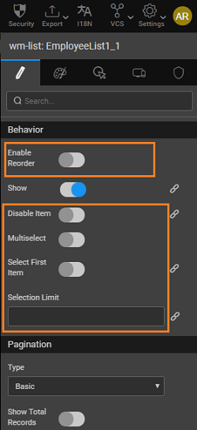

1. **Selection Limit**: This property sets the maximum items that can be chosen at run-time. It also determines whether the list can have single or multiple items selected. This property can be bound to a variable to determine the selection limit at run-time.
2. **Multiselect:** Multiselect will enable users to select multiple list items at runtime. These items can be captured via the _selecteditem_ which will be an array of objects. See Usage Scenarios for more details.
3. Item Reordering: **Enable reorder **will allow users to reorder the list items at run-time.

< Configuration

Properties, Events and Methods >

[1\. Live & Data Widgets](/learn/app-development/widgets/widget-library/#data-live)

- [1.1 Cards](/learn/app-development/widgets/datalive/cards/)
    - [i. Data Source](/learn/app-development/widgets/datalive/cards/cards-data-source/)
    - [ii. Templates](/learn/app-development/widgets/datalive/cards/cards-templates/)
        - [○ Profile Cards](/learn/app-development/widgets/datalive/cards/cards-templates/#profile)
        - [○ Feed Cards](/learn/app-development/widgets/datalive/cards/cards-templates/#feed)
        - [○ Product Cards](/learn/app-development/widgets/datalive/cards/cards-templates/#product)
    - [iii. Card Configuration](/learn/app-development/widgets/datalive/cards/card-configuration/)
        - [○ Items per Row](/learn/app-development/widgets/datalive/cards/card-configuration/#items-per-row)
        - [○ Grouping & Ordering](/learn/app-development/widgets/datalive/cards/card-configuration/#grouping-ordering)
        - [○ Pagination](/learn/app-development/widgets/datalive/cards/card-configuration/#pagin)
        - [○ Message](/learn/app-development/widgets/datalive/cards/card-configuration/#message)
    - [iv. Card Behavior Settings](/learn/app-development/widgets/datalive/cards/card-behavior-settings/)
        - [○ Selection Limit](#selection)
        - [○ Multiselect](#multicelect)
        - [○ Item Reordering](#item-reordering)
    - [v. Properties, Events & Methods](/learn/app-development/widgets/datalive/cards/cards-properties-events-methods/)
        - [○ Properties](/learn/app-development/widgets/datalive/cards/cards-properties-events-methods/#properties)
        - [○ Events](/learn/app-development/widgets/datalive/cards/cards-properties-events-methods/#events)
        - [○ Methods](/learn/app-development/widgets/datalive/cards/cards-properties-events-methods/#methods)
    - [vi. Use Cases](/learn/app-development/widgets/datalive/cards/card-use-cases/)
- [1.2 Data Table](/learn/app-development/widgets/datalive/data-table/)
- [1.3 Form](/learn/app-development/widgets/datalive/form/)
- [1.4 List](/learn/app-development/widgets/datalive/list/)
- [1.5 Live Form](/learn/app-development/widgets/datalive/live-form/)
- [1.6 Live Filter](/learn/app-development/widgets/datalive/live-filter/)
