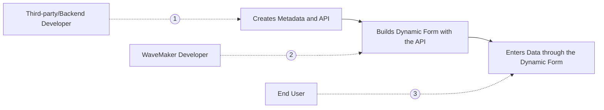

---

A Form is a set of fields used to collect responses from users. These Forms are generally static where the input fields are fixed and are known to the Form developers during design time. Now, to render forms with varying fields, Dynamic Forms come into use.

Dynamic Form is a type of service Form that adapts its fields and layout based on metadata received from an API. The metadata contains information about the form fields, such as their field names, data types, validation rules, and more.

In the case of Dynamic Forms, the specific fields and their arrangement are not predetermined or hard-coded. Instead, they are determined dynamically at runtime based on the metadata received from the API. This flexibility allows for the creation of customizable forms that can change frequently based on business requirements or user roles.

For example, a Business Analyst can use their expertise to define the form fields for a targeted customer. By manipulating the metadata, they can determine which fields should be included in the Form, what types of data they should accept, and any additional validation rules, if needed.

Dynamic Forms are beneficial in scenarios when:

- the Form requirements change frequently
- driven by business models, or
- the Form is determined by different user roles

By relying on metadata and an API, Dynamic Forms provide a flexible and adaptable solution that can accommodate these dynamic requirements without requiring code changes or redeployment of the Form.

## Understanding Form Types

Following are the differences described to understand which type of Form is appropriate to use.

|   Form   |   Dynamic Form   |
|--------|----------|
| Static display with Fixed fields and labels | Interactive display No fixed fields and labels |
| Upfront knowledge about fields i.e Validation, layout, widget type, formatting etc | No configuration is done upfront, only metadata is available |

## Dynamic Forms in WaveMaker

WaveMaker expects metadata to render fields inside a dynamic form. This metadata is an array of objects where each object represents a field inside the form. A typical field object could be something as follows

```markup
[{
“name”: “” //name of the field
“displayname”: “” //name to be displayed for the field
“type”: “” //type of the field
“required”: “” //isRequired
“widget”: “” //widget type for the field
“dataset”: “” //dataset for the field, if the widget is accepting the dataset
}]
```



## Dynamic Form Workflow

1. Third-party/Backend Developers, create the API that returns the metadata for a form. It is shared with WaveMaker developers to create a Dynamic Form.
2. WaveMaker developers work on User Interface (UI) to create the required Dynamic Form with the received metadata.
3. The end user can use the created Dynamic Form to provide the responses.

## Benefits of Dynamic Form

### Business Users can Control Fields to Display

Dynamic Forms are metadata-driven, which allows business users to configure the fields to be displayed, including in what order, and how to be displayed, in real-time. These Forms are created with a simple UI that takes Form fields as inputs from business users.

### Update Forms without Frequent Deployments

Dynamic Form is constructed over metadata, where they provide necessary details about the data such as name, type, widget type, and validation rules which help in avoiding repeated deployments to add new field details as it is done in Static Forms. Fields can be added in real-time by business users as per the requirement, as the metadata already contains the field details.

## How to Configure Dynamic Form

You can create or import a service where the service is created against the metadata.

:::note
**Metadata**: It contains information like name, type, widget type, validation rules, and other required details about the field.
:::

:::important
If the metadata service returns some other structure than the one mentioned above, use the
[on-beforerender event](#modifying-dynamic-form-metadata) on the Form to modify the data accordingly.
:::

### Importing Service

Go to Web Services. Click **Import Web Service** to import a new web service. To know how to import REST Web Service, see [Import REST Services](https://docs.wavemaker.com/learn/app-development/services/web-services/rest-services#test-rest-service-api).

### Creating Variable

Create a variable `MetadataVariable` to fetch the metadata. To know how to create a variable, see [Creating Service Variable](https://docs.wavemaker.com/learn/app-development/variables/web-service#how-to-create-a-service-variable).

The created variable should be used in the **Markup** tab to [bind the metadata with the Form](#binding-variable-with-form).  

[](/learn/assets/variable-markup-dynamicform.png)

### Creating Dynamic Form

1. Go to pages and create a new page. To create a new page, see [Creating Page](https://docs.wavemaker.com/learn/app-development/ui-design/page-creation).

#### Binding Variable with Form

1. Go to the Markup tab and enter the following code snippet to create a Dynamic Form. Add metadata property in the markup with the created variable. For example, the accepted value for metadata is `metadata="bind:Variables.<Variable Name>.dataSet"`.

```markup

<wm-form errormessage="" captionposition="top" title="Form" enctype="application/x-www-form-urlencoded" method="post" metadata="bind:Variables.createMetadata.dataSet" captionalign="left" name="form1" on-beforerender="form1BeforeRender($metadata, widget)">
                <wm-form-action key="reset" class="form-reset btn-secondary" iconclass="wi wi-refresh" display-name="Reset" type="reset"></wm-form-action>
                <wm-form-action key="save" class="form-save btn-success" iconclass="wi wi-save" display-name="Save" type="submit"></wm-form-action>
            </wm-form>

```

[](/learn/assets/add-formcode-dynamicform.png)

2. Click **Save** to save the changes in the Markup tab. Click Preview to view the created Dynamic Form.

[](/learn/assets/confirm-formcode-dynamicform.png)

#### Modifying Dynamic Form Metadata

1. If the Form fields do not render as expected, use the **on-beforerender** event to modify the provided field details into WaveMaker accepted format. For example, use the following format `on-beforerender="<Form_Widget_Name>Beforerender($metadata, $isolateScope)"` where `$isolateScope` is the accepted widget type.

[](/learn/assets/add-formcode-onbeforerender-dynamicform.png)

You can preview the Dynamic Form.

## Create Business User Form

To create Business User (BU) Form, you can create Static Form only in cases when BU wants to add or edit fields through WaveMaker.

1. Create a new page. To create a new page, see [Creating Page](https://docs.wavemaker.com/learn/app-development/ui-design/page-creation).

2. Drag and drop the **Data Table** widget onto the page.

[](/learn/assets/drop-datatable-dynamicform.png)

3. Configure the Data by selecting the service type as Database CRUD and provide the Service, Table Name, and Variable Name. Click **Next** to confirm the details.

[](/learn/assets/configure-liveform-admindynamic.png)

4. Configure the Layout, Table Columns, Form Layout, and Form Fields. To configure a data table widget, see [Data Table Configuration](https://docs.wavemaker.com/learn/app-development/widgets/datalive/datatable/data-table-basic-usage).

5. Once the **Data Table** is configured, click Preview.

6. Click **New** and enter Name, Displayname, Type, and Widget as given in the metadata. Click **Save** to save the field details in the Form.

[](/learn/assets/enter-field-adminform.png)

You can manage the fields in the Form.

[](/learn/assets/adminform-entry-dynamicform.png)

