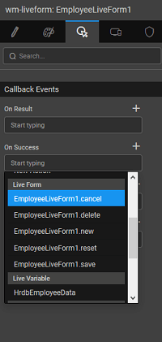

### Configuring live form actions

You can define **action buttons** using the **Actions** tab. By default, six actions are provided categorized based upon the behavior of the Form. They are:

- In Edit mode - **cancel**, **save** and **reset** actions of which cancel and save in are pre-selected.
- In View mode - **delete**, **update** and **new** actions.

For each action button, you can specify the

- **Title**;
- **class**;
- display **icon**;
- **Action** to be performed on click: These actions can be form actions like cancel, save and view; or navigation events; or any API invocation. **Multiple events** can be handled for a single Action.
- **Type** of button -
    - _submit_ or
    - _reset_;
- **hidden** to hide the button from the form
- choose an icon to be displayed on the button.

The Form Events can be triggered from actions outside the Live Form, i.e. a button placed outside the Live Form template can trigger a form save the event. 

New action functionality can be added by clicking on the **ADD** button, against the respective category. Once the action is specified a code snippet will be created in the JavaScript which can be used to code the desired action. The Action will be a JS function as shown below. Here we have written a function to display an alert dialog. The name of the function is the action field entry in the custom button created earlier.

Page.test = function(){ 
        alert("hello");
   };

< Field Configurations

Events & Methods >

[1\. Live & Data Widgets](/learn/app-development/widgets/widget-library/#data-live)

- [1.1 Cards](/learn/app-development/widgets/datalive/cards/)
- [1.2 Data Table](/learn/app-development/widgets/datalive/data-table/)
- [1.3 Form](/learn/app-development/widgets/datalive/form/)
- [1.4 List](/learn/app-development/widgets/datalive/list/)
- [1.5 Live Form](/learn/app-development/widgets/datalive/live-form/)
    - [i. Data Source](/learn/app-development/widgets/datalive/live-form/live-form-data-source/)
    - [ii. Layouts](/learn/app-development/widgets/datalive/live-form/liveform-layouts/)
    - [iii. Configuration](/learn/app-development/widgets/datalive/live-form/liveform-configurations/)
    - [iv. Fields Configuration](/learn/app-development/widgets/datalive/live-form/fields-configuration/)
        - [○ Display Options](/learn/app-development/widgets/datalive/live-form/fields-configuration/#display)
        - [○ Validations](/learn/app-development/widgets/datalive/live-form/fields-configuration/#validations)
        - [○ Widget Usage](/learn/app-development/widgets/datalive/live-form/fields-configuration/#widgets)
    - [v. Actions](/learn/app-development/widgets/datalive/live-form/liveform-actions/)
    - [vi. Events & Methods](/learn/app-development/widgets/datalive/live-form/events-methods/)
        - [○ Events](/learn/app-development/widgets/datalive/live-form/events-methods/#events)
        - [○ Methods](/learn/app-development/widgets/datalive/live-form/events-methods/#methods)
    - [v. Use Cases](/learn/app-development/widgets/datalive/live-form/liveform-use-cases/)
- [1.6 Live Filter](/learn/app-development/widgets/datalive/live-filter/)
