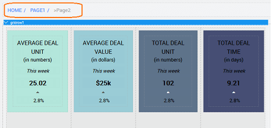

We will see here a simple usage of a **Breadcrumb** widget. All breadcrumbs start with the home page. The home page is the first level because it’s the user’s starting point. Displaying the home page first helps users recognize the hierarchy. Breadcrumbs are typically placed, in horizontal form, under the masthead or navigation of a website.

**Scenario**: Consider an app with three pages - Main, First and Second Pages. Breadcrumb in the First Page will enable one to navigate to Main Page, while the one in Second Page will provide navigation to First and Main Page.

## Step 1: App Creation

Create an app with three pages - Main, Page1, and Page2. We have used Employee Profile and Admin Dashboard templates for Page1 and Page2 respectively.

## Step 2: Variable Creation

- Click Variables option under Variables in Workspace Toolbar. Select New Variables button and click Model.  Choose the Application as Owner i.e. Application scoped. 
- In the text editor of the above Model Variable, enter the following code: This code sets values for the properties of _label, id, icon, and link_ to be displayed on the breadcrumb.
    
    - _label_ and _icon_ are the name and icon displayed on the Breadcrumb,
    - _a link_ is an action to be performed when the Breadcrumb item is clicked,
    - _id_ is the identifier for the current page i.e the page name. The Breadcrumb will search for the page name in this dataset and gets the first possible path for the page.
    - _children_ will be a repeat of the entire structure in case you want a sub-menu like structure
    
    \[{
      "label": "Main Page",
      "icon": "glyphicon glyphicon-home",
      "link": "#/Main",
      "id": "Main",
      "children": \[
        {
          "label": "First Page",
          "icon": "wi wi-ellipsis-v",
          "link": "#/Page1",
          "id": "Page1",
          "children": \[
            {
              "label": "Sub Page1",
              "id": "subPage11",
              "icon": "wi wi-euro-symbol"
            },
            {
              "label": "Sub Page2",
              "id": "subPage12",
              "icon": "wi wi-euro-symbol",
              "link": "#/subPage12"
            }
          \]
        }
        \]},
        {
          "label": "Page2",
          "id": "Page2",
          "icon": "wi wi-euro-symbol",
          "link": "#/Page2"
        }
      \]
    
    
    
    ## Step 3: Binding
    
    - Drag and drop **Breadcrumb widget** onto the canvas of FirstPage
    - Bind the **value (under dataset) property** to the Model **dataset** which we have created above and set the **Action** properties to the corresponding fields from the Model. 
    
    ## Step 4: Page2
    
    - Open the **Page2** and repeat the above steps
    
    ## Step 5: Run
    
    - Run the app, see the breadcrumb displayed in the First and Second pages. Clicking on the links will navigate to the previous pages
    - In the above Model structure the provision to have Breadcrumb for sub-levels is also given, for example Page1 has two sub pages subPage11 and subPage12. This will help in setting the path for the sub pages. **Note:** If the id's are repeating then the first possible path will be shown in the breadcrumb.

[6\. Navigation Widgets](/learn/app-development/widgets/widget-library/#nav-widgets)

- [6.1 Breadcrumb](/learn/app-development/widgets/navigation/breadcrumb/)
    - [○ Properties](/learn/app-development/widgets/navigation/breadcrumb/#properties)
    - [○ Use Cases](/learn/app-development/widgets/navigation/breadcrumb-use-cases/)
- [6.2 Dropdown Menu](/learn/app-development/widgets/navigation/dropdown-menu/)
- [6.3 Nav](/learn/app-development/widgets/navigation/nav/)
- [6.4 Nav Bar](/learn/app-development/widgets/navigation/nav-bar/)
- [6.5 Popover](/learn/app-development/widgets/navigation/popover/)
