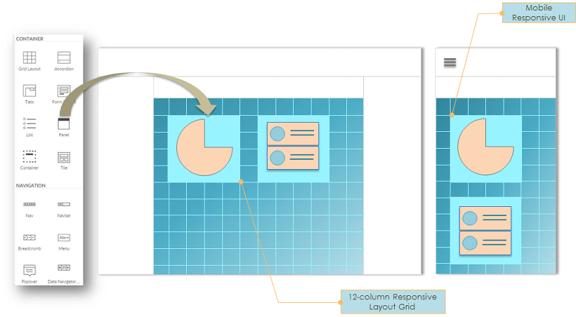

You can find everything about WaveMaker widgets in this section. 

---

Learn about Widgets in WaveMaker which are HTML/Bootstrap based widgets with rich interaction and designed for highly-responsive design. Also, see the common Widget properties in this section.

:::tip
To view the list of widgets in WaveMaker, see [Widget Library](widget-library.md).
:::

## Widget Basics

Pages are constructed as a composition of widgets using the visual drag-n-drop approach. Responsive Layout grid is used for the placement of widgets for automatically making them responsive to all devices.

WaveMaker provides **HTML/Bootstrap based widgets or UI Components**, with rich interaction and for responsive design. Widgets are the building block of any application. They are the tools for exchange of information from the user to the project. Widgets eliminate repeated development and provide consistent behavior across browsers and platforms. Drag and drop action lets you add widgets to your project.

Widgets could simply map to a standard HTML construct like a label or select or could be complex HTML structures like Lists or extended Forms built for responsive design.

## Widget Properties

Once you add a widget to your page, click on the widget to see the available actions in the **Properties Panel**. Below are some of the common actions of Widgets.

### Basic Attributes
Define the content to be displayed in a widget by connecting it to a database query, web service, Java method, or another widget. Data binding provides integration with data sources known as ‘Variables’ or any other Widgets. Variables offer the ability to integrate with services such as a database, web service or any other backend service. [More on Variables and Binding](/learn/app-development/variables/data-integration/).

### Styling
Use the **Styles** tab in the **Properties Panel** to define styles. Widget styles for alignment such as margin, padding, text & background, and border styles can be customized as per the required look-n-feel. Advanced users can switch to the Style **Page Mode** to edit the code. [More on Styling](/learn/app-development/ui-design/page-artefacts/#page-style "Markup, Scripting and Styles").

### Event Binding
Use the **Event** tab in the **Properties Panel** to choose the action for specific events. Widgets expose click, mouse enter/leave events, tap and double tap for multiple devices, which can be bound to Variables or methods of Services. [More on Events](/learn/responsive-web/web-ui-design/#events "Events and navigation"). For Mobile app, these take the form of [gestures](/learn/hybrid-mobile/mobile-page-concepts/#page-transitions-gestures).

### Device
Use the **Device** tab in the **Properties Panel** to choose the widget visibility. Manage the widget visibility across device sizes.

### Access Control
Define which user roles can access the widget in the **Security** tab of the **Properties Panel**. [More on role-based access](/learn/app-development/app-security/access-levels-permissions/ "Role-based Access Control") and [widget security](/learn/app-development/app-security/access-levels-permissions/#role-based-access).

We have seen the basics of the HTML/Bootstrap based widgets or UI Components and properties.

## See Also

3\. UI Elements - Widgets & Prefabs

- [3.1 Widgets](#)
    - [i. Basics](#widget-basics)
    - [ii. Properties](#widget-properties)
- 3.2 Widget Library
    - [1\. Data Widgets](/learn/app-development/widgets/widget-library/#data-live)
    - [2\. Container Widgets](/learn/app-development/widgets/widget-library/#container)
    - [3\. Form Widgets](/learn/app-development/widgets/widget-library/#form)
    - [4\. Basic Widgets](/learn/app-development/widgets/widget-library/#basic)
    - [5\. Chart Widgets](/learn/app-development/widgets/widget-library/#chart)
    - [6\. Navigation Widgets](/learn/app-development/widgets/widget-library/#nav-widgets)
    - [7\. Advanced Widgets](/learn/app-development/widgets/widget-library/#advanced)
    - [8\. Modal Dialog Widgets](/learn/app-development/widgets/widget-library/#dialog)
    - [9\. Custom Widgets - Prefabs](/learn/app-development/widgets/widget-library/#prefabs)
    - [10\. Mobile & Device Widgets](/learn/app-development/widgets/widget-library/#mobile)
