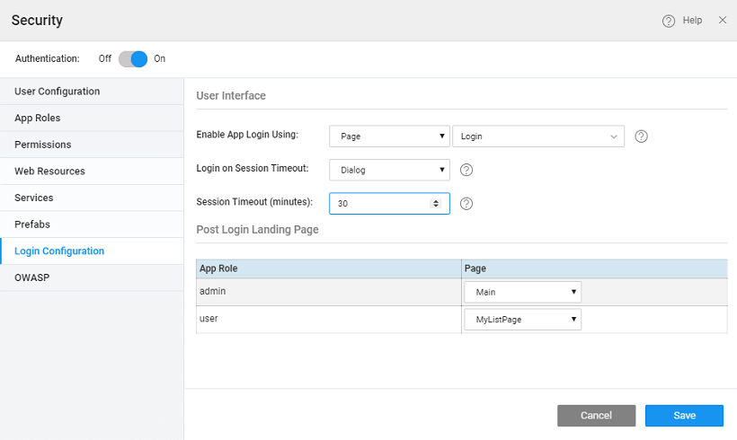

**Login Configuration** defines the login behavior once authentication is enabled.

There are two behaviors that can be defined:

- login page and
- landing page.

You can also configure the session timeout behavior.

# Setting Login Page

1. **How** the Login should be handled: using a **login page** - you can use the default login page provided by Studio or create your own page; 
2. or using a **login dialog** pop-up provided by Studio. This dialog is present in the _Common page_ as "_CommonLoginDialog_" and can be customized. 

# Setting Landing Page

1. **Where** the user should land: **Landing page** can be defined to be different for different roles the user is assigned. For example, an admin might want to start with the employee management page, while a user would start with their profile page. In such cases, the employee management page would be the Landing Page for the admin role and the employee profile page would be the Landing Page for the user role.
2. Few things that you need to be aware of regarding the landing page configured here and the home page configured in the [**Project Settings**](http://[supsystic-show-popup id=108]) dialog ([Settings accessed from the Project Configurations of Workspace](http://[supsystic-show-popup id=107])):
    - In case the app is not secure, user is redirected to the Home page configured in the project settings
    - In case the app is secure but the Home Page is not (permission set to everyone), user is redirected to the Home page configured in the project settings
    - In case the app and Home Page are secure (permission set to specific user role), user is redirected to the configured login page as per the user role 

# Session Timeout

1. **Session timeout behavior** can also be defined. Session timeout occurs due to session inactivity or deletion of browser cookies. The re-login mechanism in the app can be configured as follows:
    
    - - Page: On session timeout, the user is redirected to the configured login page. Any page can be configured to redirect the user on session timeout.
        - Dialog: On session timeout, a dialog pops-up, for re-logging in the app.
    
    
    
    In both the cases, on re-login, redirection occurs based upon the user login:
    
    - same user (last logged-in), the user is redirected to the last page(session timeout through Page) or remains in the same state(session timeout through Dialog).
    - different user, the user is redirected to the Landing Page against the user role
    
    Control comes to the _onSessionTimeout callback_ function as soon as session timeout is detected by the app. You can perform a custom action like clearing sensitive data, etc in this callback. This function can be invoked from **app.js** file:
    
    App.onSessionTimeout = function () {
    
    };
    
    This function can be invoked from any **page.js** file:
    
    Page.onSessionTimeout = function () {
    
    };
    

# Setting session timeout

By default, the session timeout is set to 30 minutes. You can choose to change it 

< Role Based Access

Security Variables >

7\. Security

- 7.1 App Security Overview
    - [i. Overview](/learn/app-security/app-security/#)
    - [ii. How Security Works](/learn/app-security/app-security/#working)
    - [iii. How Security is Implemented](/learn/app-security/app-security/#implementation)
    - [iv. Security Terminology](/learn/app-security/app-security/#terminology)
- 7.2 Authentication
    - [i. Overview](/learn/app-security/authentication/)
    - [ii. Security Providers](/learn/app-security/authentication/#security-providers)
        - [○ Demo](/learn/app-security/authentication/#demo)
        - [○ Database](/learn/app-security/authentication/#database)
        - [○ LDAP](/learn/app-security/authentication/#ldap)
        - [○ Active Directory](/learn/app-security/authentication/#ad)
        - [○ CAS](/learn/app-security/authentication/#cas)
        - [○ SAML](/learn/app-security/authentication/#saml)
        - [○ Custom](/learn/app-security/authentication/#custom)
- 7.3 Authorization
    - [i. Overview](/learn/app-security/authorization/)
    - [ii. User Onboarding](/learn/app-security/authorization/#user-onboarding)
    - [iii. App Roles](/learn/app-security/authorization/#app-roles)
- 7.4 Access Levels & Permissions
    - [i. Overview](/learn/app-security/access-levels-permissions/)
    - [ii. Setting Permissions](/learn/app-security/access-levels-permissions/#setting-permissions)
    - [iii. Role Based Access to Widgets](/learn/app-security/access-levels-permissions/#role-based-access)
- [7.5 Login Configuration](#)
    - [i. Overview](#)
    - [i. Login Page](#login-page)
    - [ii. Landing Page](#landing-page)
    - [iii. Session Timeout](#session-timeout)
- 7.6 Security Related Variables
    - [i. Overview](/learn/app-security/security-variables)
- 7.7 SSL Encryption
    - [i. Overview](/learn/app-security/ssl-encryption/)
- 7.8 OWASP
    - [i. Overview](/learn/app-security/owasp/)
    - [ii. Preventing XSS Attacks](/learn/app-security/owasp/#xss)
    - [iii. Preventing CSRF Attacks](/learn/app-security/owasp/#csrf)
- 7.9 Single Sign-On (CAS)
    - [i. Overview](/learn/app-security/central-authentication-system/)
- 7.10 Token Based Authentication
    - [i. Overview](/learn/app-security/token-based-authentication/)
    - [ii. How Token Based Authentication Works](/learn/app-security/token-based-authentication/#working)
    - [iii. What is Token](/learn/app-security/token-based-authentication/#token)
    - [iv. Token Repository](/learn/app-security/token-based-authentication/#token-repository)
    - [v. Token Request](/learn/app-security/token-based-authentication/#token-request)
    - [vi. API Invocation](/learn/app-security/token-based-authentication/#api-invocation)
    - [vii. Token Validity](/learn/app-security/token-based-authentication/#token-validity)
- 7.11 SAML Integration
    - [i. Overview](/learn/app-development/app-security/saml-integration/)
    - [i. Profiles](/learn/app-development/app-security/saml-integration/#profiles)
    - [ii. Integration](/learn/app-development/app-security/saml-integration/#integration)
    - [iii. Configuration Files](/learn/app-development/app-security/saml-integration/#files)
    - [iv. Deployment](/learn/app-development/app-security/saml-integration/#deployment)
    - [v. Troubleshooting](/learn/app-development/app-security/saml-integration/#troubleshooting)
    - [vi. Use Cases](/learn/app-development/app-security/saml-integration/#use-cases)
