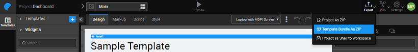
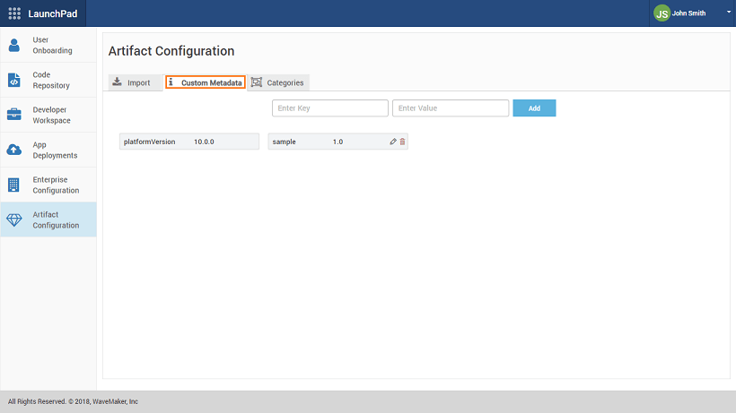
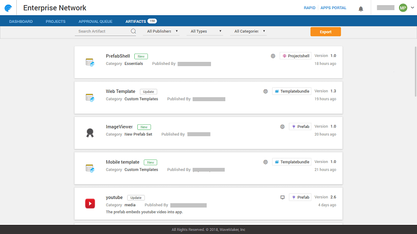

**Repository** is a collection of artifacts or resources used across application development lifecycle in WaveMaker platform. It allows for easy exploration and discovery of Artifacts available to the developer network. These artifacts include:

- : Prefabs are a collection of one or more widgets that are bound to APIs or services.
- **Shell**: Project Shell is an app with functionality that is common to multiple apps across the enterprise. This can be used as a starting point in app development.
- **Bundles**: A template bundle is a collection of templates - a re-usable arrangement of one or more widgets in the page content that together capture the purpose of the page.
- : Themes are style elements which work at the widget or UI component level. Themes help provide a consistent look and feel to your application.

Each of the above artifacts has a workspace to develop the artifact and then publish it for other developers across the enterprise to import/use them.

## Publishing Mechanism

There are three ways in which an Artifact can be published:

1. **to Project**: This will allow the artifact developer to send it to a specific project for testing purposes.
2. **to EDN **(only for enterprise version): To make the artifact available for the entire enterprise for all applications to use, it needs to be published to EDN. After publishing, EDN Admin or Product Owner approves the artifact for use within the enterprise.
3. **to Workspace** (only for non-enterprise version): Once tested and verified, it can be used for any project under development. This is done by publishing the artifact to artifact developer's workspace and made available for any project he/she is currently working on.

Each of the Artifact has a slightly different publishing flow as described in the sections for , [Shell](#shells), [Bundle](#templates) and

In the enterprise version of WaveMaker Publishing mechanism helps collaboration among enterprise users.  Find more from here.

Once published the artifacts can be viewed from the Artifacts dialog.

### Publishing

Prefab is developed from the Project Workspace, similar to any other app development, and then made available to other developers.  Publishing states for a Prefab include:

- **to EDN** (only for enterprise version) – Approval by EDN Admin. Once approved, Prefab has to be explicitly be imported for use within an application.
- **to Workspace** (only for non-enterprise version) - Once published to workspace the Prefab will implicitly be available for use across all projects within the developer's workspace.
- **to Project** (both enterprise and non-enterprise versions)– This will result in the Prefab appearing in the specified project with a MOD  tag. This can be used for testing purposes before publishing the Prefab.

To know more about creating and publishing Prefabs, [here](/learn/app-development/custom-widgets/creating-prefabs/)

### Shell Publishing

Project shell is created by the App Owner from the Studio workspace, by exporting the project being developed as a shell. 

**Project As Shell** behaves differently for the enterprise and non-enterprise versions:

- **version**: Once the developer exports a project as Shell to EDN, they will be prompted to enter the publishing information as mentioned in the [section](#features) The EDN Admin has to [or reject](#states) the Shell as with any other Artifact. Once approved, developers can select the Shell when creating new projects.
- **\-enterprise version**: Export Project as Shell to Workspace will allow the developer to select the Shell when creating new projects within their workspace.

To know more about creating and publishing Project Shell, [here](/learn/app-development/ui-design/project-shells/)

### Bundle Publishing

Template Bundle can be created from the Project Workspace using from the Template Bundles tab. Publishing Template Bundles process is different for the enterprise and non-enterprise versions:

- **version**: Once developed Template Bundles can be Published to EDN.  The developer will be prompted to enter the publishing information as mentioned in the [ section](#features) The EDN Admin has to [ or reject](#states) the Shell as with any other Artifact. Once approved, the Template Bundle will appear in the Page Creation dialog for selection by the developers.
- **\-enterprise version**: The developer needs to Export the Template Bundle as ZIP and then IMPORT it to any app within their Dashboard. 

To know more about creating and publishing Template Bundles, [here](/learn/app-development/ui-design/page-concepts/page-templates/)

### Publishing

Themes can be built by setting up WaveMaker Theme Repository and using Grunt commands.

- **Version**: Themes can be published using the Export -> Theme to EDN option: 
- **\-enterprise Version**: There is no Theme publish option for non-enterprise version, the theme zip file generated needs to be imported from the Themes dialog.

To know more about creating and publishing Themes, [here](/learn/app-development/ui-design/themes/)

## flow in Enterprise version

##### (ONLY for Enterprise version)

The following sections are for Enterprise version of WaveMaker.

### States

When publishing to EDN Artifact goes through several stages: 

- **Development**: Developer is working on it. No one else has access. Could be a new artifact or a new version of the existing artifact.
- : Developer applied for approval and it is awaiting action from EDN admin.
- : Rejected by the EDN Admin, the developer can rectify/modify the artifact and re-publish it.
- : Once approved by the EDN Admin, the artifact is available in the artifact repository.

### Features

Each artifact needs the following information for proper tracking and identification from within the repository: 

- : this will be useful for searching. Each artifact can have multiple tags.
- : this will be used for grouping purpose. Categories are typically defined by EDN Admin and developers associate the artifact with a given category at the time of publishing. The category can be selected from the available list or a new category can be entered. New category needs to be approved by the EDN admin.
- **Number**: Each artifact is associated with a version (automatic versioning) at the time of the publishing process.
- **Log**: These include the comments that the developer needs to add before publishing the artifact.

### Publish Process

Artifact Publishing involves the following steps:

1. **Info**: This requires the Developer to enter the Category, Version, and Change Log. In case this Artifact uses or has a dependency on other Artifacts (for example, Project Shell using a Prefab), the dependencies are listed here. 
2. : Here the developer can add Tags to aid in the discovery process of the Artifact. It also lists the Metadata like the Platform version it was developed on etc., this information is generated by the platform by default. 
3. (only for Prefabs): This is populated automatically by the platform, from the Configuration Settings entered at the time of the Prefab development. Any changes to this need to be done at the Prefab development time. 
4. : Verify the details before proceeding with publishing. 

### Artifacts and Updates

Once published the artifacts can be viewed from the Artifacts dialog.

**dialog** will list all the Artifacts available with details like

- with the category, publisher, changelog, tags, dependency information and metadata information
- ** History**, and

Prefabs can be imported from this dialog. Other Artifacts are available for use as soon as EDN Admin approves the Artifact.

**Updates**: Every time there is a change or modification in an Artifact, it needs to be Published again with a changed Version number. When a developer opens a project using that updated Artifact, Artifact updates are prompted. The developer can choose to update, revert (in case artifact is being downgraded) or ignore. Alternatively, notifications will be pushed for the developer within Studio to take an action on artifact upgrades.

### Management

Artifact Management involves two aspects:

- **\-development**: this involves defining the Categories, Custom Metadata and Import of Artifacts. These activities are accessed from Launchpad by Super Admin.
- **\-development**: this involves reviewing, approving/rejecting and export of Artifacts. These activities are accessed from EDN by Enterprise Admin.

allows the Super Admin to the following functionality:

1. **of Artifacts**: Artifacts imported here will be available enterprise-wide. 
2. **Metadata**: This information is used to identify Artifacts based upon say the platform version and so on. Define the Key-value pairs and add. All Artifacts developed will get this data attached. 
3. : used by the Artifact developer to aid in grouping the Artifacts 

allows management of Artifacts by the Enterprise Admin. The Artifacts can be filtered by:

- \- There are two ways an Artifact is created:
    - default Artifacts as provided by the , or
    - created and published by
- \- As mentioned earlier the different Artifact types include: Project Shell, Prefab, Template Bundle or Themes
- as defined by the publisher at the time of developing and/or publishing the Artifacts.

 ** Artifact**

1. 1. can be selected for
    2. can set the Filter criterion and only the Artifacts meeting the filter requirements will be selected for Export.
    3. will be prompted for a Package name, a default package name will be generated.
    4. selected Artifacts will be bundled into a zip file with the given package name.

**Queue** This will list all the Artifacts Pending Approvals and Rejected.  Artifacts Pending Approval can be selected, reviewed, and approved or rejected. For both Approve and Reject, the reason can be entered under Remarks. This will be appended to the Version History and in case of rejection, the developer can act upon it accordingly. 

< Pre-Requisites

Localization >

1\. WaveMaker Overview

- 1.1 Platform Overview
    - [Modern Web Apps](/learn/app-development/wavemaker-overview/platform-overview/#modern-web-apps)
    - [App Architecture](/learn/app-development/wavemaker-overview/platform-overview/#app-architecture)
    - [App Building Process](/learn/app-development/wavemaker-overview/platform-overview/#app-building-process)
    - [Technology Stack](/learn/app-development/wavemaker-overview/platform-overview/#technology-stack)
    - [Material Design](/learn/app-development/wavemaker-overview/platform-overview/#material-design)
    - [Hybrid Mobile Apps](/learn/app-development/wavemaker-overview/platform-overview/#mobile-apps)
- 1.2 Product walk-through
    - [Getting Started](/learn/app-development/wavemaker-overview/product-walkthrough/#getting-started)
    - [Project Dashboard ](/learn/app-development/wavemaker-overview/product-walkthrough/#project-dashboard)
    - [ Project Workspace](/learn/app-development/wavemaker-overview/product-walkthrough/#workspace)
    - [Canvas](/learn/app-development/wavemaker-overview/product-walkthrough/#canvas)
    - [Project Settings](/learn/app-development/wavemaker-overview/product-walkthrough/#settings)
    - [Configuration Profiles](/learn/app-development/wavemaker-overview/product-walkthrough/#profiles)
- [1.3 Supported Technologies](/learn/app-development/wavemaker-overview/supported-technologies/)
- [1.4  Pre-requisites](/learn/app-development/wavemaker-overview/pre-requisites/)
- [1.5 Artifacts Repository](#)
    - [Publishing Mechanism](#publishing)
        - [States](#states)
        - [Features](#features)
        - [Process](#process)
        - [Prefabs](#prefabs)
        - [Project Shells](#shells)
        - [Template Bundle](#templates)
        - [Themes](#themes)
    - [Artifacts flow for Enterprise version](#enterprise)
        - [States](#states)
        - [Features](#features)
        - [Publish Process](#process)
        - [Published Artifacts & Updates](#updates)
        - [Artifacts Management](#management)
- 1.6 WaveMaker Localization
    - [Platform Localization](/learn/app-development/wavemaker-overview/localization/#platform_locale)
    - [Setting Language Preference](/learn/app-development/wavemaker-overview/localization/#setting)
    - [Adding Language Bundles](/learn/app-development/wavemaker-overview/localization/#adding)
    - [Build Platform](/learn/app-development/wavemaker-overview/localization/#build)
- 1.7 User Management
    - [Overview](/learn/app-development/wavemaker-overview/project-user-management/#roles)
    - [Member Roles](/learn/app-development/wavemaker-overview/project-user-management/#roles)
    - [Add Members](/learn/app-development/wavemaker-overview/project-user-management/#add)
    - [Permissions](/learn/app-development/wavemaker-overview/project-user-management/#permissions)
