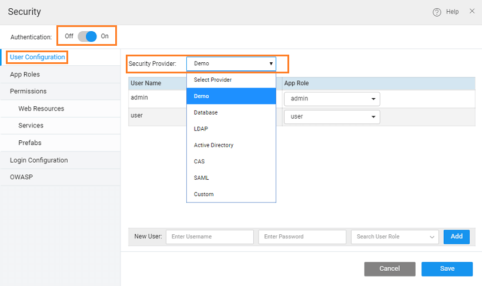
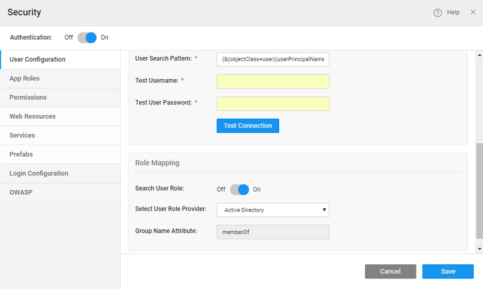

is a process by which the access to the app is restricted to known/authentic users.

WaveMaker application can include a login page that requires users to sign on in order to gain access to the application. In order to set up user authentication, you need to configure a data source that stores the user IDs and passwords. You have the following options for storing this data:

- supported by WaveMaker
- Directory Access Protocol ()
- Directory ()
- Authentication Service ()
- Assertion Markup Language ()
- Java Service
- Studio also provides a simple data source. You can use this data source to set up and test your login page during development. We do not recommend the Demo data source for production applications.

# Security Providers

can choose any of the following security providers for your WaveMaker applications:

- ,
- ,
- ,
- _[Directory](#ad)_,
- ,
- ,
- _[ID](#openid)_, and

the WaveMaker developer enables security, the demo is the default option. This option, as the name suggests, is for demo purpose, ease the user into security features. Demo option provides by default two out of box users called “admin” and “user” with password same as username. Developers can add/remove users.

Demo data source provides a great design-time tool for authentication. With this data source, you can quickly define a few usernames and passwords to use while creating and testing the login functionality for your application. It is recommended that you set up a more robust data source for authentication before you deploy your application into production.

default, the Demo data source provides two users - and These users are assigned to the and role respectively. You can create roles on the tab. You can add new users and assign them roles created in the tab. You can also delete existing users by clicking the icon next to a user row.

can use a database to store your authentication data. The database must include a table that provides a column for usernames and passwords. The usernames and passwords must be stored in the same table in the database.

you choose the **Provider**, you can perform the following configurations on the tab:

- **Configuration**:
    - : The Database that contains the tables for the username and password fields. Choose the Database from the pull-down menu. (You have to import the database first. See  [Integration](http://[supsystic-show-popup id=106]) If you have imported the database and it does not appear in this list, try closing and reopening the project).
    - _Table_: Select the table that contains the columns for the usernames and passwords.
- :
    - _Id Column_: Select the column for the user id
    - _Column_: Select the column for the user (login) name
    - _Column_: Select the column for the password.
- **Mapping**: This will build the query to fetch the role values from the user table based on the logged in user details. See [Onboarding](/learn/app-development/app-security/authorization/#user-onboarding) for more information.

(Lightweight Directory Access Protocol) is a software protocol for enabling anyone to locate organizations, individuals, and other resources such as files and devices in a network, whether on the public Internet or on a corporate intranet.

set up authentication using an LDAP data source, choose as the **Provider**

you choose  the  **Provider**, you can perform the following configurations:

- _URL_: This field specifies the host name and port number of the LDAP server. This is the root node of which security will be able to use - ldap://localhost:389/dc=wavemaker,dc=com. For deployment profile, you can specify _LDAP server URLs_, if required, by providing the multiple LDAP URLs as space-separated values, from the security tab of the [Configuration](http://[supsystic-show-popup id=109]) 
- _DN_: Distinguished Name for admin access, this is an optional field
- _Password_: Password in case admin access is mentioned above, this is an optional field
- _Search Pattern:_ Filter used to find the user in the directory, relative to the root specified above. The only valid variable is {0} which is replaced with the user's login name. For example: "cn={0},ou=people"
- _user DN:_ Full DN of the user account for testing connection URL. Example: someUser
- _user Password:_ The password for the test account that you use to test the LDAP URL.

you have configured the security provider, click the **Test Connection** button.  The **Connection** button only verifies that the _User DN_ and can be used to "bind" using the URL. You must specify a full DN for the _User DN_ A search is not performed for **Connection** as is normally done for login.

##### Mapping

Role Mapping for logged in users can come from the configured LDAP security provider or an imported Database. 

- _User Role_: Check this box to select the user role provider - Database or LDAP.
    - you select  both authentication and authorization (roles) will be retrieved from the LDAP security provider. You need to provide:
        - _Search Base_ the search base from which the search for group membership should be performed. Eg: ou=roles, where ou is organizational unit
        - _Name Attribute_ the attribute that holds data about the role name for a group. Eg: cn (common name)
        - _Group Filter_ the search filter used to search through the LDAP directory to find the roles to which an authenticated user belongs. {0} would be substituted with the user's DN. Eg: (member={0})
    - you select  authentication is performed using LDAP and authorization (roles) content is retrieved from the database. This allows you to use username and password credentials from LDAP while retrieving role content from a separate database. For role configuration using database [here](/learn/app-development/app-security/authorization/#user-onboarding)

: These configurations are for the development profile of the app. Configuration for Deployment profiles needs to be made from the Config Profile. [here for more](/learn/app-development/deployment/configuration-profiles/#deploy-profile)

#### Directory

**Directory Domain Service** is Microsoft's Directory Server. It provides authentication and authorization mechanisms as well as a framework within which other related services can be deployed (AD Certificate Services, AD Federated Services, etc). It is an compliant database that contains objects.

set up authentication using an Active Directory data source, choose _Directory_ as the **Provider.**

When you choose  _Directory_ the  **Provider**, you can perform the following configurations:

- _:_ field specifies the protocol and hostname of the AD server. Example: _://ad.mydomain.com_
- _:_ The fully qualified domain name (FQDN) of the Active Directory domain is an optional field. For instance: example.com
- _Dn:_ will be automatically populated based on domain entry only the first time. The user can change this later and subsequent changes to the domain will have no effect on rootDn. Example: When Domain is example.com; then RootDn is automatically updated as  dc=example, dc=com
- _Search Pattern_ is a filter which is prepopulated by default. Users can change it, as per their requirement.
- _username:_ Full DN of the user account for testing connection URL. Example: user1. If the domain is provided, then simply enter the username. On the other hand, if a domain is not provided, then username must be appended to the domain name.
- _user password:_ The password for the test account that you use to test the AD URL.

you have configured the security provider, click the **Test Connection** button, test user credentials are authenticated in this step. Keep in mind, during runtime, the authentication will happen based on user credentials and user search pattern. [here for more use cases](/learn/how-tos/active-directory-use-cases/)

##### Mapping

Role Mapping for logged in users can come from the configured Active Directory security provider or an imported Database. 

- _User Role_: Check this box to select the user role provider - Database or AD.
    - you select  both authentication and authorization (roles) will be retrieved from the AD security provider. You need to configure the  _Role Attribute._
    - you select  authentication is performed using AD and authorization (roles) content is retrieved from the database. This allows you to use username and password credentials from AD while retrieving role content from a separate database. For role configuration using database [here](/learn/app-development/app-security/authorization/#user-onboarding)

: These configurations are for the development profile of the app. Configuration for Deployment profiles needs to be made from the Config Profile. [here for more](/learn/app-development/deployment/configuration-profiles/#deploy-profile)

**Authentication Service** () is a single sign-on protocol for the web. Its purpose is to permit a user to access multiple applications while providing their credentials (such as user id and password) only once. It also allows web applications to authenticate users without gaining access to a user's security credentials, such as a password.

set up authentication using a Central Authentication Service, choose  as the  **Provider** [more about single sign-on using CAS](/learn/app-development/app-security/central-authentication-system/)

When you choose  the  **Provider**, you can perform the following configurations on the  tab:

- _URL_: This field specifies the protocol and hostname of the CAS server. Example: http://mydomain.com:8080/cas
- _URL_: This field is the login URL of the CAS server
- _URL_: This field specifies the URL used for validating the service ticket issued by the CAS server.
- _Parameter Name_: This field configures the request parameter to look for when sending request to CAS E.g./cas-server-webapp-4.0.0/login?service=https%3A%2F%2Flocalhost%3A8443%2Fcassample-1.0%2Flogin%2Fcas
- _Parameter Name_: This field configures the Request Parameter to look for when attempting to see if a CAS ticket was sent from the server. The default value is “ticket”. Eg. /cassample-1.0/login/cas?ticket=ST-1-lCYeRuXfmhKid1auqdy2-cas01.example.org

##### Mapping

Role Mapping for logged in users can come from the configured CAS security provider or an imported Database. 

- _User Role Provider_: Choose the user role provider. There are two role providers - CAS and Database.
    - user can configure role attribute and the same role can be configured in the WaveMaker application.  The  _Attribute Name_ needs to be configured.
    - you select  then authentication is performed using CAS and authorization (roles) content is retrieved from the database. This allows you to use username and password credentials from CAS while retrieving role content from a separate database.For role configuration using database [here](/learn/app-development/app-security/authorization/#user-onboarding)

: These configurations are for the development profile of the app. Configuration for Deployment profiles needs to be made from the Config Profile. [here for more](/learn/app-development/deployment/configuration-profiles/#deploy-profile)

**Assertion Markup Language (SAML)** is an XML-based standard for exchanging authorization and authentication data between security domains. SAML exchanges are between

- identity provider (IdP) – producer of assertions, and
- provider (SP) – consumer of assertions.

Configuration in WaveMaker helps you configure the WaveMaker application with any SAML 2.0 compliant Identity provider. [more about SAML](/learn/app-development/app-security/saml-integration/)

: These configurations are for the development profile of the app. Configuration for Deployment profiles needs to be made from the Config Profile. [here for more](/learn/app-development/deployment/configuration-profiles/#deploy-profile)

#### ID

is an open standard and decentralized authentication protocol. It allows you to use an existing account like Google, or Facebook, or Yahoo etc., to sign in to multiple websites, without needing to create new passwords.

WaveMaker allows you to authenticate your apps with OpenID. Setting the Security Provider to OpenID will allow you to configure a Service Provider of your choice.  This involves the following details:

1. **Provider Information**:
    - **ID** is the Service Provider, it can be Google, Facebook or anything.
    - **Url**, **Url**, **Url**, and **Info Endpoint** of the authorization service provider for obtaining the authorization and access to the service. For Google provider, these fields are pre-populated by WaveMaker.
2. **Provider Information**:
    - **URL** is pre-populated by WaveMaker and is not editable. You need to copy this link and use it to as the callback URL in Provider app settings page when you register the app.
3. **Information**:
    - Credentials issued once your app is registered with the Provider. It will be in the form of **ID** and  **Secret**
    -  defines what the access token can do and what resources it can access. Check with the selected service provider to understand how to further configure this field, usually, it will be email, username, etc..
    - **Name Attribute**: Attribute name used to access the user's name from the user info response
4. **Mapping:**
    - **User Role**: Select this option for authorization role mapping
    - **User Role Provider**:
        - you select then both authentication and authorization (roles) will be retrieved from the OpenId security provider. You need to provide  _Attribute_ - the role parameter configured in the Identity Provider.
        - you select then authentication is performed using OpenId and authorization (roles) content is retrieved from the database. This allows you to use username and password credentials from OpenId while retrieving role content from a separate database. For role configuration using database [here](/learn/app-development/app-security/authorization/#user-onboarding)

: These configurations are for the development profile of the app. Configuration for Deployment profiles needs to be made from the Config Profile. [here for more](/learn/app-development/deployment/configuration-profiles/#deploy-profile)

set up authentication using Java Services, choose  as the  **Provider**

you choose  the  **Provider**, you need to specify the _qualified Java Class_ name, if this does not exist a sample implementation will be generated at the location as shown below.

Java Class should:

1. the , whose signature is given below:
    
    /\*\*
     \* Copyright © 2015 WaveMaker, Inc.
     \*
     \* Licensed under the Apache License, Version 2.0 (the "License");
     \* you may not use this file except in compliance with the License.
     \* You may obtain a copy of the License at
     \*
     \*   http://www.apache.org/licenses/LICENSE-2.0
     \*
     \* Unless required by applicable law or agreed to in writing, software
     \* distributed under the License is distributed on an "AS IS" BASIS,
     \* WITHOUT WARRANTIES OR CONDITIONS OF ANY KIND, either express or implied.
     \* See the License for the specific language governing permissions and
     \* limitations under the License.
     \*/
    package com.wavemaker.runtime.security;
    
    import org.springframework.security.core.AuthenticationException;
    
    public interface WMCustomAuthenticationManager {
    
        /\*\*
         \* should return WMUser object if the authentication details can be extracted from authRequestContext.
         \* Otherwise the method should return null.
         \* @param authRequestContext
         \* @return
         \*/
        public WMUser authenticate(AuthRequestContext authRequestContext) throws AuthenticationException;
    }
    
    The AuthRequestContext has the following structure
    
     com.wavemaker.runtime.security;
    
    import javax.servlet.http.HttpServletRequest;
    import java.io.Serializable;
    
    public class AuthRequestContext implements Serializable {
    
        private String username;
    
        private String password;
    
        private HttpServletRequest httpServletRequest;
    
        public AuthRequestContext(HttpServletRequest httpServletRequest) {
            this(null, null, httpServletRequest);
        }
    
        public AuthRequestContext(String username, String password, HttpServletRequest httpServletRequest) {
            this.username = username;
            this.password = password;
            this.httpServletRequest = httpServletRequest;
        }
    
        public String getUsername() {
            return username;
        }
    
        public String getPassword() {
            return password;
        }
    
        public HttpServletRequest getHttpServletRequest() {
            return httpServletRequest;
        }
    }
    
    You can handle exceptions by throwing [of AuthenticationException](http://docs.spring.io/autorepo/docs/spring-security/3.2.3.RELEASE/apidocs/org/springframework/security/core/AuthenticationException.html)
2. returns a which can be initialized by a call to the following constructor:
    
     WMUser(String userId, String userName, Collection roles)
    
    For example, the following sample implementation extracts the from the parameter from the Http header data and adds the roles of user and admin, accordingly. : You can use any parameters returned by the HttpServletRequest, here we are showing username and password fields.
    
     java.util.List;
    import java.util.List;
    import java.util.ArrayList;
    
    import javax.servlet.http.HttpServletRequest;
    
    import com.wavemaker.runtime.security.WMCustomAuthenticationManager;
    import com.wavemaker.runtime.security.WMUser;
    import com.wavemaker.runtime.security.AuthRequestContext;
    
    public class SecureService implements WMCustomAuthenticationManager {
        @Override
        public WMUser authenticate(AuthRequestContext authRequestContext) {
    	String username = authRequestContext.getUsername();
    	String password = authRequestContext.getPassword();
    	HttpServletRequest httpServletRequest = authRequestContext.getHttpServletRequest();
            if(username.equals("John") && password.equals("John123")) {
                List roles = new ArrayList();
                roles.add("admin");
                return new WMUser("John", username, roles);
            } else if(username.equals("Jane") && password.equals("Jane123")) {
                List roles = new ArrayList();
                roles.add("user");
                return new WMUser("Jane", username, roles);
            }
            return null;
        }
    }
    

< App Security

\>

7\. Security

- 7.1 App Security Overview
    - [Overview](/learn/app-security/app-security/#)
    - [How Security Works](/learn/app-security/app-security/#working)
    - [How Security is Implemented](/learn/app-security/app-security/#implementation)
    - [Security Terminology](/learn/app-security/app-security/#terminology)
- [7.2 Authentication](#)
    - [Overview](#)
    - [Security Providers](#security-providers)
        - [Demo](#demo)
        - [Database](#database)
        - [LDAP](#ldap)
        - [Active Directory](#ad)
        - [CAS](#cas)
        - [SAML](#saml)
        - [OpenID](#openid)
        - [Custom](#custom)
- 7.3 Authorization
    - [Overview](/learn/app-security/authorization/)
    - [User Onboarding](/learn/app-security/authorization/#user-onboarding)
    - [App Roles](/learn/app-security/authorization/#app-roles)
- 7.4. Access Levels & Permissions
    - [Overview](/learn/app-security/access-levels-permissions/)
    - [Setting Permissions](/learn/app-security/access-levels-permissions/#setting-permissions)
    - [Role Based Access to Widgets](/learn/app-security/access-levels-permissions/#role-based-access)
- 7.5 Login Configuration
    - [Overview](/learn/app-security/login-configuration/)
    - [Login Page](/learn/app-security/login-configuration/#login-page)
    - [Landing Page](/learn/app-security/login-configuration/#landing-page)
    - [Session Timeout](/learn/app-security/login-configuration/#session-timeout)
- 7.6 Security Related Variables
    - [Overview](/learn/app-security/security-variables)
- 7.7 SSL Encryption
    - [Overview](/learn/app-security/ssl-encryption/)
- 7.8 OWASP
    - [Overview](/learn/app-security/owasp/)
    - [Preventing XSS Attacks](/learn/app-security/owasp/#xss)
    - [Preventing CSRF Attacks](/learn/app-security/owasp/#csrf)
- 7.9 Single Sign-On (CAS)
    - [Overview](/learn/app-security/central-authentication-system/)
- 7.10 Token Based Authentication
    - [Overview](/learn/app-security/token-based-authentication/)
    - [How Token Based Authentication Works](/learn/app-security/token-based-authentication/#working)
    - [What is Token](/learn/app-security/token-based-authentication/#token)
    - [Token Repository](/learn/app-security/token-based-authentication/#token-repository)
    - [Token Request](/learn/app-security/token-based-authentication/#token-request)
    - [API Invocation](/learn/app-security/token-based-authentication/#api-invocation)
    - [Token Validity](/learn/app-security/token-based-authentication/#token-validity)
- 7.11 SAML Integration
    - [Overview](/learn/app-development/app-security/saml-integration/)
    - [Profiles](/learn/app-development/app-security/saml-integration/#profiles)
    - [Integration](/learn/app-development/app-security/saml-integration/#integration)
    - [Configuration Files](/learn/app-development/app-security/saml-integration/#files)
    - [Deployment](/learn/app-development/app-security/saml-integration/#deployment)
    - [Troubleshooting](/learn/app-development/app-security/saml-integration/#troubleshooting)
    - [Use Cases](/learn/app-development/app-security/saml-integration/#use-cases)
