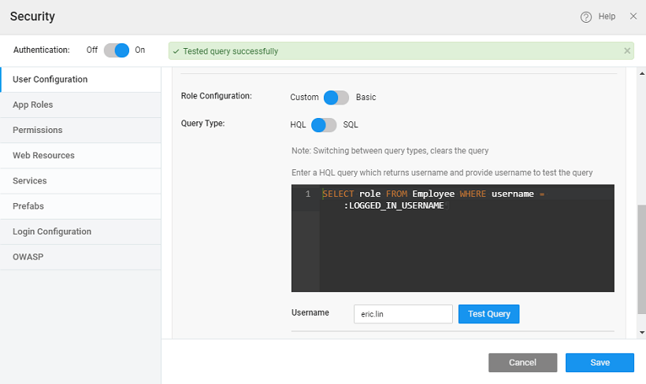

**Authorization** is a process through which the access to various aspects of the app such as services, widgets, and functionality is restricted to the specified app roles.

Enabling authentication in an application makes all pages (except Common, Login) and services to be authenticated. Common and Login pages have permission set as ‘Everyone’ and this cannot be changed. For the other pages and services, WaveMaker allows you to control the application behavior based on the user's role. It is a three-step process of:

1. _defining the roles_,
2. _assigning these roles to users_ and then
3. _setting the access levels_ to various pages, services and widgets of the app.

### User Onboarding

In order to use Role-based Access Control, you must have configured Security Providers and Roles. The configuration for user details should be set.

_Role Configuration_ can be Basic or Custom. In the case of **Basic**, a HQL query will be built by default in read-only mode. In case of **Custom**, you can change the query to suit the app needs. **NOTE**: Here we are talking about the database-based role configuration. For other role providers like LDAP, AD etc., refer to the corresponding section in [Authentication document](/learn/app-development/app-security/authentication/).

- In the case of **Basic Role Configuration**, set the _Role Column_ to the field within the user table where role information is stored. **NOTE**: In case the role column is in a related table, use Custom query. 
- In the case of **Custom Role Configuration**, Query Type can be set to HQL or SQL. By default, HQL is selected and a default query is generated, which can be modified. **NOTE**: The username and role can reside in separate tables and you can write a query to retrieve the information. **The parameter to the query LOGGED\_IN\_USERNAME needs to be retained as it is, WaveMaker stores the username details in this variable**. 
- As an example, if you select Database as Security Provider; sample hrdb as the Database; User as the Entity; Username, Userid and Password as themselves, then the sample query would be provided along with a text box to enter a sample value for username and test the query. 

### App Roles

You need to add the roles that you want to use in your application as per the roles in the above-mentioned Security Providers and Roles in the **App Roles** tab. There are two App Roles - _admin_ and _user_ offered for all providers. They are for authorization and provided out of the box. Users can add/remove to suit their needs. Using the arrow keys, you can set the **role precedence** for multiple roles within an application. This is particularly useful when a single user has multiple roles with different overlapping functionality. For example, Manager has two roles – admin and user. And for admin the landing page is set as EmployeeDashboard, while user has the landing page as EmployeeProfile. Based on the role precedence the corresponding landing page takes priority, i.e., when Manager logs in, if admin role has higher precedence then EmployeeDashboard page is displayed, if user role has higher precedence then EmployeeProfile page is displayed.

< Authentication

Role-Based Access >

7\. Security

- 7.1 App Security Overview
    - [i. Overview](/learn/app-security/app-security/#)
    - [ii. How Security Works](/learn/app-security/app-security/#working)
    - [iii. How Security is Implemented](/learn/app-security/app-security/#implementation)
    - [iv. Security Terminology](/learn/app-security/app-security/#terminology)
- 7.2 Authentication
    - [i. Overview](/learn/app-security/authentication/)
    - [ii. Security Providers](/learn/app-security/authentication/#security-providers)
        - [○ Demo](/learn/app-security/authentication/#demo)
        - [○ Database](/learn/app-security/authentication/#database)
        - [○ LDAP](/learn/app-security/authentication/#ldap)
        - [○ Active Directory](/learn/app-security/authentication/#ad)
        - [○ CAS](/learn/app-security/authentication/#cas)
        - [○ SAML](/learn/app-security/authentication/#saml)
        - [○ Custom](/learn/app-security/authentication/#custom)
- [7.3 Authorization](#)
    - [i. Overview](#)
    - [ii. User Onboarding](#user-onboarding)
    - [iii. App Roles](#app-roles)
- 7.4 Access Levels & Permissions
    - [i. Overview](/learn/app-security/access-levels-permissions/)
    - [ii. Setting Permissions](/learn/app-security/access-levels-permissions/#setting-permissions)
    - [iii. Role Based Access to Widgets](/learn/app-security/access-levels-permissions/#role-based-access)
- 7.5 Login Configuration
    - [i. Overview](/learn/app-security/login-configuration/)
    - [i. Login Page](/learn/app-security/login-configuration/#login-page)
    - [ii. Landing Page](/learn/app-security/login-configuration/#landing-page)
    - [iii. Session Timeout](/learn/app-security/login-configuration/#session-timeout)
- 7.6 Security Related Variables
    - [i. Overview](/learn/app-security/security-variables)
- 7.7 SSL Encryption
    - [i. Overview](/learn/app-security/ssl-encryption/)
- 7.8 OWASP
    - [i. Overview](/learn/app-security/owasp/)
    - [ii. Preventing XSS Attacks](/learn/app-security/owasp/#xss)
    - [iii. Preventing CSRF Attacks](/learn/app-security/owasp/#csrf)
- 7.9 Single Sign-On (CAS)
    - [i. Overview](/learn/app-security/central-authentication-system/)
- 7.10 Token Based Authentication
    - [i. Overview](/learn/app-security/token-based-authentication/)
    - [ii. How Token Based Authentication Works](/learn/app-security/token-based-authentication/#working)
    - [iii. What is Token](/learn/app-security/token-based-authentication/#token)
    - [iv. Token Repository](/learn/app-security/token-based-authentication/#token-repository)
    - [v. Token Request](/learn/app-security/token-based-authentication/#token-request)
    - [vi. API Invocation](/learn/app-security/token-based-authentication/#api-invocation)
    - [vii. Token Validity](/learn/app-security/token-based-authentication/#token-validity)
- 7.11 SAML Integration
    - [i. Overview](/learn/app-development/app-security/saml-integration/)
    - [i. Profiles](/learn/app-development/app-security/saml-integration/#profiles)
    - [ii. Integration](/learn/app-development/app-security/saml-integration/#integration)
    - [iii. Configuration Files](/learn/app-development/app-security/saml-integration/#files)
    - [iv. Deployment](/learn/app-development/app-security/saml-integration/#deployment)
    - [v. Troubleshooting](/learn/app-development/app-security/saml-integration/#troubleshooting)
    - [vi. Use Cases](/learn/app-development/app-security/saml-integration/#use-cases)
