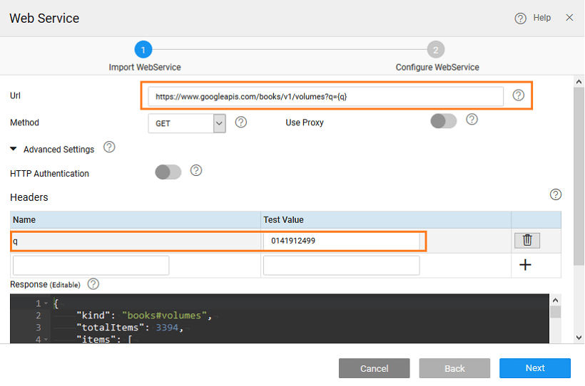
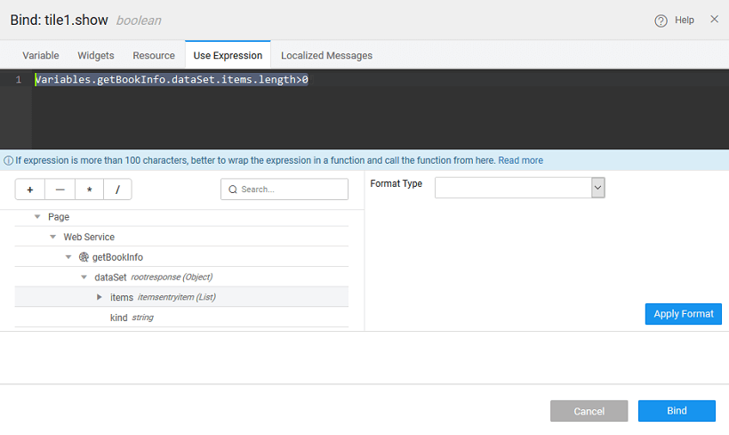
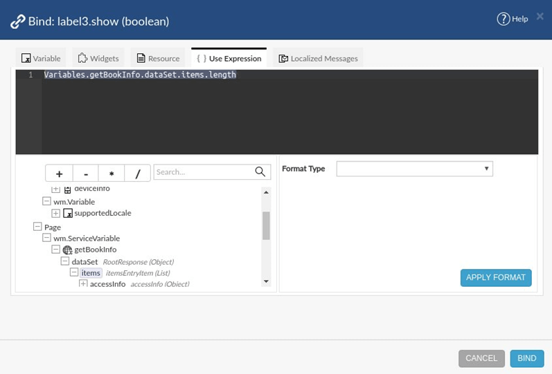
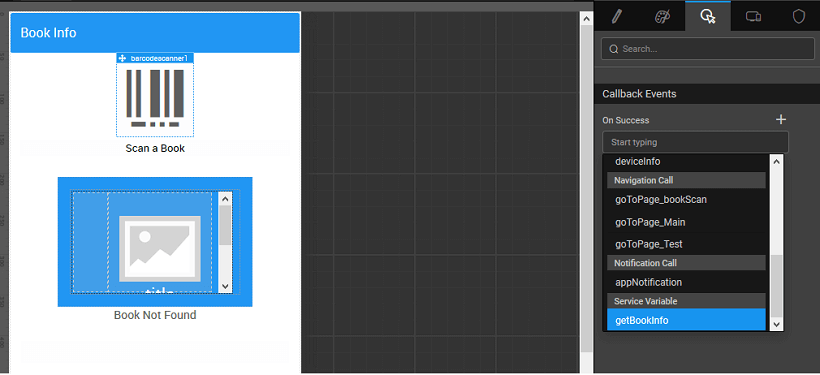

**Barcode** is a number encoded in a sequence of bars (vertical line). It is used for machine reading the number.  A common example where barcode scanning is used is billing in supermarkets. Bill desk employees add a product to the bill by just scanning the product’s barcode. Barcode scanner widget brings this scanning functionality to mobile devices.

**Barcode Scanner widget** is a button which, when clicked, opens the device camera for scanning. The scanned information will be available as ‘datavalue’ outbound property.

# Features

Barcode scanner has two main properties.

1. **Caption** to be displayed
2. **Icon class** for the icon to use.

# Properties

| **Property** | **Description** |
| --- | --- |
| Caption | The caption is the text that the end user sees. |
| Name | The name is a unique identifier for the Barcode Scanner. Special characters and spaces are not allowed in widget name. |
| **Default Value** |
| Value | This is the default value to display value for an editor widget. Note that the display value is just what the user sees initially, and is not always the dataValue returned by the widget. |
| **Behavior** |
| Show | Showing determines whether or not a component is visible. It is a bindable property. |
| Load on Demand (visible only when show property is bound to a variable) | When this property is set and show property is bound, the initialization of the widget will be deferred till the widget becomes visible. This behavior improves the load time. Use this feature with caution, as it has a downside (as we will not be able to interact with the widget through script until the widget is initialized). When show property is not bound the widget will be initialized immediately. |
| Bar Code Format | You can restrict the format of the barcode to scan based on your app requirement.
The format can be:

- CODABAR (not supported in iOS),
- CODE\_39,
- CODE\_93 (not supported in iOS),
- CODE\_128,
- DATA\_MATRIX,
- EAN\_8,
- EAN\_13,
- ITF
- PDF\_417 (not supported in iOS),
- QR\_CODE,
- RSS14 (not supported in iOS),
- RSS\_EXPANDED (not supported in iOS),
- UPC\_E,
- UPC\_A,
- ALL is the default setting. This option can be used to scan any barcode format listed above except PDF\_417 and RSS\_EXPANDED.

 |
| **Graphics** |
| Icon Class | This bindable property defines the class of the icon that is applied to the button. |
| Icon Size | This property defines the size of the icon. Value has to be specified along with the units (em or px). |
| **Format** |
| Horizontal Align | This property specifies how the elements should be aligned horizontally - left, center or right. |

# Events

- **On Success** - The event listener to call when the barcode is successfully scanned. Two parameters are passed -  event object and isolate scope of the widget.

# Use Cases

### Overview

Barcode Scanner can be used to scan and encode a barcode sequence. **Example: Barcode Scanner Usage with Web Service for book details from scanned book barcode** In this post, we will be creating a page that has a button to scan a book’s barcode. When a book’s barcode is scanned, information about the book has to fetched using google books API and barcode. 

### Step 1: Data

1. Open or Create a Hybrid Mobile App.
2. From the **Resources** section, click on **Web Services** option >> Plus Icon>> Rest services to import the Google books API rest web service.
    
    - Use the following **Url**: https://www.googleapis.com/books/v1/volumes?q={q}
    - Enable **Advanced Settings** and specify following parameters:
        - Headers Name: q
        - Test Value: 0141912499
    - Click **TEST** at the bottom of the dialog.
    - Once the response appears, click **NEXT**
    - Click **IMPORT**
    
    

### Step 2: Layout

1. Create a page with _basic profile template_. 
2. Drag and drop _barcode scanner_ widget on the page. 

### Step 3: Variable & Binding

1. Create a page level **API variable** to use the imported google books API. 
2. Bind the value of q with barcode scanner ‘dataValue’ property and save the variable.  
3. On the page:
    1. Bind Card Image to book thumbnail of the Variable.
    2. Bind Caption of Main Label to the book title.
    3. Bind Caption of the Last Label to the book description.
    4. Bind Show property of Tile such that tile will be shown only if there is book information. 
    5. Drag and Drop a Label to the page, set Caption property to ‘Book Not found’. Bind the Show property this label such that this label is shown when the Variable does not return any books. 
4. On the success of barcode scanner, invoke the created variable. 

### Step 4: Build & Run

1. Build the apk, install it on an android phone and open the app. 
2. Click on ‘scan a book’ button. The camera will open for barcode scanning. Point the camera at any book barcode. 
3. Book data will come up on the app, provided google has the book information. 

[10\. Mobile & Device Widgets](/learn/app-development/widgets/widget-library/#mobile)

- [10.1 Media List](/learn/app-development/widgets/mobile-widgets/media-list/)
- [10.2 Segmented Control](/learn/app-development/widgets/mobile-widgets/segmented-control/)
- [10.3 Barcode Scanner](/learn/app-development/widgets/mobile-widgets/barcode-scanner/)
    - [i. Features](#features)
    - [ii. Properties](#properties)
    - [iii. Events](#events)
    - [iv. Use Cases](#use-cases)
- [10.4 Camera](/learn/app-development/widgets/mobile-widgets/camera/)
