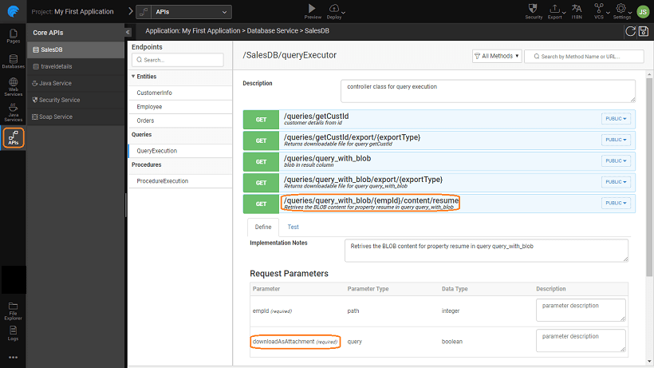

datatype being large in size and amorphous in nature need to be handled separately.

WaveMaker, the Database services generated for each table provides an additional API for downloading the content for each BLOB column in the table and this support has been extended to Queries and Procedures post 8.5 release.

##  Cases for BLOB

The following use cases are discussed in this section:

- [BLOB data as a query parameter](#query_blob_param)
- [BLOB content in query results](#query_blob_return) (single or paginated results)
- [ the BLOB data as procedure parameter](#proc_blob_param)
- [BLOB content as output parameter of a procedure](#proc_param_return)

- returning more than one response field and simultaneously containing BLOB field are not supported. In other words, if Blob exists in response, then no other fields should be returned.
- queries with the response containing Blob columns are not supported.
- response in CURSOR fields is ignored for procedures.

###  for uploading the BLOB data as a query parameter

- new param type "Blob" can be found in the Parameter section of the Query Editor.
- : This Blob type is enabled only for Insert and Update queries.
- Blob type column supports single file upload, i.e. not as a list. However, there can be multiple Blob params for a single query. 
- a Blob parameter exists in a query, then the generated API for such query will accept Multipart data and POST method is used irrespective of query type.

### Blob content in query results (single or paginated results)

- query tested in design mode has resultant data with Blob content it is depicted as a file icon and the content is not visible or available for download.
-  returning a PAGINATED response containing Blob field should provide  while saving the query
    - identifier is required to uniquely identify the column in the query result.
    - can select multiple columns as Identifier.
    - **:** You cannot save the query without Identifier. 
- API will be generated for each Blob field with a return type in addition to the executeQueryAPI. The response of the execute query's Blob field's value will contain the absolute URL to the Blob content. It will be null for the rows which do not have a value for that field. 

**:**

-  is not required for Queries returning SINGLE response.
-  queries are  not  supported if they contain Blob fields in response.

###  for uploading the blob data as Procedure Param

- typical procedure with Blob input is as shown below: 
- param type of Blob is IN in a procedure, then the generated API for such procedure will be accepted as multipart data and the remaining fields are expected as one part with the content type `/json` There can be multiple Blob inputs parameters.

### Blob content as output param of a procedure

-  returning more than one response field and simultaneously containing BLOB field are not supported. In other words, if Blob exists in response, then no other fields should be returned.
-  response is supported only for OUT parameters. If Blob field exists in Cursor data, then it is ignored.
- procedure consists of BLOB field in OUT param, then the generated API will return response otherwise <procedureName>Response object.

5\. Creating Backend Services

- 5.1 Overview
    - [Accessing Data](/learn/app-development/services/creating-backend-services/#accessing-data)
        - [Life-cycle of data](/learn/app-development/services/creating-backend-services/#life-cycle)
    - [Manipulating Data](/learn/app-development/services/creating-backend-services/#manipulating-data)
        - [Life-cycle of Events](/learn/app-development/services/creating-backend-services/#life-cycle-events)
    - [REST APIs](/learn/app-development/services/creating-backend-services/#rest-apis)
- 5.2 Web Services
    - [Overview](/learn/services/web-services/web-services/#overview)
    - [Variables for Invocation](/learn/services/web-services/web-services/#service-variable)
    - iii. Working with SOAP Services
        - [Overview](/learn/app-development/services/web-services/web-services/working-with-soap-services/#SOAP-service-setup)
        - [SOAP Service Setup](/learn/app-development/services/web-services/working-with-soap-services/#SOAP-service-setup)
        - [SOAP Service Settings](/learn/app-development/services/web-services/working-with-soap-services/#SOAP-service-settings)
        - [Generated REST APIs](/learn/app-development/services/web-services/working-with-soap-services/#generated-rest-apis)
        - [SOAP Service Usage](/learn/app-development/services/web-services/working-with-soap-services/#SOAP-service-usage)
    - iv. Working with REST Services
        - [ Overview](/learn/app-development/services/web-services/rest-services/)
        - [ Test REST Service](/learn/app-development/services/web-services/rest-services/#test-API)
        - [ Configure REST Service](/learn/app-development/services/web-services/rest-services/#configure-REST-service)
        - [REST Service Usage](/learn/app-development/services/web-services/rest-services/#REST-service-usage)
    - iii. Working with Web Sockets
        - [Overview](/learn/app-development/services/web-services/working-with-websockets/)
        - [Service Integration](/learn/app-development/services/web-services/working-with-websockets/#import)
        - [Service Consumption](/learn/app-development/services/web-services/working-with-websockets/#variable)
        - [Use Cases](/learn/app-development/services/web-services/working-with-websockets/#use-cases)
- [5.3 Database Services](/learn/app-development/services/database-services/database-services/)
    - [Overview](/learn/app-development/services/database-services/database-services/#)
    - [Supported Databases](/learn/app-development/services/database-services/database-services/#supported-databases)
    - iii. Working with Databases
        - [Overview](/learn/app-development/services/database-services/working-with-databases/#)
        - [Adding Database](/learn/app-development/services/database-services/working-with-databases/#integrating-database)
        - [Database Actions](/learn/app-development/services/database-services/working-with-databases/#database-actions)
    - iv. Data Modelling
        - [Overview](/learn/app-development/services/database-services/data-modelling/#)
        - [Configuration Settings](/learn/app-development/services/database-services/data-modelling/#configuration-settings)
        - [Database Designer](/learn/app-development/services/database-services/data-modelling/#database-designer)
            - [Schema Import Modes](/learn/app-development/services/database-services/database-schema-import-modes/)
        - ○ Working with Database Schema
            - [Overview](/learn/app-development/services/database-services/working-database-schema/)
            - [Adding Tables and Columns](/learn/app-development/services/database-services/working-database-schema/#add-tables-columns)
            - [Working with Relationships](/learn/app-development/services/database-services/working-database-schema/#database-relationships)
            - [Identity Generators for Primary Key Column](/learn/app-development/services/database-services/working-database-schema/#identity-generators)
            - [Column Metadata Configuration](/learn/app-development/services/database-services/working-database-schema/#column-metadata-configuration)
            - [Virtual Primary Keys and Relations](/learn/app-development/services/database-services/working-database-schema/#virtual-primary-keys)
            - [Temporal Support](/learn/app-development/services/database-services/temporal-support/)
    - [Databases Access](#)
        - [Overview](/learn/app-development/services/database-access/)
        - ○ Working with Queries
            - [Overview](/learn/app-development/services/database-services/working-with-queries/)
            - [Query Editor](/learn/app-development/services/database-services/working-with-queries/#query-editor)
            - [Types of Queries](/learn/app-development/services/database-services/working-with-queries/#query-types)
            - [Query Creation](/learn/app-development/services/database-services/working-with-queries/#query-creation)
            - [Query Usage](/learn/app-development/services/database-services/working-with-queries/#query-usage)
            - [Parameterised Query Creation](/learn/app-development/services/database-services/working-with-queries/#query-creation-parameterised)
            - [Query Operation Type](/learn/app-development/services/database-services/working-with-queries/#query-op-types)
            - [Query Architecture](/learn/app-development/services/database-services/working-with-queries/#query-architecture)
        - ○ Working with Stored Procedures
            - [Overview](/learn/app-development/services/db-services/working-stored-procedures/)
            - [Procedure Creation](/learn/app-development/services/db-services/working-stored-procedures/#procedure-creation)
            - [Procedure Parameters](/learn/app-development/services/db-services/working-stored-procedures/#proc-params)
            - [Procedure Invocation](/learn/app-development/services/db-services/working-stored-procedures/#procedure-invocation)
            - [Procedure Architecture](/learn/app-development/services/db-services/working-stored-procedures/#procedure-architecture)
        - [Versioning of Queries and Procedures](/learn/app-development/services/database-services/versioning-queries-procedures/)
        - [ Blob Support for Queries and Procedures](#)
        - [Invoking Queries & Procedures from Java Service](/learn/app-development/services/database-services/invoking-queriesprocedures-java-services/)
        - [ Database Views](/learn/app-development/services/db-services/database-views/)
        - ○ Database Tools
            - [Overview](/learn/app-development/services/database-tools/)
            - [DB Shell](/learn/app-development/services/database-tools/#db-shell)
            - [DB Scripts](/learn/app-development/services/database-tools/#db-scripts)
                - [Import DB](/learn/app-development/services/database-tools/#import-db)
                - [Export DB](/learn/app-development/services/database-tools/#export-db)
    - vi. ORM Artifacts
        - [Database Integration Process](/learn/app-development/services/db-services/orm-artifacts/#database-integration-process)
        - [Layered Architecture](/learn/app-development/services/db-services/orm-artifacts/#layered-architecture)
        - [Generated Files](/learn/app-development/services/db-services/orm-artifacts/#generated-files)
        - [Generated APIs](/learn/app-development/services/db-services/orm-artifacts/#generated-apis)
            - [CRUD APIs](/learn/app-development/services/db-services/orm-artifacts/#crud-apis)
            - [Query APIs](/learn/app-development/services/db-services/orm-artifacts/#query-apis)
            - [Custom Query Syntax](/learn/app-development/services/db-services/orm-artifacts/#custom-query-syntax)
- 5.4 Java Services
    - [ Overview](/learn/app-development/services/java-services/java-service/#overview)
    - [Java Services Framework](/learn/app-development/services/java-services/java-service/#java-services-framework)
    - iii. Integration Services
        - [Current Loggedin User](/learn/app-development/services/java-services/java-integration-services/#loggedin-user)
        - [External Java Libraries](/learn/app-development/services/java-services/java-integration-services/#external-java-libraries)
        - [Database Entities](/learn/app-development/services/java-services/java-integration-services/#db-services)
        - [Named Queries](/learn/app-development/services/java-services/java-integration-services/#query-service)
        - [Imported Web Services](/learn/app-development/services/java-services/java-integration-services/#web-services)
    - [Service Variables](/learn/app-development/services/java-services/service-variables/)
    - [ Generated REST APIs](/learn/app-development/services/java-services/generated-rest-apis-api-designer/)
- 5.5 API Designer
    - [Overview](/learn/app-development/services/api-designer/api/)
    - [Database Services APIs](/learn/app-development/services/api-designer/database-service-apis/)
    - [Web Services APIs](/learn/app-development/services/api-designer/web-service-apis/)
    - [Java Services APIs](/learn/app-development/services/api-designer/java-service-apis/)
    - [Security Services APIs](/learn/app-development/services/api-designer/security-service-apis/)
- 5.6 3rd Party Libraries
    - [Overview](/learn/app-development/services/3rd-party-libraries/)
    - [Including resource files](/learn/app-development/services/3rd-party-libraries/#resource-files)
    - [Using third-party JavaScript file](/learn/app-development/services/3rd-party-libraries/using-3rd-party-javascript-files/)
    - [Using third-party jar file](/learn/app-development/services/3rd-party-libraries/using-3rd-party-jar-files/)
