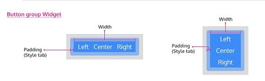

**Button Group** widget is a container that shows a set of buttons that can be managed and styled as a group.

The buttons inside the group can be:

- aligned horizontally or
- vertically.

Using Button Group, Buttons can exist together as a group. They are great when you need to display a group of actions in a bar. These build off the button styles and work perfectly with the grid. Button group can be used in cases where you have three different behavior upon a single entity. Example for video/audio we have a play, pause, stop operations. In such cases, the button group provides visual groupings of buttons.

# Properties

Refer to  [Button widget document](/learn/app-development/widgets/form-widget/button/) for individual Button features and properties.

Property

Description

Name

The name is a unique identifier for the Button Group. Special characters and spaces are not allowed in widget name.

Add Button

You can choose to add more buttons to the given default three buttons using this control.

**Layout**

Width

The width of your widget can be specified in _em, pt, px or %_ (i.e 50px, 75%).

Vertical

This property determines if the tabs should be vertical.

**Behavior**

Show

Showing determines whether or not a component is visible. It is a bindable property.

Load on Demand (visible only when show property is bound to a variable)

When this property is set and show property is bound, the initialization of the widget will be deferred till the widget becomes visible. This behavior improves the load time. Use this feature with caution, as it has a downside (as we will not be able to interact with the widget through script until the widget is initialized). When show property is not bound the widget will be initialized immediately.

**Format**

Horizontal Align

This property specifies how the elements should be aligned horizontally.

[3\. Form Widgets](/learn/app-development/widgets/widget-library/#form)

- [3.1 Button](/learn/app-development/widgets/form/button/)
- [3.2 Button Group](#)
    - [i. Properties](#properties)
- [3.3 Calendar](/learn/app-development/widgets/form/calendar/)
- [3.4 Checkbox](/learn/app-development/widgets/form/checkbox/)
- [3.5 CheckboxSet](/learn/app-development/widgets/form/checkboxset/)
- [3.6 Chips](/learn/app-development/widgets/form-widgets/chips/)
- [3.7 Color Picker](/learn/app-development/widgets/form/color-picker/)
- [3.8 Currency](/learn/app-development/widgets/form/currency/)
- [3.9 Date](/learn/app-development/widgets/form/date/)
- [3.10 Datetime](/learn/app-development/widgets/form-widgets/date-time-datetime/)
- [3.11 FileUpload](/learn/app-development/widgets/form/file-upload/)
- [3.12 Number](/learn/app-development/widgets/form-widgets/number/)
- [3.13 Radioset](/learn/app-development/widgets/form/radioset/)
- [3.14 Rating](/learn/app-development/widgets/form/rating/)
- [3.15 Select](/learn/app-development/widgets/form/select/)
- [3.16 Select Locale](/learn/app-development/widgets/form/select-locale/)
- [3.17 Slider](/learn/app-development/widgets/form/slider/)
- [3.18 Switch](/learn/app-development/widgets/form/switch/)
- [3.19 Text](/learn/app-development/widgets/form/text/)
- [3.20 Textarea](/learn/app-development/widgets/form/textarea/)
- [3.21 Time](/learn/app-development/widgets/form-widgets/date-time-datetime/)
- [3.22 Toggle](/learn/app-development/widgets/form/toggle/)
