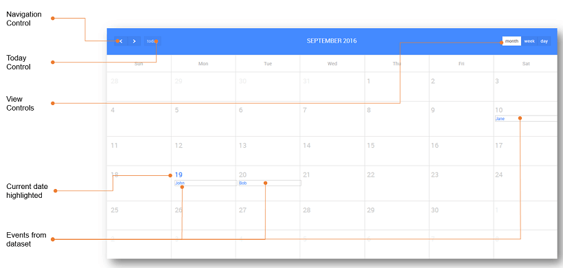

**Calendar** widget is the most popular solution for scheduling events on a full-sized calendar in a web application. This widget can be used to show agenda. The calendar will be automatically switched to the Web or Mobile version, based on the device it is being viewed on.

## Events in the Calendar

displaying events in the Calendar widget you need a variable of type or an object with single event data. The data contain a field corresponding to Start property, other properties are optional. The expected date format for the value of Start property is a Date Object - ‘YYYY/MM/DD’ or ‘MM/DD/YYYY’ or ‘DD MMMM YYYY’.

1. and drop a Calendar widget onto the canvas
2. the variable consisting the data to the **Value** property of the widget.
3. the properties , , , _day_, _name_ to the keys of the variable bound. : Start property is a must, other properties are optional.
4. **controls** There are five different types of controls on the calendar that can be enabled to:
    - between the months, weeks and days, depending on the calendar view
    - current day
    - the view to Month
    - the view to Week
    - the view to Day.
5. Type can be:
    - as  - will show the events in a single row, or
    - as Agenda - will show the complete day agenda with hours included.

## Events in the Calendar

following are the outbound properties of a Calendar widget that can be captured. These values can be captured from JavaScript to be triggered by any Calendar event like _Select_:

- : gives the start and end values of the current calendar view
- : gives the entire dataset corresponding to the selected item within the calendar
- : gives the user selection on the calendar.

## for Calendar

Calendar comes in three views - Month, Week and Day.

- view of the Calendar displays all the days in the month. 
    
    <iframe width="100%" height="715" style="background-color: snow;" allowtransparency="true" src="https://apps.wavemakeronline.com/documentation_snippets/#/CalendarMonthView">Month View</iframe>
    
- view of the Calendar displays all the days in the week. 
    
    <iframe width="100%" height="715" style="background-color: snow;" allowtransparency="true" src="https://apps.wavemakeronline.com/documentation_snippets/#/CalendarWeekView">Week View</iframe>
    
- view of the Calendar displays all the events on the day. 
    
    <iframe width="100%" height="715" style="background-color: snow;" allowtransparency="true" src="https://apps.wavemakeronline.com/documentation_snippets/#/CalendarDayView">Day View</iframe>
    

name is a unique identifier for the Calendar. Special characters and spaces are not allowed in widget name.

index

tab index attribute specifies the tab order of an element. You can use this property to change the default tabbing order for widget access using the tab key. The value can range from 0 to 32767. The default is 0 and -1 makes the element non-focusable.

NOTE: In Safari browsers, by default, Tab highlights only text fields. To enable Tab functionality, in Safari Browser from Preferences -> Advanced -> Accessibility set the option "Press Tab to highlight each item on a webpage".

width of your widget can be specified in _, pt, px_ or _% (_ _50px, 75%)._

height of your widget can be specified in _, pt, px_ or _% (_ _50px, 75%)._

**Value**

is the default value to display value for an editor widget. Note that the display value is just what the user sees initially, and is not always the dataValue returned by the widget.

this property to a variable to populate the list of values to display.

**Data**

for the Event, set from the Dataset fields.

date or date time for the event, set from the Dataset fields.

date or date time for the event, set from the Dataset fields.

day

it is an All day event or not

name

Class to be applied to that event.

determines whether or not a component is visible. It is a bindable property.

on Demand (visible only when show property is bound to a variable)

this property is set and show property is bound, the initialization of the widget will be deferred till the widget becomes visible. This behavior improves the load time. Use this feature with caution, as it has a downside (as we will not be able to interact with the widget through script until the widget is initialized). When show property is not bound the widget will be initialized immediately.

property allows you to set the type of the calendar widget:

- , or
- (default).

Controls

property allows you to enable the header controls for calendar widget. These include

- \- to navigate previous/next month/week/day(depending upon the display) on the calendar,
- \- go to today's location on the calendar,
- \- to display entire month,
- \- to display entire week,
- \- to display entire day.

All these controls on the calendar are used to navigate between the months and switch the view to (or) (or)

**:-** _property is shown only for the Web version of the Calendar._

property allows you to set the default view of the calendar widget:

- (default),
- or

Mode

property can be used to control the user selection of the dates using a simple mouse drag operation. The values can be:

- : no selection, the calendar is just there to present data, not to be selected
- : only one row can be selected at a time
- : many rows can be selected at a time.

**Events**

Select

event is triggered when a user selects one or more dates.

View Render

event handler is triggered when the calendar view is changed.

Event Drop

event handler is triggered when dragging of an event in calendar stops and the event has moved to a different day/time.

Event Resize

event handler is triggered when resizing of the event in calendar stops and the event has changed in duration.

Event Click

event handler is triggered when an event is clicked in the calendar.

Event Render

event handler is triggered when an event is rendered.

set the properties of the calendar widget through the script, access the properties on the calendar as (consider the calendar with name ‘wmcalendar’) and change or assign the values accordingly. For example:

- set the first day of the month view \[Default: 0 (Sunday)\]: \= 0;
- hide the all day slot of the agenda view \[Default: true\]: \= false;
- set the text of the all-day slot in the agenda view \[Default: ‘all-day’\]: \= ‘all-day’;

Other properties which can be set using the similar methods: For more information on Calendar, properties [here.](https://fullcalendar.io/docs/)

if the title ("all-day") slot is displayed at the top of the calendar. When false, all-day events will not be displayed in agenda views.

text for title ("all-day") slot at the top of the calendar.

frequency for displaying time slots. Default: '00:30:00' (30 minutes)

the time-text that will be displayed on the vertical axis of the agenda views. default: 'h(:mm)a' The default English value will produce times that look like "5pm" and "5:30pm".

how often the time-axis is labeled with text displaying the date/time of slots.

not specified, this value is automatically computed from slotDuration. With slotDuration's default value of 30 minutes, this value will be 1 hour.

how far down the scroll pane is initially scrolled down. default: '06:00:00' (6am). The user will be able to scroll upwards to see events before this time. If you want to prevent users from doing this, use the minTime option instead.

the starting time that will be displayed, even when the scrollbars have been scrolled all the way up. default: "00:00:00" The default "00:00:00" means the start time will be at the very beginning of the day (midnight).

the end time (exclusively) that will be displayed, even when the scrollbars have been scrolled all the way down. default: "24:00:00" The default "24:00:00" means the end time will be at the very end of the day (midnight).

if timed events in agenda view should visually overlap. default: true. When set to true (the default), events will overlap each other. At the most half of each event will be obscured.  set to false, there will be absolutely no overlapping.

()

highlights the default date given for the calendar.

_1 - datavalue (data/string):_ If the default value is date object, then that particular date will be highlighted. For example: To select 1st June 2017

 = '01/0/2017';
Page.Widgets.calendar.selectDate();

_2 - datavalue (Object):_ the default value is Object, then the particular dates from start to end date will be highlighted. For example: To select dates from 1st Jan to 10th Jan 2017

 = {start:'01/01/2017', end:'10/01/2017'};
Page.Widgets.calendar.selectDate();

()

shows the calendar view to default date given for the calendar. For example, to go to a specific date - 1st Jan 2107

\='01/01/2017';
Page.Widgets.calendar.gotoDate();

(int)

method renders the present view (i.e. year view will be the same) for the specified month. For example: To view the February month.

(2);

()

method renders the present view (i.e. year view will be the same) for the next month. For example: To view the next month

();

()

method renders the present view (i.e. year view will be the same) for the prev month. For example: To view the prev month

();

()

method renders the present view (i.e. month/week view will be the same) for the next year. For example: To view the next year

();

()

 It renders the present view (i.e. month/week view will be the same ) for the previous year. For example: To view the previous year

();

()

 It rerenders the events from the dataset. For example, to get events on the calendar, we use:

();

# Cases

- [to create an event and save it in a Database](/learn/how-tos/calendar-usage-create-event/)
- [to integrate with Google Calendar](/learn/how-tos/calender-usage-google-calendar-integration/)

[3\. Form Widgets](/learn/app-development/widgets/widget-library/#form)

- [3.1 Button](/learn/app-development/widgets/form/button/)
- [3.2 Button Group](/learn/app-development/widgets/form/button-group/)
- [3.3 Calendar](#)
    - [Features](#features)
        - [Display Events](#display-events)
        - [Capturing Events](#capture-events)
        - [Calendar Configuration](#configuration)
    - [Properties](#properties)
    - [Events](#events)
    - [Methods](#methods)
    - [Use Cases](#use-cases)
- [3.4 Checkbox](/learn/app-development/widgets/form/checkbox/)
- [3.5 CheckboxSet](/learn/app-development/widgets/form/checkboxset/)
- [3.6 Chips](/learn/app-development/widgets/form-widgets/chips/)
- [3.7 Color Picker](/learn/app-development/widgets/form/color-picker/)
- [3.8 Currency](/learn/app-development/widgets/form/currency/)
- [3.9 Date](/learn/app-development/widgets/form/date/)
- [3.10 Datetime](/learn/app-development/widgets/form-widgets/date-time-datetime/)
- [3.11 FileUpload](/learn/app-development/widgets/form/file-upload/)
- [3.12 Number](/learn/app-development/widgets/form-widgets/number/)
- [3.13 Radioset](/learn/app-development/widgets/form/radioset/)
- [3.14 Rating](/learn/app-development/widgets/form/rating/)
- [3.15 Select](/learn/app-development/widgets/form/select/)
- [3.16 Select Locale](/learn/app-development/widgets/form/select-locale/)
- [3.17 Slider](/learn/app-development/widgets/form/slider/)
- [3.18 Switch](/learn/app-development/widgets/form/switch/)
- [3.19 Text](/learn/app-development/widgets/form/text/)
- [3.20 Textarea](/learn/app-development/widgets/form/textarea/)
- [3.21 Time](/learn/app-development/widgets/form-widgets/date-time-datetime/)
- [3.22 Toggle](/learn/app-development/widgets/form/toggle/)
