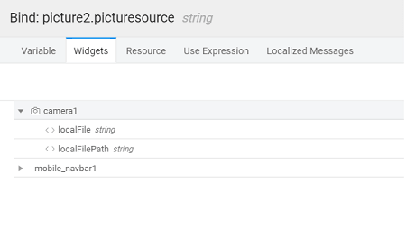
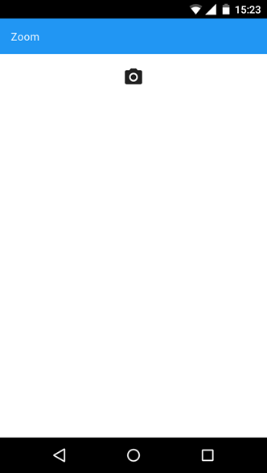

**camera** is a **based widget that opens device camera for taking photos or videos. The path of the photo or video captured is exposed as outbound property ‘localFilePath’.**

camera can be used for taking a picture or video. To specify the mode of the camera, set the **Type** to Image or Video.

**Properties** can be further configured:

- _Width_ _-_ picture is scaled to this property’s value while maintaining the image’s aspect ratio.
- _Height_ _-_ picture is scaled to this property’s value while maintaining the image’s aspect ratio. If both target width and target height are specified, then the image will be scaled to the minimum of them.
- _Type_ _-_ format in which the image has to be saved. Supported formats are JPEG and PNG.
- _Quality_ _-_ This is JPEG compression level in percentage. So, this value is used only when JPEG is selected as encoding type. If the value is 100, then no compression is applied to the image.
- _To Gallery_ _-_ turned on, then photos taken using this widget will be saved to the device gallery.
- _\-_ this property is checked, then the user can edit or crop the picture taken.

You can use the and to further enhance the app functionality. These properties are passed as parameters for Camera Success Event. See   [Case](#store-image) for more details. 

name is a unique identifier for the Camera. Special characters and spaces are not allowed in widget name.

text or HTML you enter for this property will be shown as a tooltip if the mouse hovers over this widget for 1.5 seconds.

**Value**

is the default value to display value for an editor widget. Note that the display value is just what the user sees initially, and is not always the dataValue returned by the widget.

determines whether or not a component is visible. It is a bindable property.

on Demand (visible only when show property is bound to a variable)

this property is set and show property is bound, the initialization of the widget will be deferred till the widget becomes visible. This behavior improves the load time. Use this feature with caution, as it has a downside (as we will not be able to interact with the widget through script until the widget is initialized). When show property is not bound the widget will be initialized immediately.

Type

specifies whether the image or video that is to be captured.

Class

bindable property defines the class of the icon that is applied to the button.

Size

property defines the size of the icon. Value has to be specified along with the units (em or px).

Align

property specifies how the elements should be aligned horizontally - left, center or right.

**Properties**

Width

property specifies the width in px to resize the image.

Height

property specifies the height in px to resize the image.

Quality

of the saved image expressed as a range of 0-100, where 100 is typically full resolution with no loss of file compression

Type

the returned image file's encoding. The default is JPEG.

to Gallery

the image to the photo album on the device after capture

simple editing of the image before selection.

- **Success** - The event listener to call when a photo or video is successfully captured. This can be bound to a Database CRUD Variable of Insert operation, to save the picture into a database

Capture an image using camera and store in the database using CRUD variable (we are using a Customer Database with pic as the blob type field):

1. the Input Fields from the Data tab for the CRUD Variable to the Camera -> localFile field 
2. Sucess event of Camera widget needs to invoke the above Insert Variable 

# Cases

Camera Widget can be used to capture images and videos from a Mobile App In this post, we will create a mobile app to capture and display a photo. 

### 1: Building Page

1. or Open a Hybrid Mobile App.
2. a page using _template_ and layout as ‘ _column layout with top navbar_’  
3. and drop a _widget_ and set horizontal align property as the center.
4. and drop a camera widget.
5. and drop a picture widget and set its width to 100%. 
6. the source of the picture to the ‘localFilePath’ of camera widget. 

### 4: Build & Run

1. the apk, install it on an android phone and open the app. 
2. the app and click camera button and take a photo. 
3. captured image will get displayed in the app. 

[10\. Mobile & Device Widgets](/learn/app-development/widgets/widget-library/#mobile)

- [10.1 Media List](/learn/app-development/widgets/mobile-widgets/media-list/)
- [10.2 Segmented Control](/learn/app-development/widgets/mobile-widgets/segmented-control/)
- [10.3 Barcode Scanner](/learn/app-development/widgets/mobile-widgets/barcode-scanner/)
- [10.4 Camera](/learn/app-development/widgets/mobile-widgets/camera/)
    - [Features](#features)
    - [Properties](#properties)
    - [Events](#events)
    - [Use Cases](#use-cases)
