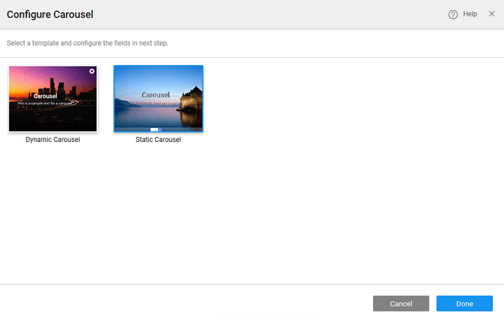

widget is a flexible, responsive way to add a slider to your site. In addition to being responsive, the content is flexible enough to allow images, iframes, videos, or just about any type of content that you might want.

provides you with two types of Carousel:

1. where the Carousel content will take the form of an array or any repeated list like a dataset. The number of items displayed within the carousel will depend upon the number of rows in the bound variable.  **Template** a subWidget of Carousel holds the slide content.
2. where the Carousel content can be bound to individual image resources.  **Content** a subWidget of Carousel holds the slide content. By default, Carousel comes with three carousel contents each with a picture widget. You can add more using the **Carousel** action property.

name is a unique identifier for Carousel.

Carousel (available only for Static Carousel)

you to add carousel content to the carousel widget.

width of your widget can be specified in px or % (i.e 50px, 75%).

height of your widget can be specified in px or % (i.e 50px, 75%).

(available only for Dynamic Carousel)

this bindable property to a variable to populate the list of images to display.

determines whether or not a component is visible. It is a bindable property.

on Demand (visible only when show property is bound to a variable)

this property is set and show property is bound, the initialization of the widget will be deferred till the widget becomes visible. This behavior improves the load time. Use this feature with caution, as it has a downside (as we will not be able to interact with the widget through script until the widget is initialized). When show property is not bound the widget will be initialized immediately.

Controls

property allows you to enable the controls in the form of:

- \- arrows on either side of the images,
- \- dots at the bottom of the images,
- \- default or

property controls the animation of an element. The animation is based on the CSS classes and works only in the run mode. Can be set to:

- \- default or

Interval

property defines the animation interval in seconds.

**Content** (only for Static Carousel) SubWidget of Carousel to hold a slide content. By default, Carousel comes with three carousel contents each with a picture widget. You can add more using the Add Carousel action button.

name is a unique identifier for your widget.

width of your widget can be specified in px or % (i.e 50px, 75%).

height of your widget can be specified in px or % (i.e 50px, 75%).

determines whether or not a component is visible. It is a bindable property.

on Demand (visible only when show property is bound to a variable)

this property is set and show property is bound, the initialization of the widget will be deferred till the widget becomes visible. This behavior improves the load time. Use this feature with caution, as it has a downside (as we will not be able to interact with the widget through script until the widget is initialized). When show property is not bound the widget will be initialized immediately.

Align

text alignment horizontally, can be left, center or right.

**Template** (only for Dynamic Carousel) SubWidget of Carousel to hold a slide content. The number of images displayed will be determined by the values of the variable bound to the Dataset Value property of Carousel.

name is a unique identifier for your widget.

width of your widget can be specified in px or % (i.e 50px, 75%).

height of your widget can be specified in px or % (i.e 50px, 75%).

determines whether or not a component is visible. It is a bindable property.

on Demand (visible only when show property is bound to a variable)

this property is set and show property is bound, the initialization of the widget will be deferred till the widget becomes visible. This behavior improves the load time. Use this feature with caution, as it has a downside (as we will not be able to interact with the widget through script until the widget is initialized). When show property is not bound the widget will be initialized immediately.

Align

text alignment horizontally, can be left, center or right.

event handler is called each time your element's value changes.

[7\. Advanced Widgets](/learn/app-development/widgets/widget-library/#advanced)

- [7.1 Carousel](#)
    - [Properties](#properties)
    - [Events](#events)
- [7.2 Login](/learn/app-development/widgets/advanced/login/)
- [7.3 Marquee](/learn/app-development/widgets/advanced/marquee/)
