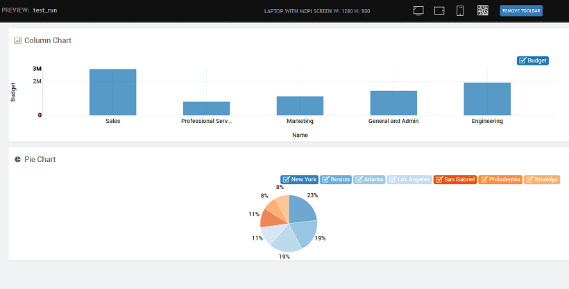

"A picture is worth a thousand words".

With this reference, WaveMaker gives you a tool to present your data in a pictorial form using the chart widgets. Using these widgets you can transform your data into either a line chart, column chart, pie chart, area chart, cumulative line chart, bar chart or a donut chart.

# Chart Types

Following are the various charts offered by WaveMaker - Area, Bar, Bubble, Column, Cumulative Line, Donut, Line, and Pie.

## Chart Comparison

The chart type property can be used to portray the data in various forms. Each type has its own advantages and disadvantages. Select the appropriate type depending upon the data and what you want to represent.

- **Comparison of data** is the most common usage of charts. It can be:
    - Comparing quarterly sales figure over a period of 3 years in which case a **column** chart would be best
    - Comparing the sales figures of say 10 different brands of any given product, wherein a **bar** chart would be most ideal
    - Trying to follow a trend like population over a period of time would be best depicted by a **line** chart
- **A composition of data** like types of users for a product can be depicted accurately through a **pie** chart.
- **Bubble** chart can be used to show **three dimensions** in a chart. Apart from the x-axis and y-axis, the size of the bubble can represent the third dimension.

Choose the type according to your need, you might want to try different types before settling for the best.

<iframe width="100%" height="375" style="background-color: snow;" id="line" allowtransparency="true" src="https://apps.wavemakeronline.com/documentation_snippets/#/Charts">Line Chart</iframe>

<iframe width="100%" height="375" style="background-color: snow;" id="area" allowtransparency="true" src="https://apps.wavemakeronline.com/documentation_snippets/#/AreaChart">Area Chart</iframe>

<iframe width="100%" height="375" style="background-color: snow;" id="column" allowtransparency="true" src="https://apps.wavemakeronline.com/documentation_snippets/#/ChartsColBar">Column Chart</iframe>

<iframe width="100%" height="375" style="background-color: snow;" id="bar" allowtransparency="true" src="https://apps.wavemakeronline.com/documentation_snippets/#/BarChart">Bar Chart</iframe>

<iframe width="100%" height="375" style="background-color: snow;" id="pie" allowtransparency="true" src="https://apps.wavemakeronline.com/documentation_snippets/#/PieChart">Pie Chart</iframe>

<iframe width="100%" height="325" style="background-color: snow;" id="donut" allowtransparency="true" src="https://apps.wavemakeronline.com/documentation_snippets/#/DonutChart">Donut Chart</iframe>

<iframe width="100%" height="575" style="background-color: snow;" id="bubble" allowtransparency="true" src="https://apps.wavemakeronline.com/documentation_snippets/#/BubbleChart">Bubble Chart</iframe>

# Features

Charts are used for graphical display of data  and WaveMaker charts come  with the following features:

- The _Title_, _Sub Heading_, and _Icon_ can be set.
- [Data](#data) can come from various sources like database, web service or another widget and can be accessed through binding to Live or Service Variables
- [The layout](#layout) can be set in terms of themes, positioning, formats for labels, captions, axis etc..
- [Types](#comp) of charts for various purposes.
- [Data aggregation](#data-aggregation) and grouping for displaying summary graphs.
- Run-time [user-interaction](#user-interaction)
- Capturing [user selection](#user-selection)

## Data Sources

Data can come from various sources as listed below:

- From Database,
- From Live Filter,
- From Web Services.

The X-Axis and Y-Axis values can be set to the fields from the data source, the chart is bound to.

Depending upon the data type of the underlying fields, you can choose the Data Display Format.

In the case, when the data source is from Web Services or Web Socket, you can choose the Format Type to be toDate or toNumber.

 For **Pie** and **Donut charts**, the options include Label and Value fields. You can specify

- the position of the Values - hidden, outside (default) or inside
- the Value to be displayed - as key, value, percent (default) or key-value pair

## Layout

- The **theme** for charts can be chosen from a list of options.
- **Custom Colors **can be used to change the set of colors that comes predefined with the selected theme. The values for this property can be
    - comma separated values, eg. red, green, blue
    - bound to a static variable containing the color names or the color hash codes
- The **position** of the chart can be defined in terms of the offset values.
- **Legend** position can be set to be top or bottom.
- Layout of the **values** can be defined in terms of location, value format, caption for line charts  and more

These options are available from the Advanced Settings of the chart. Apart from these properties, a **Title**, **Sub Heading**, and **Icon** can be assigned for the chart as a whole to be displayed on the top left corner of the Chart. 

<iframe width="100%" height="1150" style="background-color: snow;" allowtransparency="true" src="https://apps.wavemakeronline.com/documentation_snippets/#/ChartsThemes">Chart Themes</iframe>

## Data Representation

This property defines how the data is represented in the chart.

- **Datapoint Interpolation** Property determines how data points are joined and represented in the chart. This property is applicable to Line, Area and Cumulative Line Charts. Value can be set to:
    
    - Linear,
    - Cardinal for smooth curves, or
    - Step
    
    
- **Data Arrangement** Property (available only for Column, Area and Bar Charts) controls whether to show the areas in:
    
    - - stack,
        - stream, or
        - expand
    
    

## Data Aggregation and Grouping

When dealing with charts bound to live variables, you can add additional functionality to these charts. You can order the data, group the data and show the aggregate functions in your chart. The aggregation functions available are _average, count, minimum, maximum and sum_.

- In the _Aggregation_ property and _Group by_ property can be used to set the aggregation functions.
- _Order By_ property can be used to set the column by which the data needs to be sorted. By default, it will be set to the Group by column selected.
- The values to be depicted on x and y-axis are set to the _group by_ and _aggregation columns_ respectively.

## Interaction

- You can interact with the charts by selecting/unselecting the column names from the legend.
- Hovering mouse over any column displays the values of X and Y-Axis for that data point.
- These data points can be captured and used to bind to a widget for further display or computational purposes from the selected item of the chart widget

## Capturing User Selection

You can capture user selection in two ways:

1. The various outbound properties of a chart are available for binding to other widgets or variables. The fields under _selecteditem_ will be from the underlying dataset used for binding 
2. These selected values can be accessed via JavaScript
    
    Page.chart3Select = function($event, widgets, selectedItem, selectedChartItem) {
          Page.Widgets.key.datavalue = selectedChartItem.key; // key value of selected item
          Page.Widgets.xv.datavalue = selectedChartItem.x; // x value of selected item
          Page.Widgets.yv.datavalue = selectedChartItem.y; // y value of selected item
          Page.Widgets.selectname.datavalue = selectedItem.name; // name field of selected object
          Page.Widgets.selectdept.datavalue = selectedItem.deptcode; // deptcode of selected object
    };
    
    Here we have used the _On select_ event of the chart: 

# Use Cases

- [Basic Usage](/learn/app-development/widgets/chart/charts-basic-usage/)
- [How to capture user selection](/learn/how-tos/charts-displaying-user-selection-another-widget/)
- [How to handling dynamic data](/learn/how-tos/charts-handling-dynamic-data/)
- [How to displaying custom data](/learn/how-tos/charts-custom-data/)

[5\. Chart Widgets](/learn/app-development/widgets/widget-library/#chart)

- [i. Chart Types](#chart-types)
    - [○ Line Chart](#line)
    - [○ Area Chart](#area)
    - [○ Column Chart](#column)
    - [○ Bar Chart](#bar)
    - [○ Line Chart](#line)
    - [○ Pie Chart](#pie)
    - [○ Donut Chart](#donut)
    - [○ Bubble Chart](#bubble)
- [ii. Features](#features)
    - [○ Data Source](#data)
    - [○ Layout](#layout)
    - [○ Data Representation](#data-rendering)
    - [○ Data Aggregation & Grouping](#data-aggregation)
    - [○ User Interaction](#user-interaction)
    - [○ User Selection](#user-selection)
- [iii. Use Cases](#use-cases)
